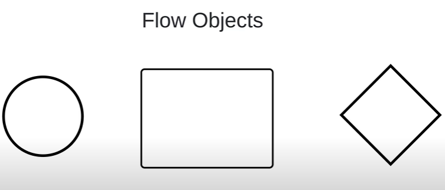
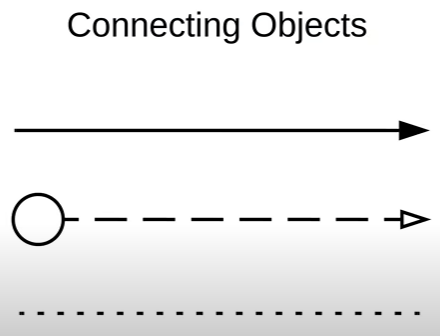
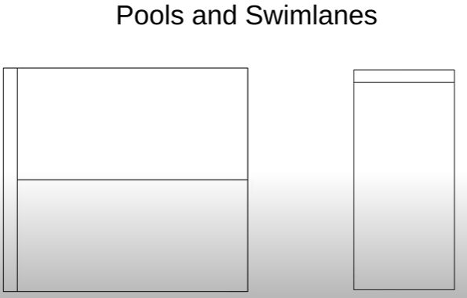
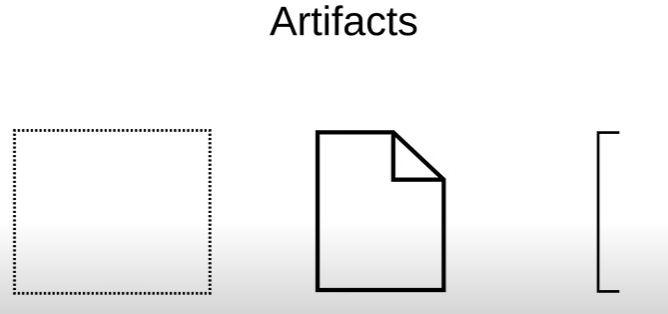
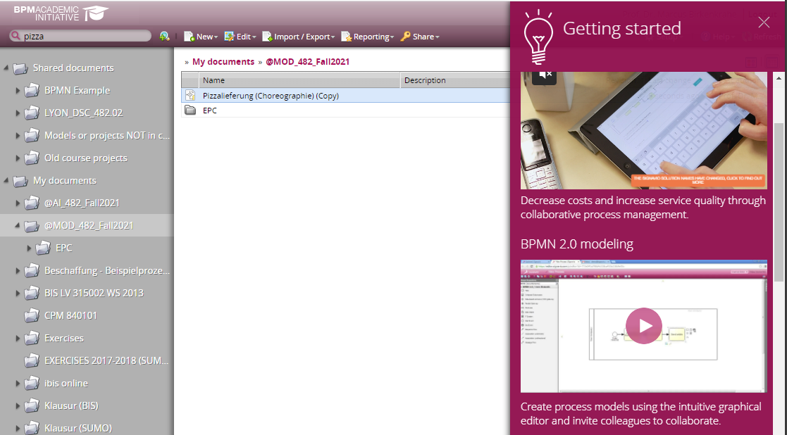
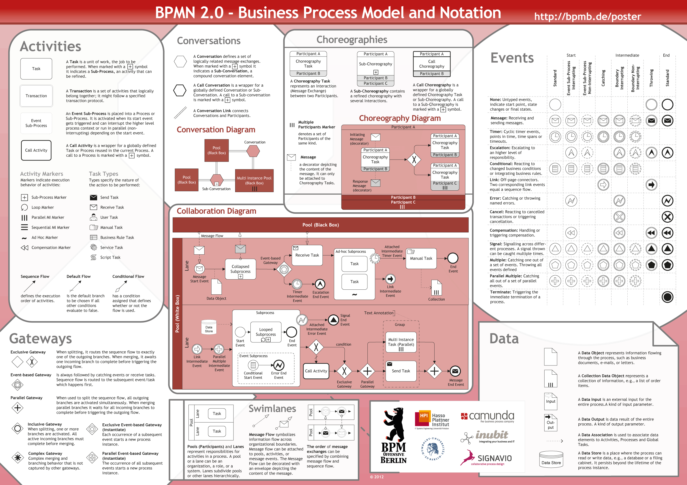
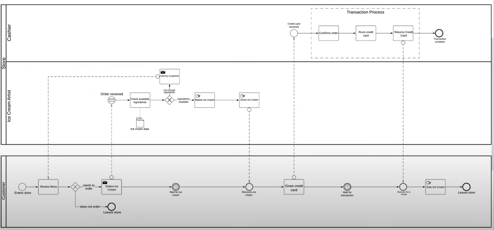
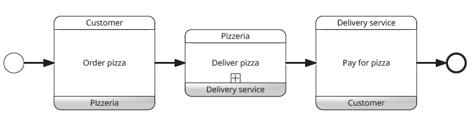
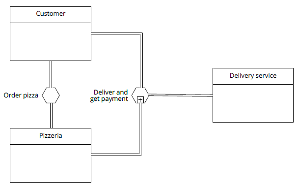

# Table of Contents

-   [What will you learn?](#org8e40d92)
-   [BPMN object summary](#org2bbf21e)
    -   [Flow objects (Action/Decision)](#org6408e36)
    -   [Connecting objects (Communication)](#org3bd5cd9)
    -   [Participants (Roles/Accountability)](#org4651af5)
    -   [Artifacts (Details)](#org9daa5ba)
    -   [More information](#orgcab3266)
-   [BPMN case](#orgdee77c4)
-   [Pizza example](#orgf33d197)
    -   [Choreography](#org9f69476)
    -   [Collaboration](#orgdd684ef)
    -   [Enterprise modeling with BPMN](#org8b52e1c)
-   [Practice](#org0fceccd)
    -   [BPMN rules](#orge2d1930)
    -   [BPMN diagram with mistakes](#orgfab94b0)
    -   [Build your first own BPMN diagram](#orgb6c1d5e)
    -   [Homework](#orgb4ef083)
-   [References](#org5169422)

# What will you learn?

-   Business Process Model and Notation
-   Object-oriented process modeling
-   Practice in the Signavio Process Editor

# BPMN object summary

Business Process Model and Notation (BPMN) 2.0 has four main groups
of shapes or objects. Source: [Lucidchart, 2020](#org2577723).

## Flow objects (Action/Decision)

## Connecting objects (Communication)

## Participants (Roles/Accountability)

## Artifacts (Details)

-   Groups
-   Documents
-   Annotation
-   Message (data)

## More information

For Signavio Process Manager, open the "Getting started" sidebar
inside the Process Manager explorer window under "Help".

[This Signavio document](https://documentation.signavio.com/suite/en-us/Content/process-manager/userguide/bpmn/modeling.htm) gives a complete, structured account of all
the most relevant aspects of BPMN with many examples (SAP Signavio,
2021).

[This guide from Camunda](https://camunda.com/bpmn/reference/) (with link to a free BPMN online editor),
is also very good and complete.

*Image: complete list of BPMN symbols and rules ([Signavio](https://www.signavio.com/downloads/short-reads/free-bpmn-2-0-poster/)*[OneDrive](https://1drv.ms/u/s!AhEvK3qWokrvwUVBiCQluz4dwFlM))/

# BPMN case

Creating and explaining this model takes about as much time as
eating a big icecream (7 min) - [Link](https://youtu.be/BwkNceoybvA?t=346).

# Pizza example

## Choreography

## Collaboration

## Enterprise modeling with BPMN

# Practice

## BPMN rules

<table border="2" cellspacing="0" cellpadding="6" rules="groups" frame="hsides">

<colgroup>
<col  class="org-right" />

<col  class="org-left" />
</colgroup>
<thead>
<tr>
<th scope="col" class="org-right">NO.</th>
<th scope="col" class="org-left">BPMN MODELING RULE</th>
</tr>
</thead>

<tbody>
<tr>
<td class="org-right">1</td>
<td class="org-left">Every participant gets a pool or a lane inside a pool</td>
</tr>

<tr>
<td class="org-right">2</td>
<td class="org-left">Every pool contains exactly one process</td>
</tr>

<tr>
<td class="org-right">3</td>
<td class="org-left">A process has at least one start and one end event</td>
</tr>

<tr>
<td class="org-right">4</td>
<td class="org-left">Sequence flow (Action) flows only within pools</td>
</tr>

<tr>
<td class="org-right">5</td>
<td class="org-left">Message flow (Communication) flows only between pools</td>
</tr>

<tr>
<td class="org-right">6</td>
<td class="org-left">All process elements must be named</td>
</tr>

<tr>
<td class="org-right">7</td>
<td class="org-left">Decision points (exclusive gateways) have questions</td>
</tr>

<tr>
<td class="org-right">8</td>
<td class="org-left">Actors with little to do can become additional participants</td>
</tr>

<tr>
<td class="org-right">9</td>
<td class="org-left">Split or joined sequence flows need gateways</td>
</tr>

<tr>
<td class="org-right">10</td>
<td class="org-left">Opened gateways must be closed</td>
</tr>
</tbody>
</table>

## BPMN diagram with mistakes

## Build your first own BPMN diagram

## Homework

# References

 Lucidchart (Apr 28, 2020). Business Process Model and
Notation (BPMN) 2.0 Tutorial [video]. [Online: youtube.com](https://youtu.be/BwkNceoybvA).

 SAP Signavio Process editor version 15.7.1. SAP
(2021). Academic edition [platform]. Online: [www.signavio.com.](https://www.signavio.com/)

 SAP Signavio (n.d.). BPMN modeling [website]. [Online:
signavio.com](https://documentation.signavio.com/suite/en-us/Content/process-manager/userguide/bpmn/modeling.htm)

