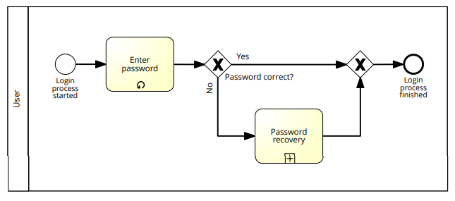

# Table of Contents

-   [What will you learn?](#org16d5496)
-   [BPMN object summary](#orgc00285d)
    -   [Flow objects (Action/Decision)](#org2e7b450)
    -   [Connecting objects (Communication)](#org35a8bf1)
    -   [Participants (Roles/Accountability)](#org6f0c634)
    -   [Artifacts (Details)](#org7f90ea4)
    -   [More information](#org9c4719f)
-   [BPMN case studies](#org5f37f9d)
    -   [Eating icecream](#orgd56932a)
    -   [Job application process](#org381da70)
    -   [IT service](#orgf8b3150)
-   [Pizza example](#orgfba434d)
    -   [Choreography](#org99200f7)
    -   [Collaboration](#orgeb85332)
    -   [Enterprise modeling with BPMN](#org690ee01)
-   [Practice I](#org7a36882)
    -   [BPMN rules](#orgcab0765)
    -   [BPMN diagram with mistakes](#orgab86628)
        -   [Problem](#org526d271)
        -   [Solution](#orgce553e4)
    -   [Assignment (complete by Nov 2, 2.30 pm)](#orga206da6)
-   [Practice II - model simple processes](#orgaa7a6c3)
    -   [Written BPMN test on November 4 at 2.30 pm](#org8bcbec1)
    -   [Assignment: Job application process](#org7a9ade4)
        -   [Problem](#orga21fd45)
        -   [Solution](#org478b4b1)
    -   [Assignment: Build your first own BPMN diagram](#org344b328)
        -   [Problem](#org97c757f)
        -   [Solution](#org45257ed)
    -   [Convert an EPC to a BPMN diagram](#orgcccb655)
        -   [Problem](#org42882ae)
        -   [Solution](#orgf7381ed)
    -   [Car purchase process](#org47a4848)
        -   [Problem](#org343fda2)
    -   [Practice session process](#org00d3aa8)
        -   [Problem](#org95190bd)
    -   [Supply chain process](#orgc92bde2)
        -   [Problem](#orgc4dcfeb)
-   [Modeling a system](#org2066a07)
    -   [Understand the problem](#org8f6c165)
    -   [Create the model](#orgd26e37f)
    -   [Run a simulation](#org33b4efe)
-   [References](#orgd77e83e)

# What will you learn?

-   Business Process Model and Notation
-   Object-oriented process modeling
-   Practice in the Signavio Process Editor

# BPMN object summary

Business Process Model and Notation (BPMN) 2.0 has four main groups
of shapes or objects. Source: [Lucidchart, 2020](#orgcbee69d).

## Flow objects (Action/Decision)

## Connecting objects (Communication)

## Participants (Roles/Accountability)

## Artifacts (Details)

-   Groups
-   Documents
-   Annotation
-   Message (data)

## More information

For Signavio Process Manager, open the "Getting started" sidebar
inside the Process Manager explorer window under "Help".

[This Signavio document](https://documentation.signavio.com/suite/en-us/Content/process-manager/userguide/bpmn/modeling.htm) gives a complete, structured account of all
the most relevant aspects of BPMN with many examples (SAP Signavio,
2021).

[This guide from Camunda](https://camunda.com/bpmn/reference/) (with link to a free BPMN online editor),
is also very good and complete.

# BPMN case studies

## Eating icecream

Creating and explaining this model takes about as much time as
eating a big icecream (7 min) - [Link](https://youtu.be/BwkNceoybvA?t=346).

## Job application process

Part 1: demonstration of creating a simple BPMN workflow for an
application process. The software used here is irrelevant - you're
still using the BPMN standard and you can recreate these models in
a process modeling editor of your choice - bpmn.io, signavio, ARIS
or even MS Visio will do. Source: Aptero Solutions, 2011.

Youtube: <https://youtu.be/WtOzW8Ck5LY>

Part 2: in this demonstration, which follows on part 1, you see how
to implement the concept of multiple pools and message flow across
pools using the same example as before, an application process. The
process participants involved are: the applicant and the HR
department of a company. Source: Aptero Solutions, 2011.

Youtube: <https://youtu.be/B5H2K8wcBGU>

## IT service

This example is (for now) only available in German.

Video: [BPMN 2.0 Prozessmodell in Signavio erzeugen.](https://youtu.be/kYK9t8fPkAY)

# Pizza example

## Choreography

## Collaboration

## Enterprise modeling with BPMN

[GitHub: Enterprise Modeling with BPMN (PDF)](https://github.com/birkenkrahe/mod482/blob/main/10_bpmn/bpmn_modeling.pdf)

# Practice I

## BPMN rules

<table border="2" cellspacing="0" cellpadding="6" rules="groups" frame="hsides">

<colgroup>
<col  class="org-right" />

<col  class="org-left" />
</colgroup>
<thead>
<tr>
<th scope="col" class="org-right">NO.</th>
<th scope="col" class="org-left">BPMN MODELING RULE</th>
</tr>
</thead>

<tbody>
<tr>
<td class="org-right">1</td>
<td class="org-left">Every participant gets a pool or a lane inside a pool</td>
</tr>

<tr>
<td class="org-right">2</td>
<td class="org-left">Every pool contains exactly one process</td>
</tr>

<tr>
<td class="org-right">3</td>
<td class="org-left">A process has at least one start and one end event</td>
</tr>

<tr>
<td class="org-right">4</td>
<td class="org-left">Sequence flow (Action) flows only within pools</td>
</tr>

<tr>
<td class="org-right">5</td>
<td class="org-left">Message flow (Communication) flows only between pools</td>
</tr>

<tr>
<td class="org-right">6</td>
<td class="org-left">All process elements must be named</td>
</tr>

<tr>
<td class="org-right">7</td>
<td class="org-left">Decision points (exclusive gateways) have questions</td>
</tr>

<tr>
<td class="org-right">8</td>
<td class="org-left">Actors with little to do can become additional participants</td>
</tr>

<tr>
<td class="org-right">9</td>
<td class="org-left">Split or joined sequence flows need gateways</td>
</tr>

<tr>
<td class="org-right">10</td>
<td class="org-left">Opened gateways must be closed</td>
</tr>
</tbody>
</table>

BPMN has slightly different rules than EPC. In addition, because
it is primarily (though not only - see process mining and BPEL)
for human consumption, the style of a diagram carries extra weight:

<table border="2" cellspacing="0" cellpadding="6" rules="groups" frame="hsides">

<colgroup>
<col  class="org-left" />
</colgroup>
<tbody>
<tr>
<td class="org-left">BPMN diagrams should be readable</td>
</tr>

<tr>
<td class="org-left">BPMN diagrams can be infinite in size</td>
</tr>

<tr>
<td class="org-left">BPMN diagrams run from the left to the right</td>
</tr>

<tr>
<td class="org-left">BPMN diagrams avoid loops (instead: attributes)</td>
</tr>

<tr>
<td class="org-left">BPMN diagrams distinguish action and communication</td>
</tr>
</tbody>
</table>

Here is a complete EPC "cheat sheet" (Source: SAP Signavio)

## BPMN diagram with mistakes

### Problem

Which rule violations can you see in the following diagram
(GitHub)? The total number is<a id="fnr.1" class="footref" href="#fn.1">1</a> = 8 errors - I count a total of
11 additional rule violations. So the total is closer to 20.

### Solution

1.  Pool name must be actor or organization
2.  Between pools only message flows
3.  Collapsed pool needs a name
4.  Whole process must be inside pool
5.  Inside pools only sequence flows
6.  Only one start event per pool
7.  Only one end event per pool
8.  Default flow only after exclusive gateway
9.  Bi-directional association serves no purpose here
10. "No" as flow title, and question at exclusive gateway missing
11. Receiving intermediate message event wrongly named
12. Task name missing
13. End event name missing
14. Sending end event neds to send something
15. Need gateway here (flow splits)
16. Start event need title
17. Task needs title
18. Task needs title
19. Artifact needs title
20. Swimline needs title

## Assignment (complete by Nov 2, 2.30 pm)

-   Review the rules using [this online lesson](https://h5p.org/node/1138751) (<https://h5p.org/node/1138751>)
-   Complete the summary quiz at the end of the lesson.
-   Watch both videos at the end (`Job application`, 20 min)
-   Rebuild the diagram in Signavio as a `new>>BPMN 2.0 diagram`
    while you watch
-   Save them in your personal folder in `Shared Documents`
-   Share the diagram with me using the `Share>>Invite for feedback` tab
-   Enter `birkenkrahe@lyon.edu` and check `Send a copy to me` for
    proof - as shown in the image.
    
    

# Practice II - model simple processes

## Written BPMN test on November 4 at 2.30 pm

Topics:

-   BPMN objects
-   BPMN rules and rule violations
-   BPMN workflow

## Assignment: Job application process

### Problem

-   Review the rules using this online lesson
    (<https://h5p.org/node/1138751>)
-   Complete the summary quiz at the end of the lesson.
-   Watch both videos at the end ("Job application", 20 min)
-   Rebuild the diagram for the **Applicant** only (= 1 pool) in
    Signavio as a BPMN 2.0 diagram while you watch the first
    video. For the second video, rebuild only the diagram that is
    finished after 7 minutes\* (= complete applicant process with
    message flows to the collapsed recruiter pool).
-   I made [this short screencast](https://youtu.be/l6-fCtOXin4) to help you get started.
-   Save the diagram in your personal folder in "Shared Documents"
-   Share the diagram with me using the "Share>>Invite for feedback"
    tab
-   Enter "birkenkrahe@lyon.edu" and check "Send a copy to me" for
    proof (as shown below)

\*) the complete model that is shown is unfortunately not very
good. I'll share my complete, rule-compliant solution with you in
class. Though BPMN 2.0 did exist in 2011, the diagram owes too much to
version 1.0.

### Solution

-   Applicant - happy path process

    ([Signavio](https://academic.signavio.com/p/editor?id=86d64600d0624b6cb17d7d81d2ef9bb5))
    
    

-   Applicant - complete process

    ([Signavio](https://academic.signavio.com/p/editor?id=d82bf0c4c92248e89874950b78ff23b0))
    
    <table border="2" cellspacing="0" cellpadding="6" rules="groups" frame="hsides">
    
    
    <colgroup>
    <col  class="org-left" />
    </colgroup>
    <tbody>
    <tr>
    <td class="org-left">Above: model in video</td>
    </tr>
    
    
    <tr>
    <td class="org-left">Below: rule compliant model</td>
    </tr>
    </tbody>
    </table>
    
    

-   Recruiter - happy path process

    ([Signavio](https://academic.signavio.com/p/editor?id=2ff1f18657664833af590c6fc7aefbfc))
    
    

-   Applicant and recruiter - happy path process

    ([Signavio](https://academic.signavio.com/p/editor?id=8ce1e76269aa48a3a7d646f29b3caebd))
    
    

-   Recruiter - complete process

    ([Signavio](https://academic.signavio.com/p/editor?id=39830914287c4e658b5bf49584ba1c58))
    
    <table border="2" cellspacing="0" cellpadding="6" rules="groups" frame="hsides">
    
    
    <colgroup>
    <col  class="org-left" />
    </colgroup>
    <tbody>
    <tr>
    <td class="org-left">Above: model in video</td>
    </tr>
    
    
    <tr>
    <td class="org-left">Below: rule compliant model</td>
    </tr>
    </tbody>
    </table>
    
    

-   Applicant (complete process) / Recruiter (collapsed process)

    ([Signavio](https://academic.signavio.com/p/editor?id=3be88a96f306465cbb6a0dc486e0f726))
    
    

-   Applicant and recruiter - complete collaborative process

    ([Signavio](https://academic.signavio.com/p/editor?id=e377cc9506544985b3c4978347b72f64))
    
    

## Assignment: Build your first own BPMN diagram

### Problem

Here is my (recommended) BPMN modeling workflow.

<table border="2" cellspacing="0" cellpadding="6" rules="groups" frame="hsides">

<colgroup>
<col  class="org-right" />

<col  class="org-left" />

<col  class="org-left" />
</colgroup>
<thead>
<tr>
<th scope="col" class="org-right">NO.</th>
<th scope="col" class="org-left">STEP</th>
<th scope="col" class="org-left">ACTION</th>
</tr>
</thead>

<tbody>
<tr>
<td class="org-right">1</td>
<td class="org-left">Who are the actors (organizational units)?</td>
<td class="org-left">Pools and lanes</td>
</tr>

<tr>
<td class="org-right">2</td>
<td class="org-left">What are the start and end events?</td>
<td class="org-left">Gather them</td>
</tr>

<tr>
<td class="org-right">3</td>
<td class="org-left">Which other events or tasks are there?</td>
<td class="org-left">Gather them</td>
</tr>

<tr>
<td class="org-right">4</td>
<td class="org-left">Is there any communication?</td>
<td class="org-left">Add message flow</td>
</tr>

<tr>
<td class="org-right">5</td>
<td class="org-left">What is the happy path?</td>
<td class="org-left">Model it</td>
</tr>

<tr>
<td class="org-right">6</td>
<td class="org-left">Can any events or tasks be parallelized?</td>
<td class="org-left">Add gateways</td>
</tr>

<tr>
<td class="org-right">7</td>
<td class="org-left">Which decisions or changes are involved?</td>
<td class="org-left">Add gateways</td>
</tr>

<tr>
<td class="org-right">8</td>
<td class="org-left">Anything else?</td>
<td class="org-left">Add it</td>
</tr>

<tr>
<td class="org-right">9</td>
<td class="org-left">Check model</td>
<td class="org-left">Spell checker</td>
</tr>

<tr>
<td class="org-right">10</td>
<td class="org-left">Save and share model diagram</td>
<td class="org-left">Save and share</td>
</tr>
</tbody>
</table>

-   Turn this workflow into a BPMN diagram. It begins with the start
    event "Modeling begins"
-   You should at least complete the happy path model. If you're up
    to it, add gateway points (identify where gateways may be placed)
-   Make sure you save the happy path model before creating a more
    detailed model
-   Save the diagram(s) in your personal folder in Shared Documents
-   Share the diagram with me using the "Share>>Invite to edit" tab

### Solution

## Convert an EPC to a BPMN diagram

### Problem

You saw this diagram [in the lecture on modeling and EPCs](https://github.com/birkenkrahe/mod482/tree/main/9_modeling_epc#flow).

Unfortunately, this diagram violates an EPC rule. Can you tell
which one? I've cleaned it up (also avoiding the loop but
retaining all the important information) in the diagram
below. Convert this diagram into a BPMN 2.0 diagram!

For simplicity use only BPMN 2.0 **core** elements (i.e. no
intermediate events). But you can overload tasks with a `loop`
attribute and set a `loop maximum` value by opening the
`Attributes|Views` sidepanel on the right side of the editor.

### Solution

Solution 1 is a straigthforward translation:

-   The Organizational Unit `User` becomes a pool
-   The events are replaced by gateway outflows
-   The process interface is integrated in the process (this has the
    advantage that the diagram shows the escalation structure
    clearly).
-   If more than one wrong password entry is allowed, the diagram
    must be expanded. That's a limitation.
    
    

Solution 2 deals with this limitation: the `Enter password` task
is looped. A loop parameter (`loop maximum`) is set and can be
changed. Now the diagram is generalized.

## Car purchase process

### Problem

Model the following process using BPMN 2.0:

> A customer wants to buy a car. He goes to a car dealer to pick a
> car. The dealer has several new, and one used car available. The
> customer picks one, pays for the car, and leaves. She's happy now!

*Tip: you don't need two pools for this process, because the
dealer doesn't have much to do.*

## Practice session process

### Problem

Model the following process using BPMN 2.0:

> The professor demonstrates the modeling language BPMN. After the
> demonstration, he assigns an exercise to the students. Once the
> assignment is completed, the student submits the solution. The
> professor checks the result before ending the class.

*Tip: model the professor first, then add the student as a second
pool.*

## Supply chain process

### Problem

Model the following supply chain process using BPMN 2.0:

> The process begins with a material purchase request, the Resource
> Manager issues a material requisition. Next, Purchasing issues a
> purchase order for the requested material. When the receipt of the
> purchased items has been received by the Resource Manager, the
> Warehouse inspects the items. Now, Accounting processes the
> vendor’s invoice and the purchase process is finished.

*Tip: think about the number of lanes or pools that you need.*

# Modeling a system

This brief example motivates the use of UML over EPCs and BPMN. It's
not that modeling cannot be done, but there are limits when it comes
to process optimization, or shared model view (two key benefits of
modeling), because we're describing a system design, not a process
model<a id="fnr.2" class="footref" href="#fn.2">2</a>.

## Understand the problem

Convert the design of a "simple reflex agent" (like a vacuum robot,
from [AIMA](#org79043c4)) into a standardized process model. Use either EPCs or
BPMN 2.0. Your input: pseudocode + non-standard diagram.

This agent acts according to a `rule` whose condition matches the
current `state`, as defined by the `percept` (input signals).

Pseudocode:

Figure:

## Create the model

This BPMN model is based on the pseudocode more than on the
diagram:

This BPMN model is based on the diagram more than on the
pseudocode:

## Run a simulation

One of the tests for a good model is to run a "simulation": go
through the process with known input values and obtain known output
values. This is the same procedure used to e.g. improve machine
learning models during training and testing phases.

Here is an example `percept~/~action` sequence for a vacuum robot
whose `world` consists of two adjacent areas A and B that are
either dirty or clean:

<table border="2" cellspacing="0" cellpadding="6" rules="groups" frame="hsides">

<colgroup>
<col  class="org-left" />

<col  class="org-left" />

<col  class="org-left" />
</colgroup>
<thead>
<tr>
<th scope="col" class="org-left"><code>percept</code></th>
<th scope="col" class="org-left"><code>action</code></th>
<th scope="col" class="org-left">Interpretation</th>
</tr>
</thead>

<tbody>
<tr>
<td class="org-left"><code>[A,dirty]</code></td>
<td class="org-left"><code>suck</code></td>
<td class="org-left">Area <code>A</code> is <code>dirty</code>, <code>suck</code> to clean</td>
</tr>

<tr>
<td class="org-left"><code>[A,clean]</code></td>
<td class="org-left"><code>right</code></td>
<td class="org-left">Area <code>A</code> is <code>clean</code>, move <code>right</code> to <code>B</code></td>
</tr>

<tr>
<td class="org-left"><code>[B,dirty]</code></td>
<td class="org-left"><code>suck</code></td>
<td class="org-left">Area <code>B</code> is <code>dirty</code>, <code>suck</code> to clean</td>
</tr>

<tr>
<td class="org-left"><code>[B,clean]</code></td>
<td class="org-left"><code>left</code></td>
<td class="org-left">Area <code>B</code> is <code>clean</code>, move <code>left</code> to <code>A</code></td>
</tr>

<tr>
<td class="org-left"><code>[A,clean],[A,clean]</code></td>
<td class="org-left"><code>right</code></td>
<td class="org-left">Do nothing, then move <code>right</code></td>
</tr>

<tr>
<td class="org-left"><code>[A,clean],[A,dirty]</code></td>
<td class="org-left"><code>suck</code></td>
<td class="org-left">Do nothing, then <code>suck</code></td>
</tr>
</tbody>
</table>

The table continues ad infinitum with arbitrarily long `precept`
sequences.

# References

 Russell/Norvig (2021). AI - A Modern
Approach. Pearson. [URL: berkeley.edu](http://aima.cs.berkeley.edu/).

 Lucidchart (Apr 28, 2020). Business Process Model and
Notation (BPMN) 2.0 Tutorial [video]. [Online: youtube.com](https://youtu.be/BwkNceoybvA).

 SAP Signavio Process editor version 15.7.1. SAP
(2021). Academic edition [platform]. Online: [www.signavio.com.](https://www.signavio.com/)

 SAP Signavio (n.d.). BPMN modeling [website]. [Online:
signavio.com](https://documentation.signavio.com/suite/en-us/Content/process-manager/userguide/bpmn/modeling.htm)

# Footnotes

<a id="fn.1" href="#fnr.1">1</a> According to the Signavio "spell checker" for BPMN 2.0 diagrams.

<a id="fn.2" href="#fnr.2">2</a> We identified the following process elements: events, roles,
activities, flows. But the modeling of processes depends on knowing
the environment and the algorithms. Modeling methods that overcome the
implicit limits include: UML, and process mining.
