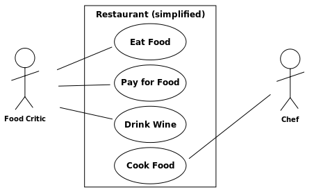

# Table of Contents

-   [What will you learn?](#org9ba2ea1)
-   [What is UML?](#orga19583b)
    -   [UML vs. Flowcharts vs. EPC vs. BPMN](#orgcc59a76)
    -   [How UML came about](#org3f5ccc9)
    -   [How do you use UML?](#orgb8600cd)
        -   [Software engineering views](#org9e31e1d)
    -   [UML diagram overview](#org9788c03)
        -   [Structure diagrams](#orgcf79a0b)
        -   [Behavior diagrams](#org487ba21)
    -   [Case study: airport](#org66ef5cc)
        -   [Use case diagrams: issuing a boarding pass](#org83877e5)
        -   [Activity diagrams: checking in](#org6faeedd)
        -   [Sequence diagrams: check in and boarding](#org611d17e)
        -   [Package diagram: organisational units](#org34dc3bd)
        -   [Class diagram: Passenger services](#orge5e20fb)
-   [Discussion - whaddayathink?](#org7d691ec)
-   [Use case diagrams](#orgf7a339c)
    -   [Use case elements](#orgd5baf4d)
        -   [Actors](#orgfd6d692)
        -   [Use cases](#orgc776a6a)
        -   [Communication lines](#org1743df9)
        -   [System boundaries](#orgf5f1faa)
        -   [Descriptions](#orga34ea66)
        -   [Relationships](#orgfe9a0fb)
        -   [Overview diagrams](#orgb131f17)
-   [Practice](#orgc664541)
    -   [Find mistakes in a use case diagram](#orgc4ca842)
    -   [As-is and to-be use case diagrams](#org0f08774)
    -   [Create a use case from simple requirements](#org11cc552)
    -   [Create a use case for the term project](#org012f667)
    -   [Transfer a EPC/BPMN into an UML use case diagram](#orgaac8e22)
    -   ["Hello world" as use case diagram](#org46f47b4)
-   [References](#orgc395b9b)

# What will you learn?

-   What is UML?
-   How do you use UML in practice?
-   What are the main UML diagrams?
-   What are use case diagrams?
-   UML case study (airport systems)
-   Use case diagrams (requirements analysis/outside view)
-   UML practice (use case only)

# What is UML?

## UML vs. Flowcharts vs. EPC vs. BPMN

<table border="2" cellspacing="0" cellpadding="6" rules="groups" frame="hsides">

<colgroup>
<col  class="org-left" />

<col  class="org-left" />

<col  class="org-left" />

<col  class="org-left" />
</colgroup>
<thead>
<tr>
<th scope="col" class="org-left">Diagram</th>
<th scope="col" class="org-left">Purpose</th>
<th scope="col" class="org-left">Example</th>
<th scope="col" class="org-left">Where</th>
</tr>
</thead>

<tbody>
<tr>
<td class="org-left">Flowcharts</td>
<td class="org-left">Model flow</td>
<td class="org-left">Programming loop</td>
<td class="org-left">Programming</td>
</tr>

<tr>
<td class="org-left">EPC</td>
<td class="org-left">Model transactions</td>
<td class="org-left">Credit card check</td>
<td class="org-left">Bank</td>
</tr>

<tr>
<td class="org-left">BPMN</td>
<td class="org-left">Model process with communication</td>
<td class="org-left">IT support communication</td>
<td class="org-left">IT Service</td>
</tr>

<tr>
<td class="org-left">UML</td>
<td class="org-left">Model systems and processes</td>
<td class="org-left">Infrastructure and services</td>
<td class="org-left">Airport</td>
</tr>
</tbody>
</table>

In UML, one can also model static systems (without flow).

## How UML came about

<table border="2" cellspacing="0" cellpadding="6" rules="groups" frame="hsides">

<colgroup>
<col  class="org-left" />

<col  class="org-left" />

<col  class="org-left" />

<col  class="org-left" />
</colgroup>
<thead>
<tr>
<th scope="col" class="org-left">Time frame</th>
<th scope="col" class="org-left">Paradigm</th>
<th scope="col" class="org-left">Problem</th>
<th scope="col" class="org-left">Solution</th>
</tr>
</thead>

<tbody>
<tr>
<td class="org-left">Until 1970s</td>
<td class="org-left">Software creation is an art</td>
<td class="org-left">Complexity crisis</td>
<td class="org-left">Engineering</td>
</tr>

<tr>
<td class="org-left">Until 1980s</td>
<td class="org-left">Split data and procedures</td>
<td class="org-left">Fragmentation</td>
<td class="org-left">ERD / Petri Nets</td>
</tr>

<tr>
<td class="org-left">Until 1990s</td>
<td class="org-left">Object orientation</td>
<td class="org-left">Reusability</td>
<td class="org-left">UML 0.9<a id="fnr.1" class="footref" href="#fn.1">1</a></td>
</tr>

<tr>
<td class="org-left">Since 2005</td>
<td class="org-left">Integrated modeling</td>
<td class="org-left">Standardisation</td>
<td class="org-left">UML 2.0 (OMG)<a id="fnr.2" class="footref" href="#fn.2">2</a></td>
</tr>
</tbody>
</table>

## How do you use UML?

<table border="2" cellspacing="0" cellpadding="6" rules="groups" frame="hsides">

<colgroup>
<col  class="org-left" />

<col  class="org-left" />
</colgroup>
<tbody>
<tr>
<td class="org-left">UML as a sketch</td>
<td class="org-left">Convey key points, then throw away</td>
</tr>

<tr>
<td class="org-left">UML as a blueprint</td>
<td class="org-left">Detailed system specification. Use UML tool. Reverse and forward engineering to keep model in line with system. Turn portions of model into code.</td>
</tr>

<tr>
<td class="org-left">UML as a programming language</td>
<td class="org-left">Go from UML model to executable code: every aspect of the system is modeled. Model enables deployment to different environments.</td>
</tr>
</tbody>
</table>

### Software engineering views

*Image: [Phillippe Kruchten's 4+1 view software engineering model](https://en.wikipedia.org/wiki/4%2B1_architectural_view_model)*

<table border="2" cellspacing="0" cellpadding="6" rules="groups" frame="hsides">

<colgroup>
<col  class="org-left" />

<col  class="org-left" />

<col  class="org-left" />
</colgroup>
<thead>
<tr>
<th scope="col" class="org-left">VIEW</th>
<th scope="col" class="org-left">WHAT IS IT</th>
<th scope="col" class="org-left">UML Diagrams</th>
</tr>
</thead>

<tbody>
<tr>
<td class="org-left">Logical view</td>
<td class="org-left">Abstract description of system's parts and their interactions (logic)</td>
<td class="org-left">class, object, state machine, interaction</td>
</tr>

<tr>
<td class="org-left">Process view</td>
<td class="org-left">Describes processes within the system and what might happen (simulation)</td>
<td class="org-left">activity</td>
</tr>

<tr>
<td class="org-left">Development view</td>
<td class="org-left">Describes how system's parts are organized into modules and components, and how they are layered (architecture)</td>
<td class="org-left">package, component</td>
</tr>

<tr>
<td class="org-left">Physical view</td>
<td class="org-left">Describes how system is transferred to the real world (deployment)</td>
<td class="org-left">deployment</td>
</tr>

<tr>
<td class="org-left">Use case view</td>
<td class="org-left">Describes the system functionality from an outside perspective - what the system is supposed to do. Guides all other views (requirements)</td>
<td class="org-left">use case, interaction overview</td>
</tr>
</tbody>
</table>

## UML diagram overview

-   Watch the video: [UML Diagrams Full Course](https://youtu.be/WnMQ8HlmeXc) ([freeCodeCamp.org,
    2021](#orgdc23419)) - especially the overview (first 10 minutes)

### Structure diagrams

<table border="2" cellspacing="0" cellpadding="6" rules="groups" frame="hsides">

<colgroup>
<col  class="org-left" />

<col  class="org-left" />

<col  class="org-left" />
</colgroup>
<thead>
<tr>
<th scope="col" class="org-left">STRUCTURE DIAGRAMS</th>
<th scope="col" class="org-left">WHAT IS IT</th>
<th scope="col" class="org-left">EXAMPLE</th>
</tr>
</thead>

<tbody>
<tr>
<td class="org-left">Class diagram</td>
<td class="org-left">Classes, types, interfaces, and the relationships between them</td>
<td class="org-left"><a href="https://github.com/birkenkrahe/mod482/blob/main/11_uml/img/class.png">Order processing system</a></td>
</tr>

<tr>
<td class="org-left">Component diagram</td>
<td class="org-left">Structural relationship of important components within your system</td>
<td class="org-left"><a href="https://github.com/birkenkrahe/mod482/blob/main/11_uml/img/component.png">Automatic Teller Machine (ATM)</a></td>
</tr>

<tr>
<td class="org-left">Deployment diagram</td>
<td class="org-left">Hardware and software across multiple machines in a realworld situation</td>
<td class="org-left"><a href="https://github.com/birkenkrahe/mod482/blob/main/11_uml/img/deployment.png">Web application</a></td>
</tr>

<tr>
<td class="org-left">Object (instance) diagram</td>
<td class="org-left">Object instances of the classes defined in class diagrams in configurations that are important to your system</td>
<td class="org-left"><a href="https://github.com/birkenkrahe/mod482/blob/main/11_uml/img/object.jpg">Order processing system (with data)</a></td>
</tr>

<tr>
<td class="org-left">Package diagram</td>
<td class="org-left">Dependencies between software packages and the hierarchical organization of groups of classes and components</td>
<td class="org-left"><a href="https://github.com/birkenkrahe/mod482/blob/main/11_uml/img/package.png">Web application</a></td>
</tr>

<tr>
<td class="org-left">Profile diagram</td>
<td class="org-left">Customize UML to your case using <code>&lt;&lt;stereotype&gt;&gt;</code></td>
<td class="org-left"><a href="https://github.com/birkenkrahe/mod482/blob/main/11_uml/img/profile.png">Server classes</a></td>
</tr>

<tr>
<td class="org-left">Composite structure diagram</td>
<td class="org-left">The internals of a class or component, and class relationships within a given context</td>
<td class="org-left"><a href="https://github.com/birkenkrahe/mod482/blob/main/11_uml/img/composite.jpg">School class</a></td>
</tr>
</tbody>
</table>

### Behavior diagrams

<table border="2" cellspacing="0" cellpadding="6" rules="groups" frame="hsides">

<colgroup>
<col  class="org-left" />

<col  class="org-left" />

<col  class="org-left" />
</colgroup>
<thead>
<tr>
<th scope="col" class="org-left">BEHAVIOR DIAGRAMS</th>
<th scope="col" class="org-left">WHAT IS IT</th>
<th scope="col" class="org-left">EXAMPLE</th>
</tr>
</thead>

<tbody>
<tr>
<td class="org-left">Use case diagram</td>
<td class="org-left">Interactions between your system and users or other external systems. Helpful to map requirements.</td>
<td class="org-left"><a href="https://github.com/birkenkrahe/mod482/blob/main/11_uml/img/usecase.png">Broadcasting System</a></td>
</tr>

<tr>
<td class="org-left">Activity diagram</td>
<td class="org-left">Sequential and parallel activities within your system (functions)</td>
<td class="org-left"><a href="https://github.com/birkenkrahe/mod482/blob/main/11_uml/img/activity.jpg">Enter PIN</a></td>
</tr>

<tr>
<td class="org-left">State machine diagram</td>
<td class="org-left">The state of an object throughout its lifetime and the events that can change that state</td>
<td class="org-left"><a href="https://github.com/birkenkrahe/mod482/blob/main/11_uml/img/state.png">Game states</a></td>
</tr>

<tr>
<td class="org-left">Sequence diagram</td>
<td class="org-left">Interactions between objects where the order of the interactions is important</td>
<td class="org-left"><a href="https://github.com/birkenkrahe/mod482/blob/main/11_uml/img/sequence.png">ATM scenario</a></td>
</tr>

<tr>
<td class="org-left">Communication (collaboration) diagram</td>
<td class="org-left">The ways in which objects interact and the connections that are needed to support that interaction</td>
<td class="org-left"><a href="https://github.com/birkenkrahe/mod482/blob/main/11_uml/img/communication.png">Bank transaction</a></td>
</tr>

<tr>
<td class="org-left">Timing diagram</td>
<td class="org-left">Interactions between objects where timing is an important concern</td>
<td class="org-left"><a href="https://github.com/birkenkrahe/mod482/blob/main/11_uml/img/timing.png">Car park</a></td>
</tr>

<tr>
<td class="org-left">Interaction overview diagram</td>
<td class="org-left">Used to collect sequence, communication, and timing diagrams to capture an important interaction that occurs within your system</td>
<td class="org-left"><a href="https://github.com/birkenkrahe/mod482/blob/main/11_uml/img/interaction.png">Online shopping</a></td>
</tr>
</tbody>
</table>

## Case study: airport

Airports are complicated. Though it does not always go like this:
watch the [video](https://youtu.be/gWYTnc7m9mE) of a 21st century public project scandal. ([DW 2020](#orge26663c))

Some services in an airport:

Three relevant models:

1.  Business system model (passenger services)
2.  IT systems model (enabling passenger services)
3.  System integration model (interacting IT systems)

8 diagram types used to model the whole airport ([PDF](https://github.com/birkenkrahe/mod482/blob/main/11_uml/img/airport.pdf)):

### Use case diagrams: issuing a boarding pass

First draft of the use case:

Extended use case diagram:

### Activity diagrams: checking in

`Passenger services` overview (low level of detail):

More detail: `Passenter checks in`:

The same diagram but without explanations:

### Sequence diagrams: check in and boarding

Constructing sequence of actions:

The entire sequence spans the business use cases `check-in` and
`boarding`:

### Package diagram: organisational units

Constructing a package diagram by collecting organizational
units/roles:

Package diagram for the organization unit `Passenger service`:

### Class diagram: Passenger services

Illustration of class "generalization". In OOP terms, `List of
    checked in passengers` and `List of passengers not yet on board`
inherits attributes and methods from `Passenger List`.

Classes of the internal view of the business system:

Class diagram of `Passenger services` including associations
between them. This way of drawing class diagrams focuses on the
relationships, not on the methods/functions or abilities of the
classes.

# Discussion - whaddayathink?

-   What do you like best? EPC, BPMN, UML? Why?
-   If Germans are so fond of modeling, why can't they seem to build
    an international airport? ([DW, 2020](#orge26663c)).

# Use case diagrams

Overview: [freeCodeCamp.org](https://www.youtube.com/watch?v=WnMQ8HlmeXc&t=3427s) (video, 7 min)

<table border="2" cellspacing="0" cellpadding="6" rules="groups" frame="hsides">

<colgroup>
<col  class="org-left" />

<col  class="org-left" />

<col  class="org-left" />
</colgroup>
<thead>
<tr>
<th scope="col" class="org-left">PURPOSE</th>
<th scope="col" class="org-left">CASE EXAMPLE</th>
<th scope="col" class="org-left">VIEW</th>
</tr>
</thead>

<tbody>
<tr>
<td class="org-left">Specify the context of a system</td>
<td class="org-left">Weblog CMS</td>
<td class="org-left">Logical</td>
</tr>

<tr>
<td class="org-left">Capture requirements of a system</td>
<td class="org-left">Create new blog account</td>
<td class="org-left">Process</td>
</tr>

<tr>
<td class="org-left">Validate system architecture</td>
<td class="org-left">Specify successful/failed end condition</td>
<td class="org-left">Development</td>
</tr>

<tr>
<td class="org-left">Drive implementation and generate test cases</td>
<td class="org-left">Program and debug use cases with test data</td>
<td class="org-left">Physical</td>
</tr>
</tbody>
</table>

## Use case elements

The problem: "Chinese whispers"

\\

The solution: Use case modeling

<table border="2" cellspacing="0" cellpadding="6" rules="groups" frame="hsides">

<colgroup>
<col  class="org-left" />

<col  class="org-left" />
</colgroup>
<tbody>
<tr>
<td class="org-left">Focus</td>
<td class="org-left">System <b>requirements</b> strictly from the outside looking in</td>
</tr>

<tr>
<td class="org-left">Task</td>
<td class="org-left">Specify the <b>value</b> that the system delivers to <b>users</b>.</td>
</tr>

<tr>
<td class="org-left">Tools</td>
<td class="org-left">User <b>stories</b>, project canvas, <b>agile</b> workflow (Scrum)</td>
</tr>

<tr>
<td class="org-left">Excluded</td>
<td class="org-left">Nonfunctional requirements (e.g. performance targets)</td>
</tr>
</tbody>
</table>

### Actors

### Use cases

### Communication lines

### System boundaries

### Descriptions

### Relationships

### Overview diagrams

# Practice

([Image: xkcd](https://xkcd.com/927)).

-   Find mistakes in a use case diagram
-   As-is and to-be use case diagrams
-   Create a use case from simple requirements
-   Create a use case for the term project
-   Transfer a EPC/BPMN into an UML use case diagram
-   "Hello World" as UML ([Akehurst, 2014](#orgae6150a))

## Find mistakes in a use case diagram

## As-is and to-be use case diagrams

Remember "process optimization" in the context of process modeling?
It also applies to requirements analysis with use case diagrams.

As-is diagram:

To-be diagram:

(Source: [Monteleone, 2021](#org33ffec0)).

## Create a use case from simple requirements

## Create a use case for the term project

## Transfer a EPC/BPMN into an UML use case diagram

## "Hello world" as use case diagram

-   It doesn't have to be this complicated: [Akehurst (2014](#orgae6150a))

# References

 Miles/Hamilton: Learning UML 2.0. O'Reilly (2006). ISBN:

1.  URL: [URL: oreilly.com.](https://www.oreilly.com/library/view/learning-uml-20/0596009828/)

 Graessle/Baumann/Baumann: UML 2.0 in Action - a
Project-based Tutorial. Packt Publishing
(2005). ISBN: 9781904811558. URL: [URL: packtpub.com](https://www.packtpub.com/product/uml-2-0-in-action-a-project-based-tutorial/9781904811558).

 Object Management Group: Unified Modeling Language
Specifications [website]. [URL: omg.org.](https://www.omg.org/spec/UML/2.5.1/About-UML/)

 freeCodeCamp.org (21 Apr 2021). UML Diagrams Full Course
(Unified Modeling Language) [video]. [URL: youtu.be/WnMQ8HlmeXc.](https://youtu.be/WnMQ8HlmeXc)

 Creately.com (10 Sept 2021). UML Diagram Types Guide:
Learn about All Types of UML Diagrams with Examples [blog]. [URL:
creately.com](https://creately.com/blog/diagrams/uml-diagram-types-examples).

 Akehurst (17 Aug 2014). Examples: UML: Simple Hello
World. [URL: dhakehurst.blogspot.com.](http://dhakehurst.blogspot.com/2014/08/examples-uml-hello-world-part-1.html)

 DW (31 Oct 2020). Berlin's new airport finally opens: A story
of failure and embarrassment [blog]. URL: [URL: www.dw.com.](https://www.dw.com/en/berlins-new-airport-finally-opens-a-story-of-failure-and-embarrassment/a-55446329)

 Monteleone (2021). Generalization/Specialization Use
Case Diagrams and Scenarios [blog]. URL: [URL: modernanalyst.com.](https://modernanalyst.com/Resources/Articles/tabid/115/ID/5465/Generalization-Specialization-Use-Case-Diagrams-and-Scenarios.aspx)

# Footnotes

<a id="fn.1" href="#fnr.1">1</a> UML 0.9 =
    + Booch Method (Grady Booch)
    + Object Modeling Technique (James Rumbaugh)
    + Object-Oriented Software Engineering (Ivar Jacobsen)
    + Others

<a id="fn.2" href="#fnr.2">2</a> Since 2017: UML 2.5.1 ([OMG](#org4b40ae1))
