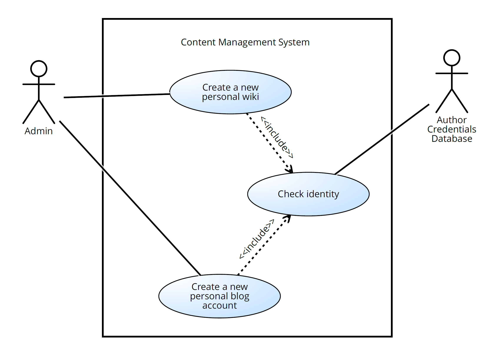
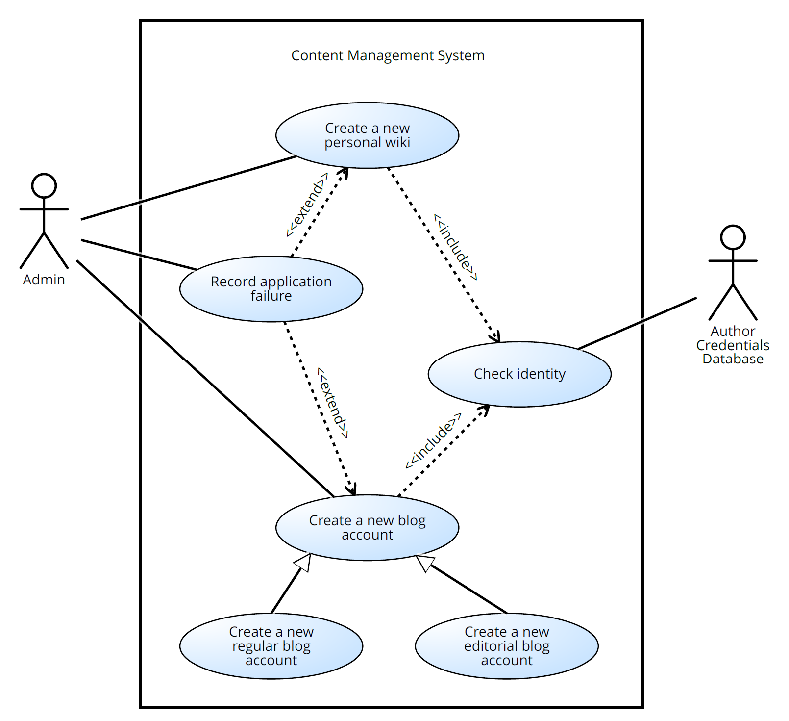
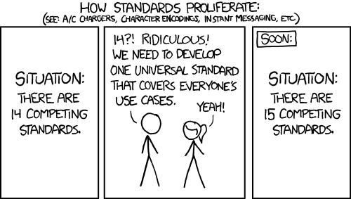
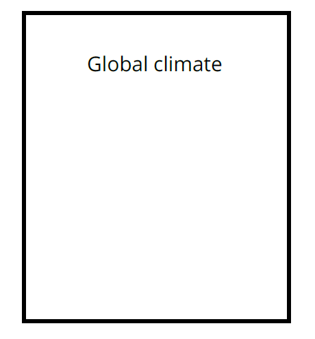
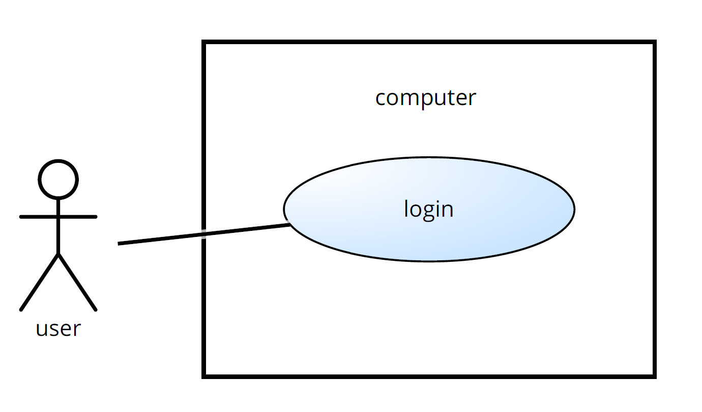

# Table of Contents

-   [What will you learn?](#org9d9e984)
-   [What is UML?](#org07b406a)
    -   [UML vs. Flowcharts vs. EPC vs. BPMN](#org97587bf)
    -   [How UML came about](#orgf482da1)
    -   [How do you use UML?](#org4593f64)
        -   [Software engineering views](#org5f25597)
    -   [UML diagram overview](#org0065fdc)
        -   [Structure diagrams](#org8222c0b)
        -   [Behavior diagrams](#org71b55cf)
    -   [Case study: airport](#orgd406114)
        -   [Use case diagrams: issuing a boarding pass](#orgcf69082)
        -   [Activity diagrams: checking in](#org349748e)
        -   [Sequence diagrams: check in and boarding](#org9800d45)
        -   [Package diagram: organisational units](#org8450190)
        -   [Class diagram: Passenger services](#org236bcac)
-   [Discussion - whaddayathink?](#org07d91b1)
-   [Use case diagrams](#org8eb1e92)
-   [Use case elements](#org11a1a9e)
    -   [Situation](#org0d893ea)
    -   [Requirements](#org98b2e12)
    -   [System](#orgf45772a)
    -   [Actors](#orgc277073)
        -   [Tricky actors](#org2c45b34)
        -   [Generalization](#orge3a5bf6)
    -   [Use cases](#orgaf709e1)
    -   [Communication lines](#orgbbd4adf)
    -   [System boundaries](#org4203eab)
    -   [Descriptions](#org6b8b1ce)
    -   [Reusing use cases with `<<include>>`](#orga523145)
    -   [Special cases: inheritance](#orga699ecc)
    -   [Optional reuse with `<<extend>>`](#org6980760)
    -   [Process optimization with use cases](#org595013a)
    -   [Overview diagrams](#orgcb13503)
-   [Use case practice](#orge0bbe93)
    -   [Find mistakes in a use case diagram](#orgca03ae0)
        -   [Is this a system?](#org56d3e80)
        -   [Are these `actors`?](#org2bd724e)
        -   [Are these use cases?](#orgeabf928)
        -   [Generalization](#org47243e5)
        -   [`<<include>>` and `<<extend>>`](#org9676c2a)
    -   [Write a use case description](#org808b447)
    -   [Create a use case from simple requirements](#org727214f)
        -   [Diagram](#orgf4d0c6a)
        -   [Description](#org96ac1f6)
    -   [Create a use case for the term project](#orgd53eea2)
    -   [Transfer a EPC/BPMN into an UML use case diagram](#org529852f)
    -   [Bonus: "Hello world" as use case diagram](#orgedddd01)
        -   [Problem](#org9978802)
        -   [Solution](#orge75ac7c)
        -   [Behavior diagrams](#orgabbe8db)
        -   [Further reading](#orga80ded2)
-   [References](#org104f256)

# What will you learn?

-   What is UML?
-   How do you use UML in practice?
-   What are the main UML diagrams?
-   What are use case diagrams?
-   UML case study (airport systems)
-   Use case diagrams (requirements analysis/outside view)
-   UML practice (use case only)

# What is UML?

## UML vs. Flowcharts vs. EPC vs. BPMN

<table border="2" cellspacing="0" cellpadding="6" rules="groups" frame="hsides">

<colgroup>
<col  class="org-left" />

<col  class="org-left" />

<col  class="org-left" />

<col  class="org-left" />
</colgroup>
<thead>
<tr>
<th scope="col" class="org-left">Diagram</th>
<th scope="col" class="org-left">Purpose</th>
<th scope="col" class="org-left">Example</th>
<th scope="col" class="org-left">Where</th>
</tr>
</thead>

<tbody>
<tr>
<td class="org-left">Flowcharts</td>
<td class="org-left">Model flow</td>
<td class="org-left">Programming loop</td>
<td class="org-left">Programming</td>
</tr>

<tr>
<td class="org-left">EPC</td>
<td class="org-left">Model transactions</td>
<td class="org-left">Credit card check</td>
<td class="org-left">Bank</td>
</tr>

<tr>
<td class="org-left">BPMN</td>
<td class="org-left">Model process with communication</td>
<td class="org-left">IT support communication</td>
<td class="org-left">IT Service</td>
</tr>

<tr>
<td class="org-left">UML</td>
<td class="org-left">Model systems and processes</td>
<td class="org-left">Infrastructure and services</td>
<td class="org-left">Airport</td>
</tr>
</tbody>
</table>

In UML, one can also model static systems (without flow).

## How UML came about

<table border="2" cellspacing="0" cellpadding="6" rules="groups" frame="hsides">

<colgroup>
<col  class="org-left" />

<col  class="org-left" />

<col  class="org-left" />

<col  class="org-left" />
</colgroup>
<thead>
<tr>
<th scope="col" class="org-left">Time frame</th>
<th scope="col" class="org-left">Paradigm</th>
<th scope="col" class="org-left">Problem</th>
<th scope="col" class="org-left">Solution</th>
</tr>
</thead>

<tbody>
<tr>
<td class="org-left">Until 1970s</td>
<td class="org-left">Software creation is an art</td>
<td class="org-left">Complexity crisis</td>
<td class="org-left">Engineering</td>
</tr>

<tr>
<td class="org-left">Until 1980s</td>
<td class="org-left">Split data and procedures</td>
<td class="org-left">Fragmentation</td>
<td class="org-left">ERD / Petri Nets</td>
</tr>

<tr>
<td class="org-left">Until 1990s</td>
<td class="org-left">Object orientation</td>
<td class="org-left">Reusability</td>
<td class="org-left">UML 0.9<a id="fnr.1" class="footref" href="#fn.1">1</a></td>
</tr>

<tr>
<td class="org-left">Since 2005</td>
<td class="org-left">Integrated modeling</td>
<td class="org-left">Standardisation</td>
<td class="org-left">UML 2.0 (OMG)<a id="fnr.2" class="footref" href="#fn.2">2</a></td>
</tr>
</tbody>
</table>

## How do you use UML?

<table border="2" cellspacing="0" cellpadding="6" rules="groups" frame="hsides">

<colgroup>
<col  class="org-left" />

<col  class="org-left" />
</colgroup>
<tbody>
<tr>
<td class="org-left">UML as a sketch</td>
<td class="org-left">Convey key points, then throw away</td>
</tr>

<tr>
<td class="org-left">UML as a blueprint</td>
<td class="org-left">Detailed system specification. Use UML tool. Reverse and forward engineering to keep model in line with system. Turn portions of model into code.</td>
</tr>

<tr>
<td class="org-left">UML as a programming language</td>
<td class="org-left">Go from UML model to executable code: every aspect of the system is modeled. Model enables deployment to different environments.</td>
</tr>
</tbody>
</table>

### Software engineering views

*Image: [Phillippe Kruchten's 4+1 view software engineering model](https://en.wikipedia.org/wiki/4%2B1_architectural_view_model)*

<table border="2" cellspacing="0" cellpadding="6" rules="groups" frame="hsides">

<colgroup>
<col  class="org-left" />

<col  class="org-left" />

<col  class="org-left" />
</colgroup>
<thead>
<tr>
<th scope="col" class="org-left">VIEW</th>
<th scope="col" class="org-left">WHAT IS IT</th>
<th scope="col" class="org-left">UML Diagrams</th>
</tr>
</thead>

<tbody>
<tr>
<td class="org-left">Logical view</td>
<td class="org-left">Abstract description of system's parts and their interactions (logic)</td>
<td class="org-left">class, object, state machine, interaction</td>
</tr>

<tr>
<td class="org-left">Process view</td>
<td class="org-left">Describes processes within the system and what might happen (simulation)</td>
<td class="org-left">activity</td>
</tr>

<tr>
<td class="org-left">Development view</td>
<td class="org-left">Describes how system's parts are organized into modules and components, and how they are layered (architecture)</td>
<td class="org-left">package, component</td>
</tr>

<tr>
<td class="org-left">Physical view</td>
<td class="org-left">Describes how system is transferred to the real world (deployment)</td>
<td class="org-left">deployment</td>
</tr>

<tr>
<td class="org-left">Use case view</td>
<td class="org-left">Describes the system functionality from an outside perspective - what the system is supposed to do. Guides all other views (requirements)</td>
<td class="org-left">use case, interaction overview</td>
</tr>
</tbody>
</table>

## UML diagram overview

-   Watch the video: [UML Diagrams Full Course](https://youtu.be/WnMQ8HlmeXc) ([freeCodeCamp.org,
    2021](#orgfefcba5)) - especially the overview (first 10 minutes)

### Structure diagrams

<table border="2" cellspacing="0" cellpadding="6" rules="groups" frame="hsides">

<colgroup>
<col  class="org-left" />

<col  class="org-left" />

<col  class="org-left" />
</colgroup>
<thead>
<tr>
<th scope="col" class="org-left">STRUCTURE DIAGRAMS</th>
<th scope="col" class="org-left">WHAT IS IT</th>
<th scope="col" class="org-left">EXAMPLE</th>
</tr>
</thead>

<tbody>
<tr>
<td class="org-left">Class diagram</td>
<td class="org-left">Classes, types, interfaces, and the relationships between them</td>
<td class="org-left"><a href="https://github.com/birkenkrahe/mod482/blob/main/11_uml/img/class.png">Order processing system</a></td>
</tr>

<tr>
<td class="org-left">Component diagram</td>
<td class="org-left">Structural relationship of important components within your system</td>
<td class="org-left"><a href="https://github.com/birkenkrahe/mod482/blob/main/11_uml/img/component.png">Automatic Teller Machine (ATM)</a></td>
</tr>

<tr>
<td class="org-left">Deployment diagram</td>
<td class="org-left">Hardware and software across multiple machines in a realworld situation</td>
<td class="org-left"><a href="https://github.com/birkenkrahe/mod482/blob/main/11_uml/img/deployment.png">Web application</a></td>
</tr>

<tr>
<td class="org-left">Object (instance) diagram</td>
<td class="org-left">Object instances of the classes defined in class diagrams in configurations that are important to your system</td>
<td class="org-left"><a href="https://github.com/birkenkrahe/mod482/blob/main/11_uml/img/object.jpg">Order processing system (with data)</a></td>
</tr>

<tr>
<td class="org-left">Package diagram</td>
<td class="org-left">Dependencies between software packages and the hierarchical organization of groups of classes and components</td>
<td class="org-left"><a href="https://github.com/birkenkrahe/mod482/blob/main/11_uml/img/package.png">Web application</a></td>
</tr>

<tr>
<td class="org-left">Profile diagram</td>
<td class="org-left">Customize UML to your case using <code>&lt;&lt;stereotype&gt;&gt;</code></td>
<td class="org-left"><a href="https://github.com/birkenkrahe/mod482/blob/main/11_uml/img/profile.png">Server classes</a></td>
</tr>

<tr>
<td class="org-left">Composite structure diagram</td>
<td class="org-left">The internals of a class or component, and class relationships within a given context</td>
<td class="org-left"><a href="https://github.com/birkenkrahe/mod482/blob/main/11_uml/img/composite.jpg">School class</a></td>
</tr>
</tbody>
</table>

### Behavior diagrams

<table border="2" cellspacing="0" cellpadding="6" rules="groups" frame="hsides">

<colgroup>
<col  class="org-left" />

<col  class="org-left" />

<col  class="org-left" />
</colgroup>
<thead>
<tr>
<th scope="col" class="org-left">BEHAVIOR DIAGRAMS</th>
<th scope="col" class="org-left">WHAT IS IT</th>
<th scope="col" class="org-left">EXAMPLE</th>
</tr>
</thead>

<tbody>
<tr>
<td class="org-left">Use case diagram</td>
<td class="org-left">Interactions between your system and users or other external systems. Helpful to map requirements.</td>
<td class="org-left"><a href="https://github.com/birkenkrahe/mod482/blob/main/11_uml/img/usecase.png">Broadcasting System</a></td>
</tr>

<tr>
<td class="org-left">Activity diagram</td>
<td class="org-left">Sequential and parallel activities within your system (functions)</td>
<td class="org-left"><a href="https://github.com/birkenkrahe/mod482/blob/main/11_uml/img/activity.jpg">Enter PIN</a></td>
</tr>

<tr>
<td class="org-left">State machine diagram</td>
<td class="org-left">The state of an object throughout its lifetime and the events that can change that state</td>
<td class="org-left"><a href="https://github.com/birkenkrahe/mod482/blob/main/11_uml/img/state.png">Game states</a></td>
</tr>

<tr>
<td class="org-left">Sequence diagram</td>
<td class="org-left">Interactions between objects where the order of the interactions is important</td>
<td class="org-left"><a href="https://github.com/birkenkrahe/mod482/blob/main/11_uml/img/sequence.png">ATM scenario</a></td>
</tr>

<tr>
<td class="org-left">Communication (collaboration) diagram</td>
<td class="org-left">The ways in which objects interact and the connections that are needed to support that interaction</td>
<td class="org-left"><a href="https://github.com/birkenkrahe/mod482/blob/main/11_uml/img/communication.png">Bank transaction</a></td>
</tr>

<tr>
<td class="org-left">Timing diagram</td>
<td class="org-left">Interactions between objects where timing is an important concern</td>
<td class="org-left"><a href="https://github.com/birkenkrahe/mod482/blob/main/11_uml/img/timing.png">Car park</a></td>
</tr>

<tr>
<td class="org-left">Interaction overview diagram</td>
<td class="org-left">Used to collect sequence, communication, and timing diagrams to capture an important interaction that occurs within your system</td>
<td class="org-left"><a href="https://github.com/birkenkrahe/mod482/blob/main/11_uml/img/interaction.png">Online shopping</a></td>
</tr>
</tbody>
</table>

## Case study: airport

Airports are complicated. Though it does not always go like this:
watch the [video](https://youtu.be/gWYTnc7m9mE) of a 21st century public project scandal. ([DW 2020](#org494cd0d))

Some services in an airport:

Three relevant models:

1.  Business system model (passenger services)
2.  IT systems model (enabling passenger services)
3.  System integration model (interacting IT systems)

8 diagram types used to model the whole airport ([PDF](https://github.com/birkenkrahe/mod482/blob/main/11_uml/img/airport.pdf)):

### Use case diagrams: issuing a boarding pass

First draft of the use case:

Extended use case diagram:

### Activity diagrams: checking in

`Passenger services` overview (low level of detail):

More detail: `Passenter checks in`:

The same diagram but without explanations:

### Sequence diagrams: check in and boarding

Constructing sequence of actions:

The entire sequence spans the business use cases `check-in` and
`boarding`:

>    

### Package diagram: organisational units

Constructing a package diagram by collecting organizational
units/roles:

Package diagram for the organization unit `Passenger service`:

### Class diagram: Passenger services

Illustration of class "generalization". In OOP terms, `List of
    checked in passengers` and `List of passengers not yet on board`
inherits attributes and methods from `Passenger List`.

Classes of the internal view of the business system:

Class diagram of `Passenger services` including associations
between them. This way of drawing class diagrams focuses on the
relationships, not on the methods/functions or abilities of the
classes.

# Discussion - whaddayathink?

-   What do you like best? EPC, BPMN, UML? Why?
-   If Germans are so fond of modeling, why can't they seem to build
    an international airport? ([DW, 2020](#org494cd0d)).

# Use case diagrams

-   Overview: [freeCodeCamp.org](https://www.youtube.com/watch?v=WnMQ8HlmeXc&t=3427s) (video, 7 min)<a id="fnr.3" class="footref" href="#fn.3">3</a>
-   Tutorial: [Lucidchart](https://youtu.be/zid-MVo7M-E) (video, 14 min)<a id="fnr.4" class="footref" href="#fn.4">4</a>

<table border="2" cellspacing="0" cellpadding="6" rules="groups" frame="hsides">

<colgroup>
<col  class="org-left" />

<col  class="org-left" />

<col  class="org-left" />
</colgroup>
<thead>
<tr>
<th scope="col" class="org-left">PURPOSE</th>
<th scope="col" class="org-left">CASE EXAMPLE</th>
<th scope="col" class="org-left">VIEW</th>
</tr>
</thead>

<tbody>
<tr>
<td class="org-left">Specify the context of a system</td>
<td class="org-left">Weblog CMS</td>
<td class="org-left">Logical</td>
</tr>

<tr>
<td class="org-left">Capture requirements of a system</td>
<td class="org-left">Create new blog account</td>
<td class="org-left">Process</td>
</tr>

<tr>
<td class="org-left">Validate system architecture</td>
<td class="org-left">Specify successful/failed end condition</td>
<td class="org-left">Development</td>
</tr>

<tr>
<td class="org-left">Drive implementation and generate test cases</td>
<td class="org-left">Program and debug use cases with test data</td>
<td class="org-left">Physical</td>
</tr>
</tbody>
</table>

# Use case elements

## Situation

The problem: "Chinese whispers"

The solution: Use case modeling

<table border="2" cellspacing="0" cellpadding="6" rules="groups" frame="hsides">

<colgroup>
<col  class="org-left" />

<col  class="org-left" />
</colgroup>
<tbody>
<tr>
<td class="org-left">Focus</td>
<td class="org-left">System <b>requirements</b> strictly from the outside looking in</td>
</tr>

<tr>
<td class="org-left">Task</td>
<td class="org-left">Specify the <b>value</b> that the system delivers to <b>users</b>.</td>
</tr>

<tr>
<td class="org-left">Tools</td>
<td class="org-left">User <b>stories</b>, project canvas, <b>agile</b> workflow (Scrum)</td>
</tr>

<tr>
<td class="org-left">Excluded</td>
<td class="org-left">Nonfunctional requirements (e.g. performance targets)</td>
</tr>
</tbody>
</table>

## Requirements

Requirement A.1:

> A content management system (CMS) shall allow an **administrator** to
> **create a new blog account**, provided the personal details of the new
> blogger are **verified** using the **author credentials database**.

## System

<table border="2" cellspacing="0" cellpadding="6" rules="groups" frame="hsides">

<colgroup>
<col  class="org-left" />
</colgroup>
<tbody>
<tr>
<td class="org-left">A system is defined by its boundaries.</td>
</tr>
</tbody>
</table>

## Actors

<table border="2" cellspacing="0" cellpadding="6" rules="groups" frame="hsides">

<colgroup>
<col  class="org-left" />
</colgroup>
<tbody>
<tr>
<td class="org-left">Actors are outside our system (CMS)</td>
</tr>

<tr>
<td class="org-left">Actors don't have to be actual people</td>
</tr>

<tr>
<td class="org-left">Actors must interact with the system</td>
</tr>

<tr>
<td class="org-left">Actors cannot be changed by system design</td>
</tr>
</tbody>
</table>

### Tricky actors

Some actors are tricky: is the `system clock` an actor?

Decision process:

The `system clock` is not a person and it cannot change with the
system's design (it's part of the given computing
infrastructure), so it's not an `actor`.

### Generalization

## Use cases

<table border="2" cellspacing="0" cellpadding="6" rules="groups" frame="hsides">

<colgroup>
<col  class="org-left" />
</colgroup>
<tbody>
<tr>
<td class="org-left">Use cases must have clear pass/fail criteria</td>
</tr>

<tr>
<td class="org-left">All actors must know if the system fulfils the use case</td>
</tr>

<tr>
<td class="org-left">Complete use cases have system interaction and output</td>
</tr>

<tr>
<td class="org-left">Use cases provide measurable results to users</td>
</tr>
</tbody>
</table>

A use case is drawn as an oval with a name that describes the
interaction that it represents. E.g. for requirement A.1:

## Communication lines

<table border="2" cellspacing="0" cellpadding="6" rules="groups" frame="hsides">

<colgroup>
<col  class="org-left" />
</colgroup>
<tbody>
<tr>
<td class="org-left">Communication lines are not flow lines</td>
</tr>

<tr>
<td class="org-left">Communication means purposeful interaction</td>
</tr>
</tbody>
</table>

## System boundaries

## Descriptions

<table border="2" cellspacing="0" cellpadding="6" rules="groups" frame="hsides">

<colgroup>
<col  class="org-left" />
</colgroup>
<tbody>
<tr>
<td class="org-left">Use cases are too simple to be self-explanatory</td>
</tr>

<tr>
<td class="org-left">A use case should be accompanied by description</td>
</tr>

<tr>
<td class="org-left">Writing/understanding the description requires domain knowledge</td>
</tr>
</tbody>
</table>

<table border="2" cellspacing="0" cellpadding="6" rules="groups" frame="hsides">

<colgroup>
<col  class="org-left" />

<col  class="org-left" />

<col  class="org-left" />
</colgroup>
<thead>
<tr>
<th scope="col" class="org-left">DESCRIPTION DETAIL</th>
<th scope="col" class="org-left">EXAMPLE</th>
<th scope="col" class="org-left">MEANING</th>
</tr>
</thead>

<tbody>
<tr>
<td class="org-left">Related requirements</td>
<td class="org-left">Requirement A.1</td>
<td class="org-left">Which requirements this use case fulfils</td>
</tr>

<tr>
<td class="org-left">Goal in context</td>
<td class="org-left">New or existing author requests a new blog account from the <code>Administrator</code></td>
<td class="org-left">The use case's place within the system and why this use case is important</td>
</tr>

<tr>
<td class="org-left">Preconditions</td>
<td class="org-left">Author needs to have appropriate proof of identity</td>
<td class="org-left">What needs to happen before the use case can be executed</td>
</tr>

<tr>
<td class="org-left">Successful end condition</td>
<td class="org-left">A new blog account is created for the author</td>
<td class="org-left">What the system's condition should be if the use case executes successfully</td>
</tr>

<tr>
<td class="org-left">Failed end condition</td>
<td class="org-left">The application for a new blog account is rejected</td>
<td class="org-left">What the system's condition should be if the use case fails to execute successfully</td>
</tr>

<tr>
<td class="org-left">Primary actors</td>
<td class="org-left"><code>Administrator</code></td>
<td class="org-left">The main actors that participate in the use case (and triggering or benefiting actors)</td>
</tr>

<tr>
<td class="org-left">Secondary actors</td>
<td class="org-left">Author Credentials Database</td>
<td class="org-left">Actors that participate but are not the main players in a use case's execution</td>
</tr>

<tr>
<td class="org-left">Trigger</td>
<td class="org-left"><code>Administrator</code> asks CMS to <code>create a new blog account</code></td>
<td class="org-left">The event triggered by an actor that causes the use case to execute</td>
</tr>

<tr>
<td class="org-left">Main flow</td>
<td class="org-left">1. Admin asks CMS to create new account</td>
<td class="org-left">The place to describe each of the important steps in a use case's normal execution</td>
</tr>

<tr>
<td class="org-left">&#xa0;</td>
<td class="org-left">2. Admin selects an account type</td>
<td class="org-left">&#xa0;</td>
</tr>

<tr>
<td class="org-left">&#xa0;</td>
<td class="org-left">3. Admin enters author's details</td>
<td class="org-left">&#xa0;</td>
</tr>

<tr>
<td class="org-left">&#xa0;</td>
<td class="org-left">4. Author's details are verified using the Author Credentials Database</td>
<td class="org-left">&#xa0;</td>
</tr>

<tr>
<td class="org-left">&#xa0;</td>
<td class="org-left">5. The new blog account is created</td>
<td class="org-left">&#xa0;</td>
</tr>

<tr>
<td class="org-left">&#xa0;</td>
<td class="org-left">6. A summary of the new blog account's details are emailed to the author</td>
<td class="org-left">&#xa0;</td>
</tr>

<tr>
<td class="org-left">Extensions</td>
<td class="org-left">4.1 Author Credentials Database does not verify the author's details</td>
<td class="org-left">A description of any alternative steps from the ones described in the <code>main flow</code></td>
</tr>

<tr>
<td class="org-left">&#xa0;</td>
<td class="org-left">4.2 The author's new blog account application is rejected</td>
<td class="org-left">&#xa0;</td>
</tr>
</tbody>
</table>

Improved use case diagram after reviewing the description:

## Reusing use cases with `<<include>>`

What if we add another similar requirement Requirement A.2:

> The content management system shall allow an **administrator** to
> create a **new personal wiki**, provided the personal details of
> the applying **author** are verified using the **Author Credentials
> Database**.

The requirement is easily added as a new use case:

To indicate that the step `check identity` can be reused (without
changes to the code) it is added as a separate use case with an
`<<include>>` relationship. The `administrator` has no part in
this.

All use case descriptions need to be updated to include a
`Included cases` category, and the `main flow` must contain
`include::Check Identity`:

<table border="2" cellspacing="0" cellpadding="6" rules="groups" frame="hsides">

<colgroup>
<col  class="org-left" />

<col  class="org-left" />
</colgroup>
<tbody>
<tr>
<td class="org-left">Main flow</td>
<td class="org-left">&#x2026;</td>
</tr>

<tr>
<td class="org-left"><b>include::Check Identity</b></td>
<td class="org-left">4. The author's details are checked</td>
</tr>

<tr>
<td class="org-left">&#xa0;</td>
<td class="org-left">&#x2026;</td>
</tr>
</tbody>
</table>

The use case itself get its own description:

<table border="2" cellspacing="0" cellpadding="6" rules="groups" frame="hsides">

<colgroup>
<col  class="org-left" />

<col  class="org-left" />
</colgroup>
<thead>
<tr>
<th scope="col" class="org-left">DESCRIPTION DETAIL</th>
<th scope="col" class="org-left">DESCRIPTION</th>
</tr>
</thead>

<tbody>
<tr>
<td class="org-left">Use case name</td>
<td class="org-left">Check Identity</td>
</tr>

<tr>
<td class="org-left">Related requirements</td>
<td class="org-left">Requirement A.1, Requirement A.2</td>
</tr>

<tr>
<td class="org-left">Goal in context</td>
<td class="org-left">An author's details need to be checked and verified as accurate</td>
</tr>

<tr>
<td class="org-left">Preconditions</td>
<td class="org-left">The author being checked has appopriate proof of identity</td>
</tr>

<tr>
<td class="org-left">Successful end condition</td>
<td class="org-left">The details are verified</td>
</tr>

<tr>
<td class="org-left">Failed end condition</td>
<td class="org-left">The details are not verified</td>
</tr>

<tr>
<td class="org-left">Primary actors</td>
<td class="org-left">Authors Credentials Database</td>
</tr>

<tr>
<td class="org-left">Trigger</td>
<td class="org-left">Author's credentials are provided to the system for verification</td>
</tr>

<tr>
<td class="org-left">Main flow</td>
<td class="org-left">1. The details are provided to the system</td>
</tr>

<tr>
<td class="org-left">&#xa0;</td>
<td class="org-left">2. The Author Credentials Database verifies the details</td>
</tr>

<tr>
<td class="org-left">&#xa0;</td>
<td class="org-left">3. Details are returned as verified by the Author Credentials Database</td>
</tr>

<tr>
<td class="org-left">Extensions</td>
<td class="org-left">2.1 The Author Credentials Database does not verify the details</td>
</tr>

<tr>
<td class="org-left">&#xa0;</td>
<td class="org-left">2.2 The details are returned as unverified</td>
</tr>
</tbody>
</table>

## Special cases: inheritance

If there are different blog account types (e.g. with different
rights), the use cases will differ little. Different types can be
implemented as special cases, with the original use case as their
generalization:

The description gets a `Base Use Case` field. Here is one of the
special cases:

<table border="2" cellspacing="0" cellpadding="6" rules="groups" frame="hsides">

<colgroup>
<col  class="org-left" />

<col  class="org-left" />
</colgroup>
<thead>
<tr>
<th scope="col" class="org-left">DESCRIPTION DETAIL</th>
<th scope="col" class="org-left">EXAMPLE</th>
</tr>
</thead>

<tbody>
<tr>
<td class="org-left">Use case name</td>
<td class="org-left">Create a new editorial blog account</td>
</tr>

<tr>
<td class="org-left">Related requirements</td>
<td class="org-left">Requirement A.1</td>
</tr>

<tr>
<td class="org-left">Goal in context</td>
<td class="org-left">New or existing author requests a new <b>editorial</b> blog account from the <code>Administrator</code></td>
</tr>

<tr>
<td class="org-left">Preconditions</td>
<td class="org-left">Author needs to have appropriate proof of identity</td>
</tr>

<tr>
<td class="org-left">Successful end condition</td>
<td class="org-left">A new <b>editorial</b> blog account is created for the author</td>
</tr>

<tr>
<td class="org-left">Failed end condition</td>
<td class="org-left">The application for a new <b>editorial</b> blog account is rejected</td>
</tr>

<tr>
<td class="org-left">Primary actors</td>
<td class="org-left"><code>Administrator</code></td>
</tr>

<tr>
<td class="org-left">Secondary actors</td>
<td class="org-left"><b>None</b></td>
</tr>

<tr>
<td class="org-left">Trigger</td>
<td class="org-left"><code>Administrator</code> asks CMS to <code>create a new editorial blog account</code> that will allow an author to edit entries in a set of blogs</td>
</tr>

<tr>
<td class="org-left">Base use cases</td>
<td class="org-left"><b>Create a new blog account</b></td>
</tr>

<tr>
<td class="org-left">Main flow</td>
<td class="org-left">1. Admin asks CMS to create new blog account</td>
</tr>

<tr>
<td class="org-left">&#xa0;</td>
<td class="org-left"><b>2. Admin selects the editorial account type</b></td>
</tr>

<tr>
<td class="org-left">&#xa0;</td>
<td class="org-left">3. Admin enters author's details</td>
</tr>

<tr>
<td class="org-left">&#xa0;</td>
<td class="org-left"><b>4. The Admin selects the blogs that the account is to have editorial rights over</b></td>
</tr>

<tr>
<td class="org-left"><b>include::Check Identity</b></td>
<td class="org-left">5. Author's details are checked</td>
</tr>

<tr>
<td class="org-left">&#xa0;</td>
<td class="org-left">6. The new <b>editorial</b> blog account is created</td>
</tr>

<tr>
<td class="org-left">&#xa0;</td>
<td class="org-left">6. A summary of the new <b>editorial</b> blog account's details are emailed to the author</td>
</tr>

<tr>
<td class="org-left">Extensions</td>
<td class="org-left">Branching action:</td>
</tr>

<tr>
<td class="org-left">&#xa0;</td>
<td class="org-left"><b>5.1 Author is not allowed to edit the indicated blogs</b></td>
</tr>

<tr>
<td class="org-left">&#xa0;</td>
<td class="org-left"><b>5.2 The editorial blog account application is rejected</b></td>
</tr>

<tr>
<td class="org-left">&#xa0;</td>
<td class="org-left"><b>5.3 The application rejection is recorded as part of the author's history</b></td>
</tr>
</tbody>
</table>

Inheritance is absolute: every step in the general use case must
occur in the specialized use cases, and its relationships must also
make sense in the specialized use cases.

If you don't want this, create a subroutine and `<<include>>` it,
or use the upcoming `<<extend>>` relationship.

## Optional reuse with `<<extend>>`

The branching action `5.3` in the last step shows a use case
(`Record application failure`) that extends the original use case,
`Create new editorial blog account`.

Very importantly, it is an
**optional extension**: you don't want to record application failure
if the application was successful. Like `Check identity`, this
extension is shared by both account creation use cases.

## Process optimization with use cases

Remember "process optimization" in the context of process modeling?
It also applies to requirements analysis with use case diagrams.

As-is diagram:

To-be diagram:

(Source: [Monteleone, 2021](#orgb9194ba)).

## Overview diagrams

Use case overviews don't contain any use cases, but provide some
context by painting a broad picture of your system's context.

# Use case practice

([Image: xkcd](https://xkcd.com/927)).

-   Find mistakes in a use case diagram
-   Create a use case from simple requirements
-   Create a use case for the term project
-   Transfer a EPC/BPMN into an UML use case diagram
-   "Hello World" as UML ([Akehurst, 2014](#orgb91fe49))

## Find mistakes in a use case diagram

To solve these problems, return to the rules for actors, systems
and use cases. *Answers in the footnotes.*

### Is this a system?<a id="fnr.5" class="footref" href="#fn.5">5</a>

### Are these `actors`?<a id="fnr.6" class="footref" href="#fn.6">6</a>

### Are these use cases?<a id="fnr.7" class="footref" href="#fn.7">7</a>

### Generalization

What's wrong with this diagram?<a id="fnr.8" class="footref" href="#fn.8">8</a>

### `<<include>>` and `<<extend>>`

A relational database management system (RDBMS) is queried using
Structured Query Language (SQL). During the design of an RDBMS, a
UML diagram was created. Somehow, the relationships were screwed
up. You have to fix them!

-   Copy the [diagram in Signavio](https://academic.signavio.com/p/editor?id=91f9fbb02c2c44df9738399d100182ea) into your personal (shared) folder)
-   Fix the diagram by fixing the relationships only
-   Save your diagram and share it with the class

    

## Write a use case description

Write a use case description for `Record Application Failure` from
the CMS example discussed above under `<<extend>>`.<a id="fnr.9" class="footref" href="#fn.9">9</a>

<table border="2" cellspacing="0" cellpadding="6" rules="groups" frame="hsides">

<colgroup>
<col  class="org-left" />

<col  class="org-left" />
</colgroup>
<thead>
<tr>
<th scope="col" class="org-left">DESCRIPTION DETAIL</th>
<th scope="col" class="org-left">DESCRIPTION</th>
</tr>
</thead>

<tbody>
<tr>
<td class="org-left">Use case name</td>
<td class="org-left">&#xa0;</td>
</tr>

<tr>
<td class="org-left">Related requirements</td>
<td class="org-left">&#xa0;</td>
</tr>

<tr>
<td class="org-left">Goal in context</td>
<td class="org-left">&#xa0;</td>
</tr>

<tr>
<td class="org-left">Preconditions</td>
<td class="org-left">&#xa0;</td>
</tr>

<tr>
<td class="org-left">Successful end condition</td>
<td class="org-left">&#xa0;</td>
</tr>

<tr>
<td class="org-left">Failed end condition</td>
<td class="org-left">&#xa0;</td>
</tr>

<tr>
<td class="org-left">Primary actors</td>
<td class="org-left">&#xa0;</td>
</tr>

<tr>
<td class="org-left">Secondary actors</td>
<td class="org-left">&#xa0;</td>
</tr>

<tr>
<td class="org-left">Trigger</td>
<td class="org-left">&#xa0;</td>
</tr>

<tr>
<td class="org-left">Main flow</td>
<td class="org-left">1.</td>
</tr>

<tr>
<td class="org-left">&#xa0;</td>
<td class="org-left">2.</td>
</tr>

<tr>
<td class="org-left">&#xa0;</td>
<td class="org-left">3.</td>
</tr>

<tr>
<td class="org-left">Extensions</td>
<td class="org-left">Branching action:</td>
</tr>

<tr>
<td class="org-left">&#xa0;</td>
<td class="org-left">&#xa0;</td>
</tr>
</tbody>
</table>

## Create a use case from simple requirements

1.  Fire up Signavio Process Manager
2.  Go to your personal folder in `Shared Documents`
3.  Create a new `UML use case diagram`
4.  Write a use case description for a login process
5.  Modify the diagram if necessary, using relationships
6.  > A user logs into a computer.

### Diagram

-   Create the sketch below in your personal (shared) folder
-   Fill in the use case description

### Description

<table border="2" cellspacing="0" cellpadding="6" rules="groups" frame="hsides">

<colgroup>
<col  class="org-left" />

<col  class="org-left" />
</colgroup>
<thead>
<tr>
<th scope="col" class="org-left">DESCRIPTION DETAIL</th>
<th scope="col" class="org-left">DESCRIPTION</th>
</tr>
</thead>

<tbody>
<tr>
<td class="org-left">Use case name</td>
<td class="org-left">User login</td>
</tr>

<tr>
<td class="org-left">Related requirements</td>
<td class="org-left"><b>None</b></td>
</tr>

<tr>
<td class="org-left">Goal in context</td>
</tr>

<tr>
<td class="org-left">Preconditions</td>
</tr>

<tr>
<td class="org-left">Successful end condition</td>
</tr>

<tr>
<td class="org-left">Failed end condition</td>
</tr>

<tr>
<td class="org-left">Primary actors</td>
</tr>

<tr>
<td class="org-left">Secondary actors</td>
</tr>

<tr>
<td class="org-left">Trigger</td>
</tr>

<tr>
<td class="org-left">Main flow</td>
<td class="org-left">1.</td>
</tr>

<tr>
<td class="org-left">&#xa0;</td>
<td class="org-left">2.</td>
</tr>

<tr>
<td class="org-left">&#xa0;</td>
<td class="org-left">3.</td>
</tr>

<tr>
<td class="org-left">Extensions</td>
<td class="org-left">Branching action:</td>
</tr>

<tr>
<td class="org-left">&#xa0;</td>
<td class="org-left">&#xa0;</td>
</tr>
</tbody>
</table>

## Create a use case for the term project

Projects can be seen as systems to be designed. In fact, there is a
whole (agile) methodology, "design thinking", that rests upon this
fact. Modeling with diagrams is common when using "design thinking"

-   Create a use case for the term project
-   Begin by answering the following questions:

<table border="2" cellspacing="0" cellpadding="6" rules="groups" frame="hsides">

<colgroup>
<col  class="org-left" />

<col  class="org-left" />
</colgroup>
<tbody>
<tr>
<td class="org-left">What is a suitable system?</td>
<td class="org-left">&#xa0;</td>
</tr>

<tr>
<td class="org-left">Who are the actors?</td>
<td class="org-left">&#xa0;</td>
</tr>

<tr>
<td class="org-left">What are the use cases?</td>
<td class="org-left">&#xa0;</td>
</tr>

<tr>
<td class="org-left">Are any use cases specialized/reusable/extending?</td>
<td class="org-left">&#xa0;</td>
</tr>
</tbody>
</table>

*Tip: remember that the project is an agile Scrum project.*

## Transfer a EPC/BPMN into an UML use case diagram

Transfer the [BPMN practice diagram](https://github.com/birkenkrahe/mod482/blob/main/10_bpmn/README.md#orgadb1ab2) that you created (car purchase,
practice session, or supply chain process) into an UML diagram:

## Bonus: "Hello world" as use case diagram

This bonus problem challenges you to know/remember what the
different UML diagram types were about.

### Problem

-   List UML diagram types that you could use to model the `hello,
          world` C program below.

    #include <stdio.h>
    
    int main (void)
    {
      printf("Hello, world!\n");
      return 0;
    }

### Solution

<table border="2" cellspacing="0" cellpadding="6" rules="groups" frame="hsides">

<colgroup>
<col  class="org-left" />

<col  class="org-left" />
</colgroup>
<thead>
<tr>
<th scope="col" class="org-left">STRUCTURE DIAGRAMS</th>
<th scope="col" class="org-left">RELEVANT (Y/N)</th>
</tr>
</thead>

<tbody>
<tr>
<td class="org-left">Class diagram</td>
<td class="org-left">&#xa0;</td>
</tr>

<tr>
<td class="org-left">Component diagram</td>
<td class="org-left">&#xa0;</td>
</tr>

<tr>
<td class="org-left">Deployment diagram</td>
<td class="org-left">&#xa0;</td>
</tr>

<tr>
<td class="org-left">Object (instance) diagram</td>
<td class="org-left">&#xa0;</td>
</tr>

<tr>
<td class="org-left">Package diagram</td>
<td class="org-left">&#xa0;</td>
</tr>

<tr>
<td class="org-left">Profile diagram</td>
<td class="org-left">&#xa0;</td>
</tr>

<tr>
<td class="org-left">Composite structure diagram</td>
<td class="org-left">&#xa0;</td>
</tr>
</tbody>
</table>

### Behavior diagrams

<table border="2" cellspacing="0" cellpadding="6" rules="groups" frame="hsides">

<colgroup>
<col  class="org-left" />

<col  class="org-left" />
</colgroup>
<thead>
<tr>
<th scope="col" class="org-left">BEHAVIOR DIAGRAMS</th>
<th scope="col" class="org-left">RELEVANT (Y/N)</th>
</tr>
</thead>

<tbody>
<tr>
<td class="org-left">Use case diagram</td>
<td class="org-left">&#xa0;</td>
</tr>

<tr>
<td class="org-left">Activity diagram</td>
<td class="org-left">&#xa0;</td>
</tr>

<tr>
<td class="org-left">State machine diagram</td>
<td class="org-left">&#xa0;</td>
</tr>

<tr>
<td class="org-left">Sequence diagram</td>
<td class="org-left">&#xa0;</td>
</tr>

<tr>
<td class="org-left">Communication (collaboration) diagram</td>
<td class="org-left">&#xa0;</td>
</tr>

<tr>
<td class="org-left">Timing diagram</td>
<td class="org-left">&#xa0;</td>
</tr>

<tr>
<td class="org-left">Interaction overview diagram</td>
<td class="org-left">&#xa0;</td>
</tr>
</tbody>
</table>

### Further reading

-   A solution for Java, C++ and C#: [Akehurst, 2014](#orgb91fe49)
-   Interesting is also UML for the C programming language<a id="fnr.10" class="footref" href="#fn.10">10</a>:
    
    > "Unified Modeling Language (UML) has been highly successful in
    > the modeling of software-intensive systems, including
    > systems-oriented models and realtime and embedded designs. The
    > most common implementation for these models has been C++, with
    > the C language in second place. On one hand, this is surprising
    > because the most common implementation language for realtime and
    > embedded systems overall by far is the language C. On the other
    > hand, UML is used almost exclusively for object-oriented systems
    > development, and most realtime and embedded designs are
    > functionally oriented."  ([Douglass, 2009](#org29951eb))

# References

 Miles/Hamilton: Learning UML 2.0. O'Reilly (2006). ISBN:

1.  URL: [URL: oreilly.com.](https://www.oreilly.com/library/view/learning-uml-20/0596009828/)

 Graessle/Baumann/Baumann: UML 2.0 in Action - a
Project-based Tutorial. Packt Publishing
(2005). ISBN: 9781904811558. URL: [URL: packtpub.com](https://www.packtpub.com/product/uml-2-0-in-action-a-project-based-tutorial/9781904811558).

 Object Management Group: Unified Modeling Language
Specifications [website]. [URL: omg.org.](https://www.omg.org/spec/UML/2.5.1/About-UML/)

 freeCodeCamp.org (21 Apr 2021). UML Diagrams Full Course
(Unified Modeling Language) [video]. [URL: youtu.be/WnMQ8HlmeXc.](https://youtu.be/WnMQ8HlmeXc)

 Creately.com (10 Sept 2021). UML Diagram Types Guide:
Learn about All Types of UML Diagrams with Examples [blog]. [URL:
creately.com](https://creately.com/blog/diagrams/uml-diagram-types-examples).

 Akehurst (17 Aug 2014). Examples: UML: Simple Hello
World. [URL: dhakehurst.blogspot.com.](http://dhakehurst.blogspot.com/2014/08/examples-uml-hello-world-part-1.html)

 DW (31 Oct 2020). Berlin's new airport finally opens: A story
of failure and embarrassment [blog]. URL: [URL: www.dw.com.](https://www.dw.com/en/berlins-new-airport-finally-opens-a-story-of-failure-and-embarrassment/a-55446329)

 Monteleone (2021). Generalization/Specialization Use
Case Diagrams and Scenarios [blog]. URL: [URL: modernanalyst.com.](https://modernanalyst.com/Resources/Articles/tabid/115/ID/5465/Generalization-Specialization-Use-Case-Diagrams-and-Scenarios.aspx)

 Douglass/IBM (2009). UML for the C programming language
[white paper]. URL: [URL: www.techonline.com.](https://www.techonline.com/tech-papers/uml-for-the-c-programming-language/)

# Footnotes

<a id="fn.1" href="#fnr.1">1</a> UML 0.9 =
    + Booch Method (Grady Booch)
    + Object Modeling Technique (James Rumbaugh)
    + Object-Oriented Software Engineering (Ivar Jacobsen)
    + Others

<a id="fn.2" href="#fnr.2">2</a> Since 2017: UML 2.5.1 ([OMG](#orgcfdd9a6))

<a id="fn.3" href="#fnr.3">3</a> While the general UML overview is quite good, the Use Case
diagram explanation is not great and even contains (in the last
diagram) a few mistakes. The Lucidchart video is way better.

<a id="fn.4" href="#fnr.4">4</a> I had to smile at this comment.

<a id="fn.5" href="#fnr.5">5</a> (1) "Global climate" as a system needs to have clear
boundaries. While the globe does, the climate of the globe does not
(the weather on Earth is subject to influences outside the atmosphere,
e.g. sun spots). (2) "God" is not a system at all, but a supernatural
entity that cannot be designed (as a system must be) because He is the
designer.

<a id="fn.6" href="#fnr.6">6</a> (1) The `student` is an actor but the communication line to the
use case `create assignment` is wrong, because that's not what
students do. (2) The R language is not outside of the system that
plots the histogram.

<a id="fn.7" href="#fnr.7">7</a> (1) `Live long and prosper` is subjective - outcome is not
measurable. (2) `Use case` - there is no specific action involved. (3)
`Blog account created` is an outcome of a use case (successful end
event), not a use case.

<a id="fn.8" href="#fnr.8">8</a> A `database` is not a special case of the `employee database`,
but the other way around.

<a id="fn.9" href="#fnr.9">9</a> Sample solution:

<table border="2" cellspacing="0" cellpadding="6" rules="groups" frame="hsides">

<colgroup>
<col  class="org-left" />

<col  class="org-left" />
</colgroup>
<thead>
<tr>
<th scope="col" class="org-left">DESCRIPTION DETAIL</th>
<th scope="col" class="org-left">EXAMPLE</th>
</tr>
</thead>

<tbody>
<tr>
<td class="org-left">Use case name</td>
<td class="org-left">Record application failure</td>
</tr>

<tr>
<td class="org-left">Related requirements</td>
<td class="org-left">Requirement A.1, Requirement A.2</td>
</tr>

<tr>
<td class="org-left">Goal in context</td>
<td class="org-left">Record author's details if an application for an editorial account has failed</td>
</tr>

<tr>
<td class="org-left">Preconditions</td>
<td class="org-left">Author's application has failed</td>
</tr>

<tr>
<td class="org-left">Successful end condition</td>
<td class="org-left">Author's details have been recorded</td>
</tr>

<tr>
<td class="org-left">Failed end condition</td>
<td class="org-left">Author's details were not recorded</td>
</tr>

<tr>
<td class="org-left">Primary actors</td>
<td class="org-left">Administrator</td>
</tr>

<tr>
<td class="org-left">Secondary actors</td>
<td class="org-left"><b>None</b></td>
</tr>

<tr>
<td class="org-left">Trigger</td>
<td class="org-left"><code>Administrator</code> asks CMS to <code>record failed application</code> that will allow building an author's history</td>
</tr>

<tr>
<td class="org-left">Main flow</td>
<td class="org-left">1. Admin asks CMS to record failed application author's details</td>
</tr>

<tr>
<td class="org-left">&#xa0;</td>
<td class="org-left">2. Admin selects the account type (editorial or regular)</td>
</tr>

<tr>
<td class="org-left">&#xa0;</td>
<td class="org-left">3. Admin enters author's details</td>
</tr>

<tr>
<td class="org-left">Extensions</td>
<td class="org-left">Branching action:</td>
</tr>

<tr>
<td class="org-left">&#xa0;</td>
<td class="org-left">2.1 Admin selects editorial blog account</td>
</tr>

<tr>
<td class="org-left">&#xa0;</td>
<td class="org-left">2.2 Admin selects regular blog account</td>
</tr>
</tbody>
</table>

<a id="fn.10" href="#fnr.10">10</a> We will use UML in the introduction to programming course for
C/C++ (from spring 2022).
