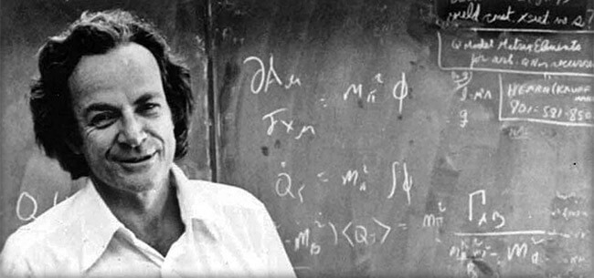
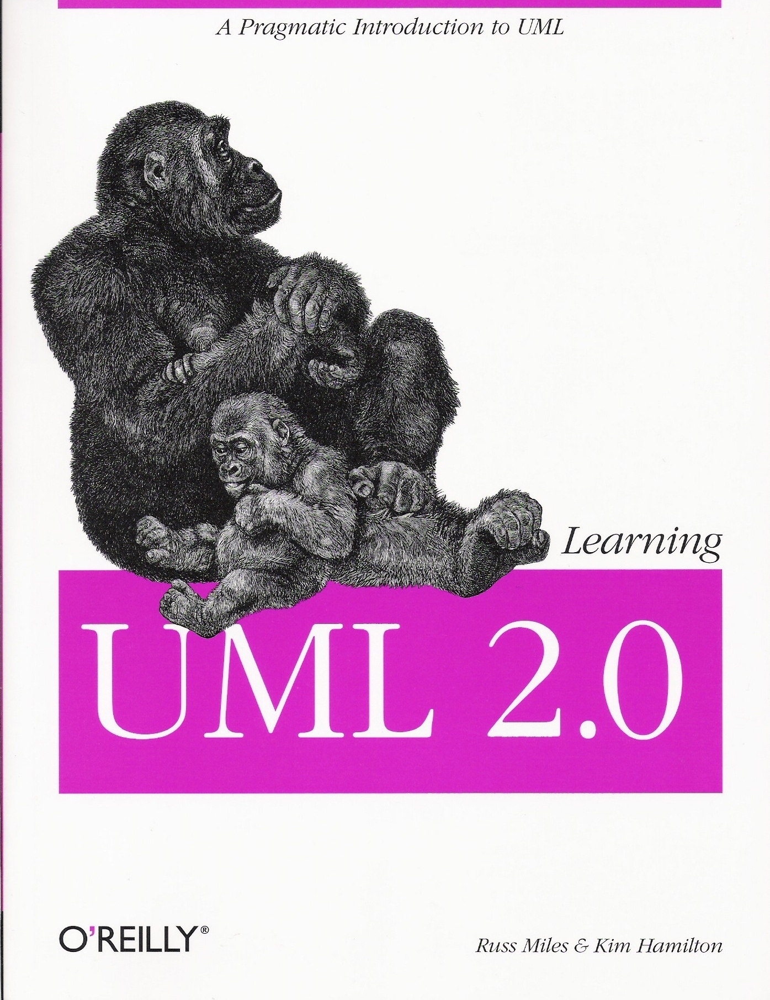
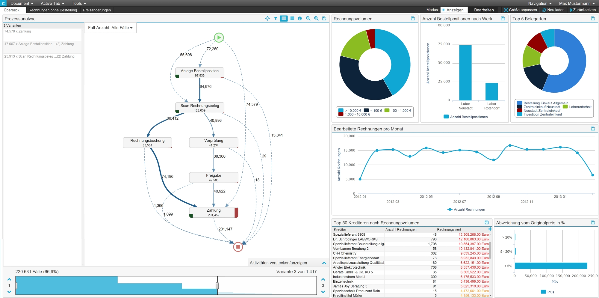
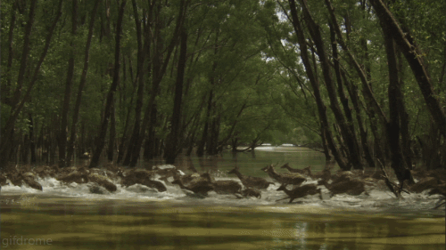

# Table of Contents

-   [What're you going to learn today?](#orge71da7c)
-   [Who am I?](#org7df2717)
    -   [Science](#org4e9304d)
    -   [Industry](#org640d2e0)
    -   [Teaching](#org3993553)
    -   [Pleasure](#org32d83d6)
-   [What are your expectations?](#org5de05f4)
-   [Which topics will we cover?](#org753d7e8)
    -   [Many-model thinking](#org7829c7d)
    -   [Decision intelligence](#org2d26973)
    -   [Process Modeling](#org899e9a3)
    -   [Linear models](#orgb9e112e)
        -   [Linear regression in R](#org63dc6bb)
    -   [Agile management](#orgfca9263)
    -   [Robotic Process Automation](#org64e564e)
    -   [Unified Modeling Language](#org83b4d7d)
    -   [Process mining](#orgef0dbbf)
    -   [Schedule (see Syllabus)](#org00a8370)
-   [How will we do it?](#org0d0850c)
    -   [Classroom sessions](#org53b784d)
    -   [Lecture scripts with exercises (GitHub)](#orgd00e7fd)
    -   [Reading assignments](#org69230b4)
    -   [Lab sessions](#orgb2d5d23)
    -   [Stuff you bring to class](#orgb7dc1a6)
-   [What do you have to do to pass?](#orga6cd09b)
    -   [Weekly lab practice (> 50%)](#org6cd3a65)
    -   [Weekly participation (> 50%)](#org236d56b)
    -   [Final essay (> 50%)](#orgc4bb86b)
        -   [What constitutes an essay?](#orgf99fe80)
        -   [Do you have essay examples?](#org064530a)
        -   [Can I write a scientific essay?](#org05e13d6)
    -   [Final exam (> 50%)](#org43fb985)
-   [What's next?](#orgffb2a18)
    -   [In the course](#orgeb0af1c)
    -   [Your challenges](#orgabe6f0c)
-   [Any questions?](#org0f67568)

# What're you going to learn today?

-   Who is your lecturer?
-   Who are you and what do you want?
-   Which topics will we cover?
-   How will we do it?
-   What do you have to do to pass?
-   What's next?

# Who am I?

## Science

-   Development of WWW
-   PhD theoretical particle physics
-   60 research publications
-   Assoc. Ed. Int. J. of Data Science
-   Ed. Board Int. J. of Big Data Mgmt.
-   Scientific member [d-cube@Berlin](https://www.hwr-berlin.de/en/research/research-centres-and-institutes/)

## Industry

-   Executive at Accenture & Shell
-   Coach and consultant
-   Certified psychotherapist
-   Startup mentor

## Teaching

-   Business informatics [@HWR Berlin](https://www.hwr-berlin.de/en/)
-   Visiting professor of data science @Lyon
-   Adviser for [CPU @LA](https://catholicpolytechnic.org/)
-   Internship supervision

## Pleasure

-   Playing: [Assassin's Creed Valhalla](https://en.wikipedia.org/wiki/Assassin%27s_Creed_Valhalla) (2020)
-   Reading: [Waugh, Sword of Honour](https://en.wikipedia.org/wiki/Sword_of_Honour) (1952-1961)
-   Watching: [The Middle](https://en.wikipedia.org/wiki/The_Middle_(TV_series)) (2009-2018)

# [What are your expectations?](https://ideaboardz.com/for/Data%20modeling%20expectations/4047934)

-   What do you want to learn here?
-   What would you like to avoid?
-   What did you take away from another course?
-   What did you really not like in another course?

# Which topics will we cover?

## Many-model thinking

[Expanded edition, Basic Books 2021](https://www.amazon.com/Model-Thinker-What-Need-Know-ebook-dp-B07B8D3V9V/dp/B07B8D3V9V/)

## Decision intelligence

## Process Modeling

Source: Signavio / 19 May test lecture

## Linear models

Source: R plot

### Linear regression in R

    x <- mtcars$wt
    y <- mtcars$mpg
    plot(x,y,xlab="Weight",ylab="Miles per gallon")
    lm_model <- lm(y~x,data=mtcars)
    abline(lm_model)

## Agile management

Image: [Scrum](https://www.scrum.org/) burndown chart

## Robotic Process Automation

Image: [Signavio Workflow Accelerator](https://www.signavio.com/products/workflow-accelerator/)

## Unified Modeling Language

Image: [Learning UML 2.0](https://www.amazon.com/Learning-UML-2-0-Pragmatic-Introduction-ebook-dp-B0028N4WII/dp/B0028N4WII/) (2006)

## Process mining

Image: [Celonis](https://www.celonis.com/) dashboard

## Schedule (see [Syllabus](https://github.com/birkenkrahe/mod482/blob/main/syllabus.md))

Image: [Princeton U.](https://www.princeton.edu/news/2018/12/03/life-unpacked-freshman-seminar-explores-search-meaningful-life)

# How will we do it?

## Classroom sessions

## Lecture scripts with exercises ([GitHub](https://github.com/birkenkrahe/mod482))

## Reading assignments

-   Image: Unsplash ([@tomhermans](https://unsplash.com/photos/9BoqXzEeQqM))

## Lab sessions

-   Image: Unsplash ([@Emin Baycan](https://unsplash.com/photos/MD2_srN-02o))

## Stuff you bring to class

-   Image: Unsplash ([@Evan Demicoli](https://unsplash.com/photos/HGCqL-tRcac))

# What do you have to do to pass?

## Weekly lab practice (> 50%)

## Weekly participation (> 50%)

## Final essay (> 50%)

Source: Unsplash ([@Aaron Burden](https://unsplash.com/photos/y02jEX_B0O0))

### What constitutes an essay?

-   IMRaD structure ([video](https://youtu.be/dip7UwZ3wUM))
-   Research question
-   Literature review
-   Methodology
-   Results (e.g. glossary)
-   Discussion with limitations
-   References

### Do you have essay examples?

-   Chapters in "Model thinking"
-   (Parts of) Research papers
-   Scientific or industry blogs

### Can I write a scientific essay?

-   Keep It Simply Scientific (IMRaD)
-   Read and take notes (see [FAQ](https://github.com/birkenkrahe/org/blob/master/FAQ.md))
-   Researchers are beginners

## Final exam (> 50%)

Final exam: date TBD

# What's next?

## In the course

-   Lecture "Decision intelligence"
-   Lab discussion "many-model thinking"
-   Data vs. models (2 articles)
-   What is a model anyway?

## Your challenges

<table border="2" cellspacing="0" cellpadding="6" rules="groups" frame="hsides">

<colgroup>
<col  class="org-left" />

<col  class="org-left" />
</colgroup>
<thead>
<tr>
<th scope="col" class="org-left">What?</th>
<th scope="col" class="org-left">When?</th>
</tr>
</thead>

<tbody>
<tr>
<td class="org-left">Read "Many-model thinking"</td>
<td class="org-left">Aug 19</td>
</tr>

<tr>
<td class="org-left">Complete test challenge</td>
<td class="org-left">Aug 24</td>
</tr>

<tr>
<td class="org-left">List possible research questions</td>
<td class="org-left">Sep 2</td>
</tr>

<tr>
<td class="org-left">Check FAQs x 2 in GitHub</td>
<td class="org-left">n.d.</td>
</tr>

<tr>
<td class="org-left">Ask questions (class/GitHub)</td>
<td class="org-left">n.d.</td>
</tr>
</tbody>
</table>

*\*) do this every week until December*

# Any questions?

[This presentation is available online.](https://github.com/birkenkrahe/dsc101/tree/main/1_overview)

