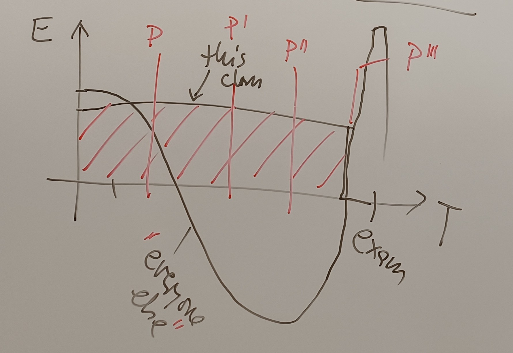

([Whiteboards](https://drive.google.com/drive/folders/1qmqSFwM8H6Au3IZq11e8qPndNeCXyUOS?usp=sharing))

# Remember words and know concepts

It may sound trivial and/or tedious to you, but knowing concepts
and terms, and remembering them is better than having to look them
up. Being able to look them up is, of course, better than not
being able to do even that. Learning anything also consists of
learning a certain number of technical terms. You've probably been
brought up with Google search, instead of having to go to a book
shelf or a library, or having to ask a real person. But Google
does not replace own knowledge - information that you own, and
that you know you own because you don't have to think twice if
someone asks you. It is true that there is much less to learn by
heart in STEM than, say, in poetry, or even in the life sciences
or medicine. And in future, AI will likely be able to help you
even more with remembering stuff. But core technical terms and
concepts aren't just "stuff", they are like scaffold of ideas
around which the regular stuff is only draped. One of my jobs as a
teacher is to help you separate the stuff from the scaffold.

For your presentation, projects, and all that, you need to do some
semblance of research. When you do that, you should build a
glossary of terms - definitions that you ideally craft
yourself. You can also use these definitions in your writing and
presenting (in other words: a good glossary is a valid research
result). In fact, Wikipedia is nothing but a giant glossary. 

This is a long explanation why, at the start of a session, I ask
you if you remember any words or concepts or ideas from the last
session, and this challenge will also enter the weekly tests that
you write in class to get back into the topic.

# System sciences

The Gestalt principle and many other theories and models -
e.g. cybernetics, the science of control systems, the mother of
computer science - are part of the "system sciences", the sciences
that are concerned with general systems. Another, more current
descendant is "[design science](https://en.wikipedia.org/wiki/Design_science)", which has become a major modern
research method in information systems. If you're interested, a
seminal (highly readable) text on this field is "The sciences of
the artificial" by one of the pioneers of AI ([Simon, 1996](#org4b20840)).

# Communications of the ACM

The Associations for Computing Machinery (ACM) founded in 1947 "is
the world's largest scientific and educational computing society"
([Wikipedia, n.d.](#orgef06c31)). Its journal, the [Communciations of the ACM](https://en.wikipedia.org/wiki/Communications_of_the_ACM)
(CACM) are of special importance to computer scientists or
informatics people in training, because they are both scientific
and rigorous, and readable. They're written, I think, primarily
for professionals in the field, who want to keep abreast of new
developments, and do not have the time to read a lot of current
research literature. I appreciate the opinion pieces in CACM
because they frequently deviate from mainstream views. When
learning about a new topic, you should always check out CACM. 

# Burndown chart and Scrum

This tool is perhaps the tool most often adopted by companies that
use agile development or project management methods like Scrum. It
is a true depiction of the state of the project: it displays the
work still to be done vs. the work originally anticipated. The
work itself is expressed in "story points" (tasks derived from
so-called user stories, which we will also learn to create in this
course). There is a close relationship with UML use-case
diagrams. The graph illustrates the rationale behind working with
agile methods: you'll be finished with all deliverables before the
final exam time, and you have an opportunity to distribute your
efforts equally across the whole term:

# Modeling languages and tools

We'll encounter a few diagrammatic modeling languages, like:
Event-controlled Process Chains (EPC), Business Process Model and
Notation (BPMN), and Unified Modeling Language (UML). All of these
have a mathematically exact origin in the so-called [Petri nets](https://en.wikipedia.org/wiki/Petri_net)
used to model distributed systems of any kind. However, we will
(for lack of time) not use them directly. If time permits, we'll
also look at Entity Relationship Diagrams (ERD), which is
independent of Petri nets, and which is used to design relational
databases. If I can pull of the deal, we'll be using Signavio by
SAP for modeling. SAP is a German software company and the world's
largest provider of so-called Enterprise Resource Planning (ERP)
systems. The Signavio work place license is worth ca. US$ 100k per
seat. Independent of this deal, we have free tools available, like
UIPath (for Robotic Process Automation - RPA), or Celonis (for
Process Mining).

# References

In this course, references must be consistent and complete. You're
of course used to that from your liberal arts courses. Consistency
means that you pick one citation style (I don't care which one) -
e.g. [APA](https://apastyle.apa.org/). If you use bibliographic software (like Mendeley, or
Citavi, or Zotero), the software will help you pick a style and
maintain consistency. Completeness means that every reference (no
matter if you reference a personal communication, a blog, a book,
an article, a web page, an image etc.) must have: author, date,
title and place of publication (no matter if any of these are
missing - then you should indicate that they're missing). A URL or
link is not a complete reference (in fact, it's nothing, certainly
not a place of publication). Partly because you're also liberal
arts people, I pull no punches in this area and I'll mercilessly
mark you down for violations of this rule ("consistency and
completeness"), which may appear formal to you, but which is super
important, especially in our times of relentless abuse and
ignorance of intellectual property rights! End of rant!

 [Simon HA (1996). The Sciences of the Artificial. MIT
Press.](https://monoskop.org/images/9/9c/Simon_Herbert_A_The_Sciences_of_the_Artificial_3rd_ed.pdf)

 [Wikipedia (n.d.). Association for Computing
Machinery [Website]. Online: wikipedia.org.](https://en.wikipedia.org/wiki/Association_for_Computing_Machinery)

