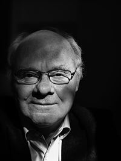

# Table of Contents

-   [What're you going to learn?](#orgccd283f)
-   [Definition](#org7e999b8)
-   [Motivation](#org438cff2)
    -   [Dörner's definition](#orgf764516)
    -   [Exercise](#orge3b0ea1)
-   [Types of models](#orgb4acf4a)
-   [Many-model thinking](#org89e3168)
    -   [Criteria for many-model thinking](#orgec376aa)
    -   [Exercise: decision-making](#orgfa4c405)
-   [What's next?](#orgb161464)
    -   [In the course](#orgb6272c8)
    -   [Your challenges](#org916c9d3)
-   [Any questions?](#org06150bc)

# What're you going to learn?

-   What are models?
-   When should we model?
-   Why many models?
-   Exercises
-   What's next?

# Definition

> "Models are formal structures represented in mathematics and diagrams
> that help us understand the world."

# Motivation

> "Practice [modeling] and you will better understand complex
> phenomena."

What are "complex phenomena?"

## Dörner's definition

1.  Problem is polytelic
2.  Variables evolve dynamically
3.  Variables are interdependent and compounded
4.  There is no clear problem definition
5.  There is no single cause and effect

## Exercise

Test Dörner's list:

-   AI
-   Covid
-   Climate change
-   Capitalism
-   Communism
-   Electric cars
-   Zombies

# Types of models

> -   Simplifications of the world (=abstractions)
> -   Mathematical analogies (=functions)
> -   Exploratory artificial constructs (=simulations)

Models must be "tractable" (apply logic). What about metaphors?

# Many-model thinking

> "We achieve wisdom through a multiplicity of lenses."

## Criteria for many-model thinking

> "The success of many-model thinking depends on a degree of separability."

## Exercise: decision-making

Analyse a recent decision you've made: 

-   Which model did you use, and why?
-   If you used only one model, why?

# What's next?

## In the course

-   Lecture "Decision intelligence"
-   Project setup (agile / Scrum)
-   When you should model (REDCAPE)

## Your challenges

<table border="2" cellspacing="0" cellpadding="6" rules="groups" frame="hsides">

<colgroup>
<col  class="org-left" />

<col  class="org-left" />
</colgroup>
<thead>
<tr>
<th scope="col" class="org-left">What?</th>
<th scope="col" class="org-left">When?</th>
</tr>
</thead>

<tbody>
<tr>
<td class="org-left">Complete 2nd test challenge</td>
<td class="org-left">Aug 31</td>
</tr>

<tr>
<td class="org-left">Read ch. 2 "Why model?"</td>
<td class="org-left">Sep 2</td>
</tr>

<tr>
<td class="org-left">List possible research questions</td>
<td class="org-left">Sep 2</td>
</tr>

<tr>
<td class="org-left">Check FAQs x 2 in GitHub</td>
<td class="org-left">n.d.</td>
</tr>

<tr>
<td class="org-left">Ask questions (class/GitHub)</td>
<td class="org-left">n.d.</td>
</tr>
</tbody>
</table>

*\*) do this every week until December*

# Any questions?

[This presentation is available online.](https://github.com/birkenkrahe/mod482/tree/main/2_why_model)

