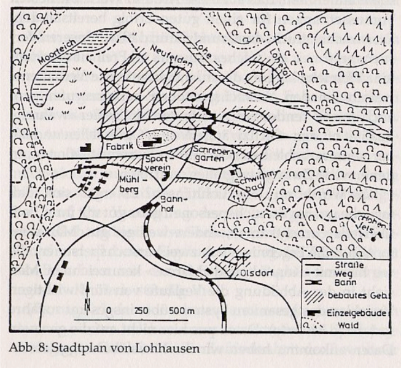
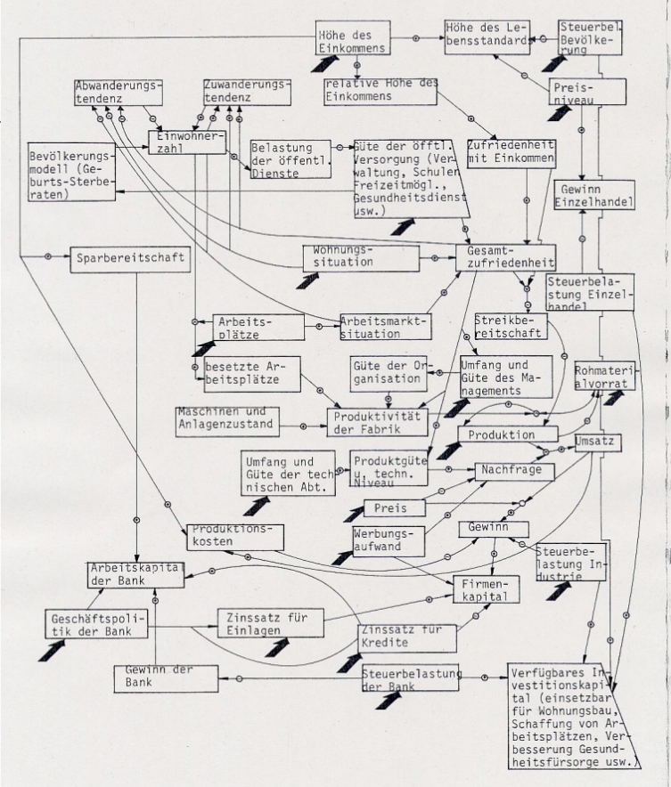
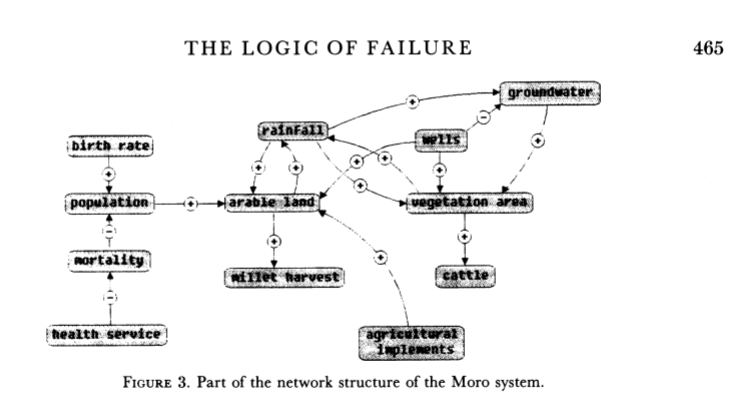

# Followup 24 August 2021

[[Whiteboards](https://drive.google.com/drive/folders/1BgOJJauPP6kEVEZn97CZcCgF0DMU87Cy?usp=sharing)]

## The Logic of Failure

Dietrich Dörner is a theoretical (i.e. computational) psychologist
from Bamberg University (Bavaria, Germany) and author of the
influential book "The Logic of Failure" ([Dörner, 1997](#orga2b0857)). See also:
review ([Kirkus, 2010](#orgc507805)).

An article by [Dörner (1990)](#orgc7fcdc3) precedes the book and presents the
main arguments with excellent illustrations - from the abstract:

> "Unlike other living creatures, humans can adapt to
> uncertainty. They can form hypotheses about situations marked by
> uncertainty and can anticipate their actions by planning. They can
> expect the unexpected and take precautions against it. In numerous
> experiments, we have investigated the manner in which humans deal
> with these demands. In these experiments, we used computer
> simulated scenarios representing, for example, a small town,
> ecological or economic systems or political systems such as a
> Third World country.

Here is the map of the fictitious town of Lohhausen, which Dörner
simulated, followed by the system model used for the simulation.

I always find the very concept of a "logic of failure" quite
puzzling - isn't logic independent of success or failure but
describes just "what is"? The article's conclusions make it a
little clearer, why he used the term "logic":

> "It is possible to learn strategic flexibility. I believe,
> however, that it is difficult to teach it. It is not a matter of
> learning a few readily grasped general principles, but of learning
> a lot of small, 'local' rules, each of which is applicable in a
> limited area. The point is not to learn how to drive a steamroller
> with which one can flatten all problems in the same way, but to
> learn the adroitness of the puppeteer, who at one time holds many
> strings in his hands and who is able to adapt his movements to the
> given circumstances in the most sophisticated ways."

## Complex systems

Page (in The Model Thinker) mentions 'complexity' but does not
define it except through examples. Dörner made an attempt at a
definition, which we talked about it class (and applied it).

-   "A system is complex when it consists of a great variety of
    variables."
-   "All these variables are closely tied to one another, they
    mutually affect each other and constitute a network of
    independencies."
-   "The system is dynamic, which means that it develops further,
    even without interventions."
-   "The system is intransparent [because] many of the variables
    defy direct observation."
-   "The system is uncertain [because] the acting subject has no
    complete knowledge about the system, about its variables and
    their interdependencies."
    
    

To summarize: complex problems (in complex systems) mean

1.  large number of variables
2.  large network of interdependent variables
3.  dynamic evolution without intervention
4.  intransparency to direct observation
5.  great uncertainty due to incomplete knowledge

The last criterion is actually more like a summary of the previous
four, and it introduces the important term "uncertainty". Complex
systems carry uncertainty, but not all uncertainty is due to
complexity.

For more details, see [Frensch & Funke (1995)](#org12251b3) on complex problem
solving.

## Essay ideas

There are a number of possible term essay topics:

-   "Complex problem criteria:" explore the issues of complex
    problem solving further. Are there different sets of criteria?
    Why is there a "European perspective" at all? When exploring
    concepts or criteria, always use (or create) examples.
-   "The Logic of Failure:" a book report or extended review,
    complete with applications to our time (the book is, after all,
    25 years old), might be very interesting. You could look for
    similar computer simulations, or even program one!
-   "List of models used to solve problem X:" we looked at a set of
    global complex problems. It might be interesting to compile a
    commented list of models used to tackle any of these problems.
-   "Local strategic rules:" what are these rules that Dörner talks
    about in the conclusions of his 1990 article, how would you
    validate his conjecture, and what is the relationship with
    many-model thinking?

## References

 [Dörner, D (1990). The logic of failure. In:
Phil. Trans.R. Soc. Lond. B 327:463-473 (1990).](https://www.gwern.net/docs/existential-risk/1990-dorner.pdf)

 [Dörner, D (1997). The Logic of Failure> Recognizing
And Avoiding Error In Complex Situations. Basic Books.](https://www.amazon.com/Logic-Failure-Recognizing-Avoiding-Situations/dp/0201479486)

 [Frensch P, Funke J (1995). Complex Problem Solving:
The European Perspective. Hillsdale NJ: Lawrence Erlbaum.](https://www.researchgate.net/publication/200134353_Complex_Problem_Solving-The_European_Perspective)

 [NA (20 May 2010). The Logic of Failure: Why things go
wrong and what we can do to make them right. In: Kirkus Review.](https://www.kirkusreviews.com/book-reviews/dietrich-dorner/the-logic-of-failure/)

