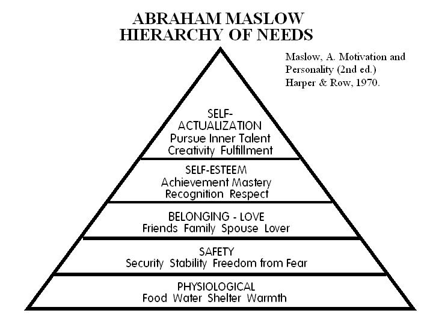

# Followup 26 August 2021

[[Whiteboards](https://drive.google.com/drive/folders/1EeyhVk4dj-UkqufAVZDstqqnFv0eqh1E?usp=sharing)]

## "Essay" project process

Three processes are aligned with one another for the project,
which in this course is an essay ([cp. Syllabus](https://github.com/birkenkrahe/mod482/blob/main/syllabus.md#grading-system)):

1.  term: beginning mid August, ending in early December. Mid-term
    grades are independent of the project.
2.  Scrum: four sprints with four sprint reviews roughly four weeks
    apart. at a sprint review, you present the status of your essay
    prototype.
3.  IMRaD: the introduction with research question (what you wish
    to investigate), the method (how you are going to do it), your
    results (what you found out), and the discussion of your
    results (what it means, how it benefits whom, including the
    limitations of your investigation).

In week 3 (Aug 30-Sep 3) we will focus on generating ideas and get
the project set up properly (1st sprint review). [See also the FAQs](https://github.com/birkenkrahe/org/blob/master/FAQ.md)

-   "What is a sprint review",
-   "What do I need to deliver at a sprint review?"
-   "What should we do in the first sprint?"
-   "What should we do in the second sprint?"
-   "What should we do in the third sprint?"
-   "What should we do in the fourth sprint?"

## Maslow pyramid of needs

This model by Maslow is so popular that it is often taken for
truth. In fact, it is just a model, and not a timeless one. It is
sometimes instructive to change a model to test its validity. For
example, you could assume "spirituality" or "faith" as the basic
need. Nothing stops you from doing that - and the model may now
have more (or less) explanatory power.

## Knowledge management model for Shell

You can find this model and an explanation of what it was created
for in an article that I wrote for the Univ of Auckland Business
Review ([Best paper, 2002](#org7382ccd))

## References

 [Birkenkrahe, M (2002). How large
multi-nationals manage their knowledge. In: University of Auckland
Business Review 4(2):2-12 (2002).](http://www.thebookshelf.auckland.ac.nz/docs/UABusReview/2002_04_i02-02-birkenkrahe.pdf)

