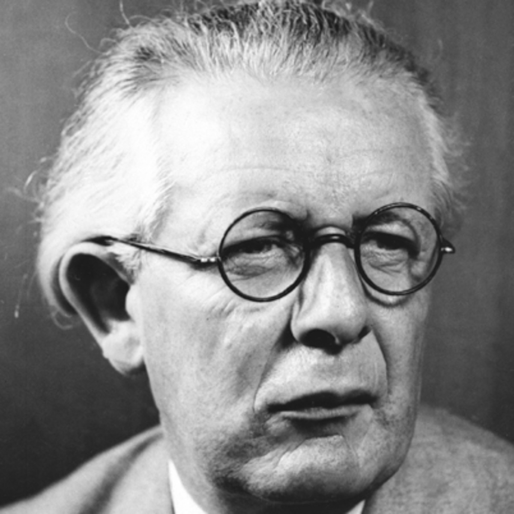
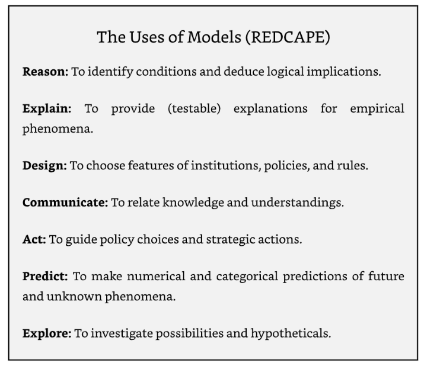
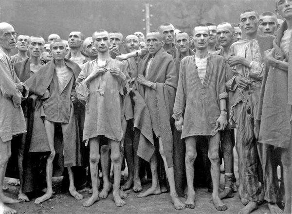
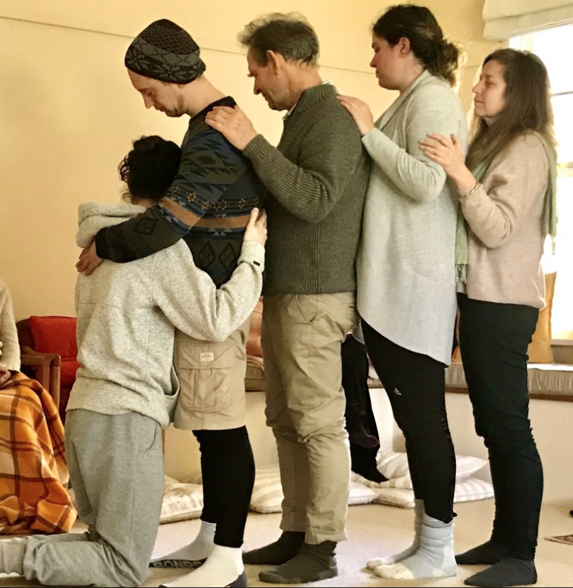
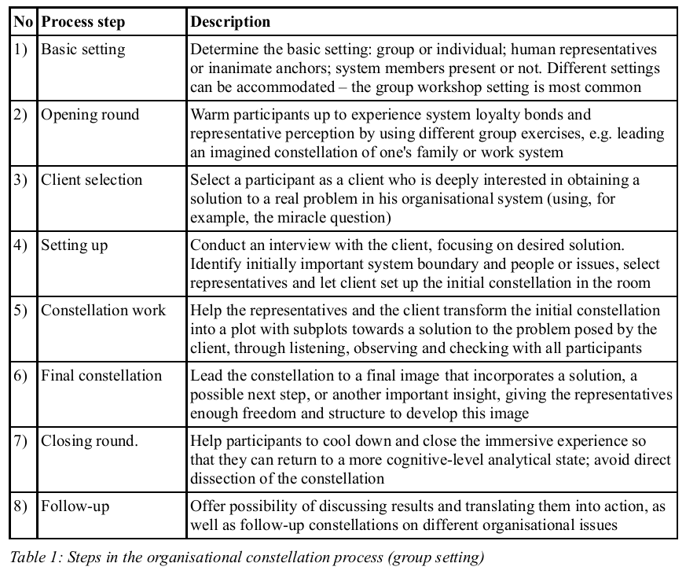

# Table of Contents

-   [What're you going to learn?](#org8839e66)
-   [Models and reality](#orgab15fe5)
    -   [Some implications](#orgffb20c0)
    -   [Implications of Piaget's work](#orgccc16f3)
-   [Three approaches to modeling](#orgf2e7ffc)
    -   [Examples](#org53bf102)
    -   [Occam's Razor](#org75c37df)
-   [Uses of models: REDCAPE](#org26b6489)
    -   [REDCAPE as a process model](#orgfe4227e)
    -   [Weaknesses of REDCAPE](#org028e08c)
-   [Example: system constellations](#orgfc61d9b)
    -   [Model history](#org774e732)
    -   [Related techniques](#org90b4fcf)
    -   [Model uses: see what is](#orgd38ab03)
    -   [Model assumptions](#org5d8329b)
    -   [Model process](#org20400f2)
    -   [Personal uses](#org0309bdd)
    -   [Summary on constellations](#orgdaefa01)
-   [Summary](#org213baea)
-   [Exercise / Assignment](#org62fd51f)
-   [Next topics](#org457ed3b)
-   [Any questions?](#org5478535)
-   [References](#orgc275f34)

# What're you going to learn?

-   Models and reality
-   Three approaches to modeling
-   Uses of models (REDCAPE)
-   Extended example: system constellations<a id="fnr.1" class="footref" href="#fn.1">1</a>
-   Exercise OR assignment
-   Next topics

# Models and reality

> Knowing reality means constructing systems of transformations that
> correspond, more or less adequately, to reality. (Jean Piaget)

## Some implications

-   Reality cannot be known directly
-   Reality is not experienced but constructed
-   Knowledge is an approximation
-   Strong dependence on models

## Implications of Piaget's work

-   Importance of formal operational thought
-   Children develop like mini-scientists
-   Hypothetical thinking over critical thinking
-   Constructivist school curricula (yours!)

([More on Piaget's theories](https://courses.lumenlearning.com/edpsy/chapter/psychological-constructivism-piagets-theories/))

# Three approaches to modeling

<table border="2" cellspacing="0" cellpadding="6" rules="groups" frame="hsides">

<colgroup>
<col  class="org-left" />

<col  class="org-left" />

<col  class="org-left" />
</colgroup>
<thead>
<tr>
<th scope="col" class="org-left">STRUCTURAL</th>
<th scope="col" class="org-left">FUNCTIONAL</th>
<th scope="col" class="org-left">PURPOSE</th>
</tr>
</thead>

<tbody>
<tr>
<td class="org-left">Abstractions</td>
<td class="org-left">Embodiment</td>
<td class="org-left">Realism</td>
</tr>

<tr>
<td class="org-left">Functions</td>
<td class="org-left">Analogy</td>
<td class="org-left">Essence</td>
</tr>

<tr>
<td class="org-left">Simulations</td>
<td class="org-left">Alternative reality</td>
<td class="org-left">Speculation</td>
</tr>
</tbody>
</table>

## Examples

<table border="2" cellspacing="0" cellpadding="6" rules="groups" frame="hsides">

<colgroup>
<col  class="org-left" />

<col  class="org-left" />
</colgroup>
<thead>
<tr>
<th scope="col" class="org-left">FUNCTION</th>
<th scope="col" class="org-left">MODEL</th>
</tr>
</thead>

<tbody>
<tr>
<td class="org-left">Embodiment</td>
<td class="org-left">Traffic network</td>
</tr>

<tr>
<td class="org-left">Analogy</td>
<td class="org-left">Crime as a disease</td>
</tr>

<tr>
<td class="org-left">Alternative reality</td>
<td class="org-left">Game of Life</td>
</tr>
</tbody>
</table>

## Occam's Razor

# Uses of models: REDCAPE

## REDCAPE as a process model

1.  Phenomena (observations) - EXPLAIN
2.  Review findings - EXPLORE
3.  Critique and test findings - REASON
4.  Extract meaning - DESIGN
5.  Communicate findings - COMMUNICATE
6.  Act on findings - ACT
7.  Extend findings to future - PREDICT

## Weaknesses of REDCAPE

-   Not testable (no observables)
-   Not mutually exclusive
-   Not collectively exhaustive
-   Not validated (except examples)

# Example: system constellations

Image: organizational system

## Model history

Image: Holocaust survivors

## Related techniques

-   Transactional analysis (Berne)
-   Psychodrama (Moreno)
-   Family sculptures (Satir)
-   Gestalt therapy (Perls)
-   Primal scream therapy (Janov)
-   Neuro-linguistic programming (Bandler/Grindler)

## Model uses: see what is

-   Overcome defensiveness
-   Establish/strengthen relationships
-   Reveal hidden truths or facts

## Model assumptions

-   System boundaries count<a id="fnr.2" class="footref" href="#fn.2">2</a>
-   System belonging time counts<a id="fnr.3" class="footref" href="#fn.3">3</a>
-   Older systems have precedence<a id="fnr.4" class="footref" href="#fn.4">4</a>
-   Acknowledging what is counts<a id="fnr.5" class="footref" href="#fn.5">5</a>

## Model process

## Personal uses<a id="fnr.6" class="footref" href="#fn.6">6</a>

-   Career advice (choices)
-   Clarify relationships (love)
-   (Re-) Establish order (work)

## Summary on constellations

-   Functional: Analogy approach
-   Structural: Simulation technique
-   Empirically well established
-   Highly effective where applicable
-   One-to-many model (many systems)

# Summary

-   Modeling is based on assumptions about the nature of reality and
    the nature of knowledge
-   There are structural and functional approaches to modeling
-   There are many-to-one and one-to-many uses of models
-   Models need to be validated in multiple ways
-   Models, even very successful ones, can be invalidated

# Exercise / Assignment

-   CHANGE your topic at any time!
-   [ADD your topic for feedback!](//GITHUB.COM/BIRKENKRAHE/MOD482/DISCUSSIONS/2)
-   Come and TALK to me about it!
-   Which APPROACH are you taking?
-   One-to-many or many-to-one?

# Next topics

-   Storytelling
-   User Stories

# Any questions?

[This presentation is available online.](https://github.com/birkenkrahe/mod482/tree/main/5_why_model)

# References

Page SE (2021). The Model Thinker. New York: Basic Books.

N.a. (n.d.). Psychological Constructivism> Piaget's Theories
[Course]. [Online: lumenlearning.com](https://courses.lumenlearning.com/edpsy/chapter/psychological-constructivism-piagets-theories/).

# Footnotes

<a id="fn.1" href="#fnr.1">1</a> The extended example is based on my 2008 paper on this topic:
Birkenkrahe, M. (2008). System constellations as tool supporting
organisational learning and change processes. In: International
Journal of Learning and Change 3(3), pp. 125-144. [Online:
researchgate.net](https://www.researchgate.net/publication/228635553_System_constellations_as_tool_supporting_organisational_learning_and_change_processes). ([GDrive copy](https://drive.google.com/file/d/16VWX55tpbJptqZOWkrPZB5v1t_5TT5xD/view?usp=sharing)).

<a id="fn.2" href="#fnr.2">2</a> The system suffers e.g. when a member is excluded for whatever
reason - e.g. because the company changed owner. This also applies
when a family tries to exclude members - e.g. in Germany because
someone was Jewish (in Nazi Germany), or because someone was a Nazi
(in Germany after the Nazis).

<a id="fn.3" href="#fnr.3">3</a> The time which members already spent in a system has to be
honored: e.g. older team members are honored by being asked to speak
first. In families, grandparents have precedence over parents, who
have precedence over their children.

<a id="fn.4" href="#fnr.4">4</a> When a company spins off another company, or when someone
remarries, the old system has precedence over the new system. In
practice, this can be honored by making it explicit.

<a id="fn.5" href="#fnr.5">5</a> When systems are in disarray, in the public or in private realm,
there is a tendency to make critical issues undiscussable, to bury
unpleasant facts, or to forget about undesirables. Take any unresolved
conflict or debate in living memory, and you can see the effects of
this process. Constellations teach us that it is important to not do
this, and that it is much easier to do it symbolically (by way of the
mechanism of "representative perception") than directly.

<a id="fn.6" href="#fnr.6">6</a> Career choices: you can set up career options (or companies) as
representatives and check in where you feel drawn. Love: same thing if
you cannot decide between potential partners, or if you have a
worrying friendship. Order: to righten a hierarchical relationship -
e.g. bowing to a representative of your boss (even you though may hate
him and that's the last thing you want to do).
