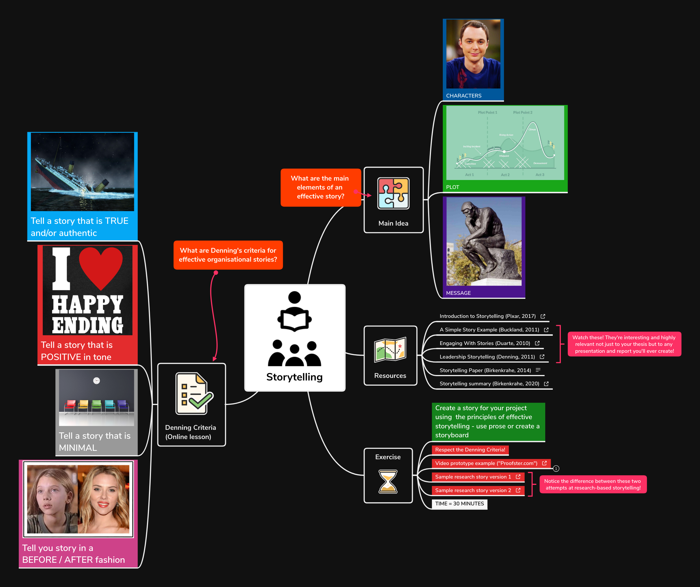

# Storytelling videos

1.  [Introduction to storytelling | Pixar in a box (2017)](https://youtu.be/ru84HBS7B_4) (3')
    
    Focus on crafting stories that contain personal reflections, uses
    Pixar's production of "Monster Inc" as an example.

2.  [A simple story by Richard Buckland (2016)](https://youtu.be/G8GR9hJ7lEY) (3')
    
    Contains the most important elements of story. Explained by
    telling a simple story.

1.  [Nancy Duarte - the power of story (2010)](https://youtu.be/GY3u6QuZXEs) (4')
    
    Argues for mixing story (narrative) and report (facts) when
    speaking to or communicating to business audiences.

2.  [Steve Denning - Leadership Storytelling (2011)](https://youtu.be/RipHYzhKCuI) (17')
    
    Explains Denning's four criteria for effective storytelling in an
    organizational (i.e. professional) setting: authenticity,
    positive tone, minimal detail, and before/after plot.

3.  [Videoprototyping example proofster.com (2016)](https://youtu.be/4MNPjWxy5Bg) (1')
    
    Student team video prototype produced in less than one hour after
    many weeks of collaborating with a startup.

4.  [Storytelling - summary (2020)](https://youtu.be/3ljt5fKVryg) (3'32'') + [exercise](https://youtu.be/94qw2drvl-k) (2'17')
    
    Short lecture on the basics of storytelling, and an outline of
    the exercise (create a story for your research project).

5.  [Research Storytelling sample 1 (2020)](https://youtu.be/xMuBp1U-rew)
    
    Not a very effective solution to the exercise. Here, I use
    Minto's pyramid principle recipe SCQA to structure the story.

6.  [Research Storytelling sample 2 (2020)](https://youtu.be/ebOqbdzIoU4)
    
    A more effective example of storytelling - same subject as the
    first example, but transported using regular storytelling
    elements.

# Storytelling mindmap

([Full mindmap XMind file](https://github.com/birkenkrahe/mod482/blob/main/6_storytelling/6_storytelling.xmind))

