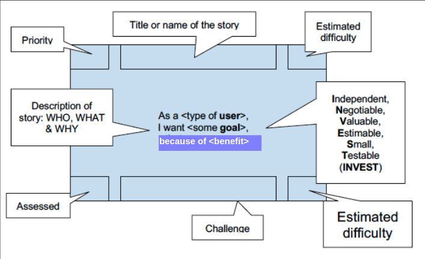

# Table of Contents

1.  [What is a user story?](#org8abed8f)
    1.  [Simple example](#org9142921)
    2.  [Epic, story and task](#orgadc3e94)
2.  [INVEST criteria](#org41a8530)
3.  [More Examples](#orgd3e116d)
    1.  [Vehicle app](#org9757d4e)
    2.  [Airline app](#orgf85422e)
    3.  [Trello example](#org257b1ed)
    4.  [Jira example](#orgcd3f4d1)
4.  [Practice!](#org2d6d603)
5.  [Sprint review challenge](#orgf7f22ab)
6.  [References](#org41eaccd)

# What is a user story?

> User stories are short, simple descriptions of a **feature** told from
> the perspective of the **person** who desires the new capability,
> usually a user or customer of the **system**. ([Cohn, 2021](#org7f8dbea))

## Simple example

User stories are short and can be thought of as fitting on an index
card.

-   Who is the **person**?
-   What is the **feature**?
-   Why does the person **want** it?
-   Which **system** is this?

## Epic, story and task

User stories are embedded in a larger story, also called an
"epic". The key reason to create a story is to derive tasks from
it. To do this, the story must be small and specific.

# INVEST criteria

To be useful in a software engineering project, user stories need
to fulfil certain criteria. A user story needs to be:

<table border="2" cellspacing="0" cellpadding="6" rules="groups" frame="hsides">

<colgroup>
<col  class="org-right" />

<col  class="org-left" />

<col  class="org-left" />
</colgroup>
<tbody>
<tr>
<td class="org-right">1)</td>
<td class="org-left">Independent</td>
<td class="org-left">To derive unique tasks from it</td>
</tr>

<tr>
<td class="org-right">2)</td>
<td class="org-left">Negotiable</td>
<td class="org-left">To be able to talk to the customer about it</td>
</tr>

<tr>
<td class="org-right">3)</td>
<td class="org-left">Valuable</td>
<td class="org-left">To generate a real value to the customer</td>
</tr>

<tr>
<td class="org-right">4)</td>
<td class="org-left">Estimable</td>
<td class="org-left">To be measurable (e.g. for burndown chart)</td>
</tr>

<tr>
<td class="org-right">5)</td>
<td class="org-left">Small</td>
<td class="org-left">To derive doable tasks from it</td>
</tr>

<tr>
<td class="org-right">6)</td>
<td class="org-left">Testable</td>
<td class="org-left">To be checked for completion</td>
</tr>
</tbody>
</table>

# More Examples

## Vehicle app

This is a common place application for many modern cars:

What could be on the back of this card?<a id="fnr.1" class="footref" href="#fn.1">1</a>

## Airline app

Here is another one, which is common place in airline travel.

The back of the card shows individual desirable features. The front
of the card is more of an epic - it leads to half a dozen more
specific user stories.

## Trello example

This example comes from a student project: the students worked with
a large retailer who wanted to create a virtual show room. There
are four epics with several user stories each. 

## Jira example

Software companies that specialize in productivity tools like
Atlassian offer complete User Story and Scrum tool boxes. The image
shows a Scrum backlog (task list) that contains user stories, and
matching features in the popular tool Jira [(Rehkopf, 2021)](#orgba05f2d).

# Practice!

This short [Samsung commercial (2017)](#orgd5f59d8) contains several user
stories. Find them! Can you suggest tasks following from the
stories?<a id="fnr.2" class="footref" href="#fn.2">2</a>

# Sprint review challenge

Include at least one user story and the task(s) derived from it.

> Example: "As a comp sci student, I want to know what technical
> jargon in my research topic X may come up in a job interview"

Task selection:

-   Look at recent job applications for X
-   Check recent research papers on X
-   Check recent conference talks on X
-   Make a master list of 10 jargon terms
-   Define each term in your own words
-   Use one term per week in conversations

# References

 Cohn M (2021). User Stories [website]. Online:
[mountaingoatsoftware.com.](https://www.mountaingoatsoftware.com/agile/user-stories)

{This is a great resource with plenty of examples from a software
engineering perspective - if you want to design, build or maintain
software.}

 DeCapua T (Jul 18, 2016). How to build performance into
your user stories [blog]. Online: [techbeacon.com](https://techbeacon.com/app-dev-testing/how-build-performance-your-user-stories).

{In another session, I embedded data modeling and other modeling
methods in the wider issue of "performance management".}

 Rehkopf (n.d.). User Stories with Examples and Template
[website]. [Online: atlassian.com.](https://www.atlassian.com/agile/project-management/user-stories) 

 Top Trending (Nov 6, 2017). Samsung mocks Apple and the iPhone X
[video]. [Online: youtube.com](https://youtu.be/s8AmkizQ39s).

# Footnotes

<a id="fn.1" href="#fnr.1">1</a> As [DeCapua (2016)](#org8b9c770) points out:

> this user-story description captures several very subjective
> ideas. What does “by the time I get to it” mean? Does it mean “user
> should walk two to three minutes more slowly than usual” to ensure
> that the vehicle is on when he arrives? Or does it mean “user should
> press auto-start 15 minutes prior to arrival” to ensure that the
> vehicle is actually “warmed up” upon user arrival? Of course not. Most
> users would expect a car to start within five seconds so that it would
> be warming for at least five or ten minutes before they’re ready to
> drive.

<a id="fn.2" href="#fnr.2">2</a> The user stories come out of several instances of inconvenience
that the user experiences: [0:02] User does not want to queue for his
new phone. [0:10] User needs storage to make more high-res
photos. [0:18] User wants to write notes by hand. [0:23] User wants to
dry his new phone after it got wet. [0:40] User wants to charge his
phone wirelessly.
