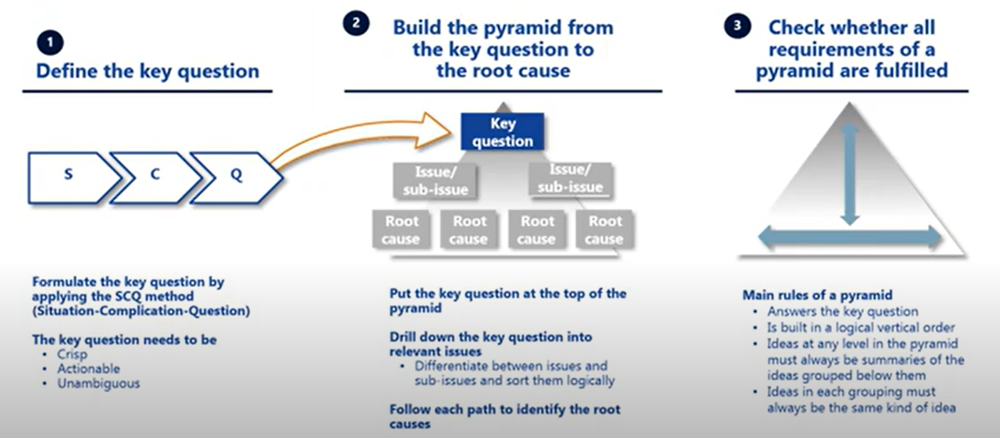
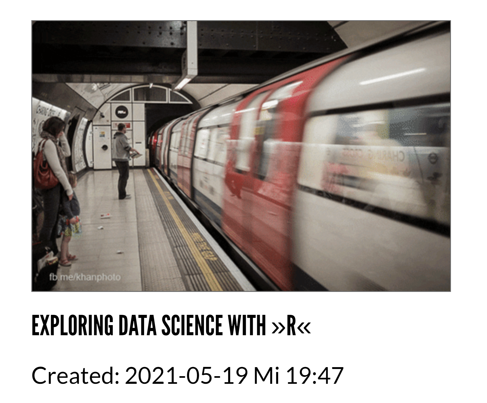
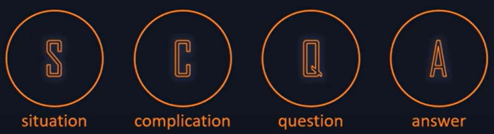
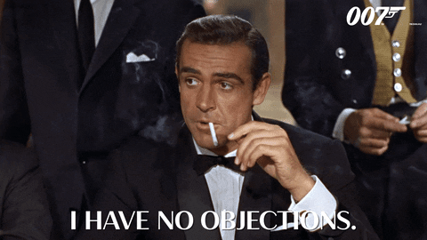

# Table of Contents

-   [What will you learn?](#org55e7a84)
-   [What is the Minto Pyramid Principle?](#orga50e012)
    -   [How to structure a presentation](#orga88ee8f)
    -   [Pyramid rules: logic + MECE](#orge9ac3d6)
    -   [Example: "Exploring Data Science with R"](#orgbfd7b22)
-   [SCQ = Situation + Complication + Question](#org4354165)
    -   [Understanding SCQ](#org4be94a1)
    -   [Example 1](#org1cd954b)
    -   [Example 2](#org88dae7b)
    -   [Example 3](#org674026c)
    -   [Practice 1](#org5645b8b)
        -   [Roadtrip trouble](#org0150eb8)
        -   [Missed assignment](#org5ce2dbe)
        -   [Sprint review](#org40ef715)
    -   [Practice 2](#orga49559a)
-   [Tutorial videos](#orgcbf653c)
-   [References](#org9d72e17)

# What will you learn?

-   What is the Minto Pyramid Principle?
-   What is the SCQA technique?
-   Examples: SCQA for different
-   Practice: SCQA for your essay project

(See also [this FAQ](https://github.com/birkenkrahe/org/blob/master/FAQ.md#orgd4994dd) for a short overview with examples.)

# What is the Minto Pyramid Principle?

Introductory video [Harrison Metal (2014)](https://vimeo.com/87537935).

-   A model to efficiently structure all documents
-   Efficiency = maximizing audience rapport
-   Developed by Barbara Minto(formerly McKinsey & Co)

## How to structure a presentation

The Minto method works for email, reports, talks, and also
presentations. For presentations, you can just read the slides off
the pyramid scheme:

*Image source: powerusersoftwares.com, 2016*

## Pyramid rules: logic + MECE

-   The pyramid answers the key question at the top
-   Deductive or inductive vertical logic
-   Horizontal logic: only items of the same kind
-   Horizontal grouping is MECE (Mutually Exclusive + Collectively
    Exhaustive)

Image: Pontema, 2021.

## Example: "Exploring Data Science with R"

I used Minto to structure [my first Lyon College lecture](https://1drv.ms/b/s!AhEvK3qWokrvioRuDzBtLvAwf8jGzw) (and I got
the job!).

-   Key message: "R is great for exploratory data analysis!" (EDA)
-   Keyline 1: EDA process model
-   Keyline 2: EDA examples in R
-   Keyline 3: EDA in Python vs. R

# SCQ = Situation + Complication + Question

-   Key to the pyramid is its top = introduction
-   SCQ = method to build an efficient introduction
-   Key question forms the top of the pyramid
-   Body of the pyramid = Answer to the key question

*Image: Rob George (2019)*

## Understanding SCQ

SCQ establishes a hypothesis and the process leading to it:

<table border="2" cellspacing="0" cellpadding="6" rules="groups" frame="hsides">

<colgroup>
<col  class="org-left" />

<col  class="org-left" />
</colgroup>
<tbody>
<tr>
<td class="org-left">Situation</td>
<td class="org-left">Context in which you're operating today</td>
</tr>

<tr>
<td class="org-left">Complication</td>
<td class="org-left">Challenge or change within the context</td>
</tr>

<tr>
<td class="org-left">Question</td>
<td class="org-left">Question that the challenge or change leads to<a id="fnr.1" class="footref" href="#fn.1">1</a></td>
</tr>

<tr>
<td class="org-left">Answer</td>
<td class="org-left">The answer to the question that is posed<a id="fnr.2" class="footref" href="#fn.2">2</a></td>
</tr>
</tbody>
</table>

For the following examples, our context area is Lyon College
itself.

## Example 1

<table border="2" cellspacing="0" cellpadding="6" rules="groups" frame="hsides">

<colgroup>
<col  class="org-left" />

<col  class="org-left" />
</colgroup>
<tbody>
<tr>
<td class="org-left">Situation</td>
<td class="org-left">"The college wants to grow its student population by 10% annually."</td>
</tr>

<tr>
<td class="org-left">Complication</td>
<td class="org-left">"Since 2010, student population in Arkansas has declined by 9.09%"</td>
</tr>

<tr>
<td class="org-left">Question</td>
<td class="org-left">"Should we stick to our strategic growth plan?"</td>
</tr>

<tr>
<td class="org-left">Answer</td>
<td class="org-left">"No."</td>
</tr>
</tbody>
</table>

Altering the situation will suggest a different complication, and
lead to a different question and hypothesis. Let's try this:

1.  Given the situation, could "We don't have a plan in place to do
    this." be a possible alternative **complication**?<a id="fnr.3" class="footref" href="#fn.3">3</a>
2.  Which **question** would this alternative complication lead
    to?<a id="fnr.4" class="footref" href="#fn.4">4</a>
3.  Which **answer** would you give to this question?

## Example 2

<table border="2" cellspacing="0" cellpadding="6" rules="groups" frame="hsides">

<colgroup>
<col  class="org-left" />

<col  class="org-left" />
</colgroup>
<tbody>
<tr>
<td class="org-left">Situation</td>
<td class="org-left">"The president of the college has been heavily critized for divisive public comments that he made in regard to the college vs. the community."</td>
</tr>

<tr>
<td class="org-left">Complication</td>
<td class="org-left">"An important role of the president is to serve as link between college and community."</td>
</tr>

<tr>
<td class="org-left">Question</td>
<td class="org-left">"How should the board of trustees react to the criticism of the president?"</td>
</tr>

<tr>
<td class="org-left">Answer</td>
<td class="org-left">"Possible reactions to the criticism of the president"</td>
</tr>
</tbody>
</table>

This **answer** directly hints at a pyramid, a deductive, logical
breakdown of "possible reactions"<a id="fnr.5" class="footref" href="#fn.5">5</a>, e.g.

<table border="2" cellspacing="0" cellpadding="6" rules="groups" frame="hsides">

<colgroup>
<col  class="org-left" />

<col  class="org-left" />

<col  class="org-left" />
</colgroup>
<tbody>
<tr>
<td class="org-left">A. The board does not react at all</td>
<td class="org-left">B. The board reprimands the president</td>
<td class="org-left">C. The board asks for the president's resignation.</td>
</tr>
</tbody>
</table>

## Example 3

The previous SCQ scheme can be improved: the **complication** isn't
actually a challenge at all - it's part of the president's job
description. The course of action is pretty clear (it involves
gathering more data etc. but not immediately firing the president).

<table border="2" cellspacing="0" cellpadding="6" rules="groups" frame="hsides">

<colgroup>
<col  class="org-left" />

<col  class="org-left" />
</colgroup>
<tbody>
<tr>
<td class="org-left">Situation</td>
<td class="org-left">"The president of the college has been heavily critized for divisive public comments that he made in regard to the college vs. the community. The president is the figure head of the college and charged with developing the relationship between the college and the community. Months late, the president issued a public statement regarding the comments in which he doubled down on his divisive comments."</td>
</tr>

<tr>
<td class="org-left">Complication</td>
<td class="org-left">"The faculty voted unanimously for the president's resignation."</td>
</tr>

<tr>
<td class="org-left">Question</td>
<td class="org-left">"How should the board of trustees react?"</td>
</tr>

<tr>
<td class="org-left">Answer</td>
<td class="org-left">"Possible reactions to the criticism of the president"</td>
</tr>
</tbody>
</table>

This **answer** directly hints at a pyramid, a deductive, logical
breakdown of "possible reactions", e.g.

<table border="2" cellspacing="0" cellpadding="6" rules="groups" frame="hsides">

<colgroup>
<col  class="org-left" />

<col  class="org-left" />

<col  class="org-left" />
</colgroup>
<tbody>
<tr>
<td class="org-left">A. The board does not react at all</td>
<td class="org-left">B. The board reprimands the president</td>
<td class="org-left">C. The board fires the president.</td>
</tr>
</tbody>
</table>

Now, the keyline makes a lot more sense and is likely what happened
after the faculty assembly vote that heated up the process and made
it more "complicated", i.e. triggered an urgent board response.

## Practice 1

Substitute the missing elements!

### Roadtrip trouble

<table border="2" cellspacing="0" cellpadding="6" rules="groups" frame="hsides">

<colgroup>
<col  class="org-left" />

<col  class="org-left" />
</colgroup>
<tbody>
<tr>
<td class="org-left">Situation</td>
<td class="org-left">"I am on a roadtrip."</td>
</tr>

<tr>
<td class="org-left">Complication</td>
<td class="org-left">"My car broke down."</td>
</tr>

<tr>
<td class="org-left">Question</td>
<td class="org-left">???</td>
</tr>

<tr>
<td class="org-left">Answer</td>
<td class="org-left">???</td>
</tr>
</tbody>
</table>

### Missed assignment

<table border="2" cellspacing="0" cellpadding="6" rules="groups" frame="hsides">

<colgroup>
<col  class="org-left" />

<col  class="org-left" />
</colgroup>
<tbody>
<tr>
<td class="org-left">Situation</td>
<td class="org-left">"As a student, I handed a assignment in too late."</td>
</tr>

<tr>
<td class="org-left">Complication</td>
<td class="org-left">???</td>
</tr>

<tr>
<td class="org-left">Question</td>
<td class="org-left">"How will missing this assignment affect my grade?"</td>
</tr>

<tr>
<td class="org-left">Answer</td>
<td class="org-left">"Breakdown of course grading criteria in the Syllabus"</td>
</tr>
</tbody>
</table>

### Sprint review

<table border="2" cellspacing="0" cellpadding="6" rules="groups" frame="hsides">

<colgroup>
<col  class="org-left" />

<col  class="org-left" />
</colgroup>
<tbody>
<tr>
<td class="org-left">Situation</td>
<td class="org-left">???</td>
</tr>

<tr>
<td class="org-left">Complication</td>
<td class="org-left">"In my presentation forgot to answer the sprint review questions."</td>
</tr>

<tr>
<td class="org-left">Question</td>
<td class="org-left">"What are these sprint review questions?"</td>
</tr>

<tr>
<td class="org-left">Answer</td>
<td class="org-left">"List of sprint review questions in the FAQ"</td>
</tr>
</tbody>
</table>

## Practice 2

-   Construct an introduction to your essay using the SCQ technique!
-   Post your SCQA + keyline breakdown (= chapter structure) in this
    [discussion forum](https://github.com/birkenkrahe/mod482/discussions/4)!
    
    

# Tutorial videos

-   Minto Pyramid Principle Part 1 - [Introductory Stories](https://youtu.be/HrmBZQuCSzo)
    (Birkenkrahe, 2016)
-   Minto Pyramid Principle Part 2 - [What Audiences Want](https://youtu.be/k_FJXpYPbQY)
    (Birkenkrahe, 2016)
-   [Pyramid principle by Minto](https://youtu.be/1y15zjp47KQ) - video with business focus (Pontema,
    1.
-   [SCQA tutorial video](https://youtu.be/SxGwSR4lKYs) using a retail example (Rob George, 2019)

# References

Birkenkrahe M (Feb 7, 2016). Minto Pyramid Principle Part 1 -
Introductory stories. [Online: youtube.com.](https://youtu.be/HrmBZQuCSzo)

Birkenkrahe M (Feb 7, 2016). Minto Pyramid Principle Part 2 - What
audiences want. [Online: youtube.com.](https://youtu.be/k_FJXpYPbQY)

Harrison Metal (2014). Storytelling & Presenting 1: Thank You,
Barbara Minto [video]. [Online: vimeo.com](https://vimeo.com/87537935)

Minto B (2002). The Pyramid Principle.

Pontema (Mar 12, 2021). Pyramid Principle by Barbara Minto
[video]. [Online: youtube.com](https://youtu.be/1y15zjp47KQ)

Power-user (Jul 31, 2016). Give a brilliant structure to your
presentations with the Pyramid Principle [website]. [Online:
powerusersoftwares.com](https://www.powerusersoftwares.com/post/2016/07/31/give-a-brilliant-structure-to-your-presentations-with-the-pyramid-principle)

Rob George (Apr 12, 2019). 3 SCQA [video]. [Online: youtube.com](https://youtu.be/SxGwSR4lKYs)

# Footnotes

<a id="fn.1" href="#fnr.1">1</a> There are several different types of questions: How, Why, What,
Who and When; it is important that the complication exactly matches
the question, in alignment with the context. For example, a
complication like "We don't know how to do X", can lead to all types
of questions, depending on the context. If the context is "we must do
X", questions on who, when and how are possible, but not what (since X
is given).  If the context is "we've been asked to decide between A
and B", leads to "why should we do A or B?", or "How should we
decide?", but not "Who", since that is given.

<a id="fn.2" href="#fnr.2">2</a> The introduction only contains the hypothesis, the first or
tentative answer. The full answer is contained in the entire body of
the pyramid of arguments.

<a id="fn.3" href="#fnr.3">3</a> "We don't have a plan in place to do this" would be possible,
but it would be better to anchor this complication by mentioning the
need for a **plan**.

<a id="fn.4" href="#fnr.4">4</a> The new complication "We don't have a plan in place to do this",
could (in the context of the situation) lead to several questions: (1)
**why** not? (2) **who** is responsible for this? (3) **how** can we put a
plan in place?,(4) **who** should lead the development of a plan, (5)
**when** should this plan be in place? Since the situational context is
quite specific, the question "how" is the best fit. All the other
questions are not well prepared by the short situation. The **answer**
to this question is not a simple "yes" or "no" but requires research
and a keyline of different (supporting) arguments. E.g. areas in which
to begin planning.

<a id="fn.5" href="#fnr.5">5</a> There are other possible breakdowns - we are hampered by having
little to go by in the situation and complication.
