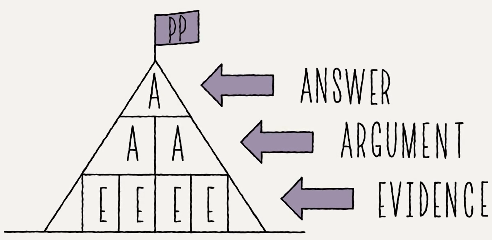

# Table of Contents

-   [What will you learn?](#org64b3c60)
-   [What is the Minto Pyramid Principle?](#org9e6d1c3)
-   [References](#org87499a9)

# What will you learn?

-   What is the Minto Pyramid Principle?
-   What is the SCQA technique?
-   Examples: SCQA for different
-   Practice: SCQA for your essay project

(See also [this FAQ](https://github.com/birkenkrahe/org/blob/master/FAQ.md#orgd4994dd) for a short overview with examples.)

# What is the Minto Pyramid Principle?

Introductory video [Harrison Metal (2014)](https://vimeo.com/87537935).

[!(<https://vimeo.com/87537935>)]

-   A model to efficiently structure all documents
-   Efficiency = maximizing audience rapport
-   Developed by Barbara Minto(formerly McKinsey & Co)

(Image source: powerusersoftwares.com, 2016)

# References

Harrison Metal (2014). Storytelling & Presenting 1: Thank You,
Barbara Minto [video]. [Online: vimeo.com](https://vimeo.com/87537935)

Minto B (2002). The Pyramid Principle.

Power-user (Jul 31, 2016). Give a brilliant structure to your
presentations with the Pyramid Principle [website]. [Online:
powerusersoftwares.com](https://www.powerusersoftwares.com/post/2016/07/31/give-a-brilliant-structure-to-your-presentations-with-the-pyramid-principle)

