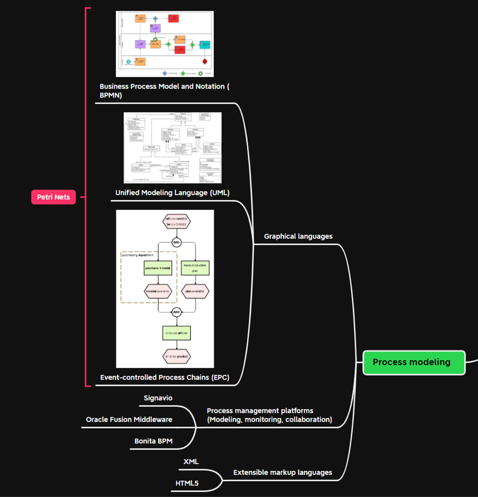

# Table of Contents

-   [What will you learn?](#org594c965)
-   [What's a process?](#org1f0f3aa)
-   [Process modeling](#org50915ec)
    -   [Shared world view](#orga143abf)
        -   [Situation](#orga8dd968)
        -   [Complication & Question](#orgc62ce89)
        -   [Answer](#org0fd012c)
    -   [Process standardization](#org8ea6fb9)
    -   [Process optimization](#orgf899252)
-   [EPCs](#org04d00c8)
    -   [What are "Event-driven Process Chains"?](#orgcdd2e9d)
    -   [EPC elements](#orgd65bbb8)
        -   [Events and functions](#org0218013)
        -   [Operators and tokens](#org0b2fc79)
        -   [Process interfaces](#org3f75344)
        -   [Organizational units](#orgd5b6e06)
    -   [Extended Event-driven Process Chain (eEPC)](#orge967e19)
    -   [EPC rules summary](#orgfd236ed)
-   [Practice](#orgf5d914d)
    -   [Signavio demo](#org955d0b9)
    -   [Find the mistakes](#org5e7ebfb)
    -   [Fill in a process model](#org518b83f)
    -   [Model a whole process](#orge865a0e)
    -   [Test (October 26)](#org940b5af)
-   [References](#org874ac6e)

# What will you learn?

-   What is a process?
-   What is process modeling\*
-   Example: Event-controlled Process Chains (EPC)
-   Practice in the Signavio Process Editor
    
    

# What's a process?

-   What are the elements of any process?
-   What's special (if anything) about "business processes"?
-   What's special (if anything) about "IT processes"?<a id="fnr.1" class="footref" href="#fn.1">1</a>
-   Does data play any special role?

# Process modeling

The three-fold purpose of process modeling:

-   Shared world view (key)
-   Process standardization (means)
-   Process optimization (end)

## Shared world view

### Situation

### Complication & Question

**Example: hiring process.**

What does an IT person see and talk about?

What does an HR person see and talk about?

-   IT view

    *Image: computer parts - the IT world-view*
    
    
    
    *Image source: [EngWorkSheets.com 2020](#orgc06f08b)*

-   HR view

    *Image: HR and people operations - HR world-view*
    
    
    
    *Image source: [Sturgess, 2019](#org6ee9f4a)*

### Answer

New problem: process model is not **standardized**.

*Image source: [CVO-Europe](#org6a7757e)*

## Process standardization

ARIS = Meta model for process modeling ("model of models")

*Image: Architecture of Information Systems (ARIS) [Software AG
2016](#org1b4892b)*

## Process optimization

*Image: Own image, modified after Camunda, BPM governance cycle,
2019*

PDF: <https://github.com/birkenkrahe/mod482/blob/main/9_modeling/img/camunda.pdf>

# EPCs

## What are "Event-driven Process Chains"?

> The event-driven Process Chain (EPC) is a flow chart for business
> process modeling introduced by [August-Wilhelm Scheer](https://en.wikipedia.org/wiki/August-Wilhelm_Scheer) in the early
> 1990s. It illustrates the business process workflows. It uses
> graphical symbols to show the control-flow structure of a business
> process as a chain of events and functions. ([Visual Paradigm, 2021](#orgc4917b9))

## EPC elements

*Image source: [Dechow et al, 2007](#orgf76313c)*

### Events and functions

<table border="2" cellspacing="0" cellpadding="6" rules="groups" frame="hsides">

<colgroup>
<col  class="org-left" />

<col  class="org-left" />
</colgroup>
<tbody>
<tr>
<td class="org-left">Function</td>
<td class="org-left">Activities carried out by a person</td>
</tr>

<tr>
<td class="org-left">Event</td>
<td class="org-left">Status triggered by a function</td>
</tr>

<tr>
<td class="org-left">Control flow</td>
<td class="org-left">Sequence of activities</td>
</tr>
</tbody>
</table>

Image source: [Software AG](#org1b4892b)

-   Event and function rules

    -   Every EPC starts and ends with an event
    -   Events and functions alternate

### Operators and tokens

<table border="2" cellspacing="0" cellpadding="6" rules="groups" frame="hsides">

<colgroup>
<col  class="org-left" />

<col  class="org-left" />
</colgroup>
<thead>
<tr>
<th scope="col" class="org-left">Operator</th>
<th scope="col" class="org-left">Meaning</th>
</tr>
</thead>

<tbody>
<tr>
<td class="org-left">AND</td>
<td class="org-left">All following flows are executed</td>
</tr>

<tr>
<td class="org-left">OR</td>
<td class="org-left">One or several following flows are executed</td>
</tr>

<tr>
<td class="org-left">XOR (exclusive OR)</td>
<td class="org-left">Only one of the following flows is executed</td>
</tr>
</tbody>
</table>

-   Operator rules

    -   Must use operator (only) when flow splits or merges
    -   Token rule: Splitting operator = joining operator
    -   Only the AND operator can split the flow after an event
    
    

### Process interfaces

-   Process interfaces are used to link independent processes
-   Trigger following process or signal preceding process
-   Can only be at the start or at the end of a process diagram

### Organizational units

-   Organizational units are only connected to functions
-   They are RACI - responsible, accountable, consulted and informed
    
    

## Extended Event-driven Process Chain (eEPC)

eEPCs integrate the other views of the ARIS house:

-   Roles/organization
-   Products/services
-   Data input/output
    
    

## EPC rules summary

<table border="2" cellspacing="0" cellpadding="6" rules="groups" frame="hsides">

<colgroup>
<col  class="org-right" />

<col  class="org-left" />
</colgroup>
<tbody>
<tr>
<td class="org-right">1</td>
<td class="org-left">Every EPC starts and ends with an event</td>
</tr>

<tr>
<td class="org-right">2</td>
<td class="org-left">Events and functions alternate</td>
</tr>

<tr>
<td class="org-right">3</td>
<td class="org-left">Must use operator (only) when flow splits or merges</td>
</tr>

<tr>
<td class="org-right">4</td>
<td class="org-left">Splitting operator = joining operator</td>
</tr>

<tr>
<td class="org-right">5</td>
<td class="org-left">Only the AND operator can split the flow after an event</td>
</tr>

<tr>
<td class="org-right">6</td>
<td class="org-left">Interfaces only before or after a process</td>
</tr>

<tr>
<td class="org-right">7</td>
<td class="org-left">Organizational units are only connected to functions</td>
</tr>
</tbody>
</table>

# Practice

Tip: [This platform allows you to play around in their online editor.](https://online.visual-paradigm.com/knowledge/business-design-tools/what-is-epc-diagram/#)

## Signavio demo

-   Fire up the Signavio process editor
-   Let's draw some EPC diagrams
-   Create your models in your own folder

## Find the mistakes

Find all mistakes in the EPC diagram!

## Fill in a process model

(Classroom exercise)

## Model a whole process

(Graded homework)

## Test (October 26)

# References

 CVO-Europe (n.d.). Our Hiring Process [website]. [Online:
cvo-europe.com](https://www.cvo-europe.com/en/careers/our-hiring-process).

 Dechow et al (2007). Interactions between modern
information technology and management control [article]. [Online:
researchgate.net.](https://www.researchgate.net/publication/274260317_Interactions_between_modern_information_technology_and_management_control)

 EngWorkSheets (2020). Computer Parts ESL Vocabulary Matching
Exercise Worksheet For Kids - PDF Preview [website]. [Online:
engworksheets.com](https://www.engworksheets.com/vocabulary-pdf-preview/Computer-Parts/4/computer-parts-esl-vocabulary-matching-exercise-worksheet-for-kids.html).

 Maya G (Jun 29,2021). ITIL Processes [blog]. [Online:
itil-docs.com.](https://www.itil-docs.com/blogs/itil-concepts/itil-processes-functions)

 Software AG University Relations (2016). BPM with ARIS
[presentation]. [Online: ariscommunity.com.](http://cdn.ariscommunity.com/community2/documents/urelation/BPM-ARIS_Part2.pdf)

 Sturgess G (June 20, 2019). What's the Difference
between HR and People Operations? [website]. [Online:
talentalign.com.](https://www.talentalign.com/whats-the-difference-between-hr-and-people-operations/)

 Visual Paradigm (2021). What is Event-Driven
Process Chain (EPC)? [Website]. [Online: visual-paradigm.com](https://online.visual-paradigm.com/knowledge/business-design-tools/what-is-epc-diagram/#).

 Wikipedia (1 Oct 2021). ITIL [website]. [Online:
en.wikipedia.org](https://en.wikipedia.org/wiki/ITIL).

# Footnotes

<a id="fn.1" href="#fnr.1">1</a> Cp. ITIL library of IT processes, especially with regards
to IT services. More: [Wikipedia](#org4c5e122) (2021).

*Image source: ITIL docs, 2021*
