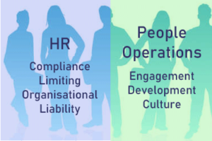
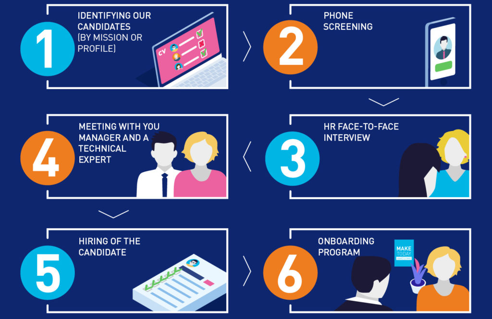
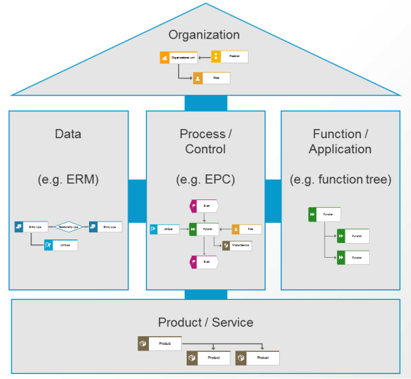
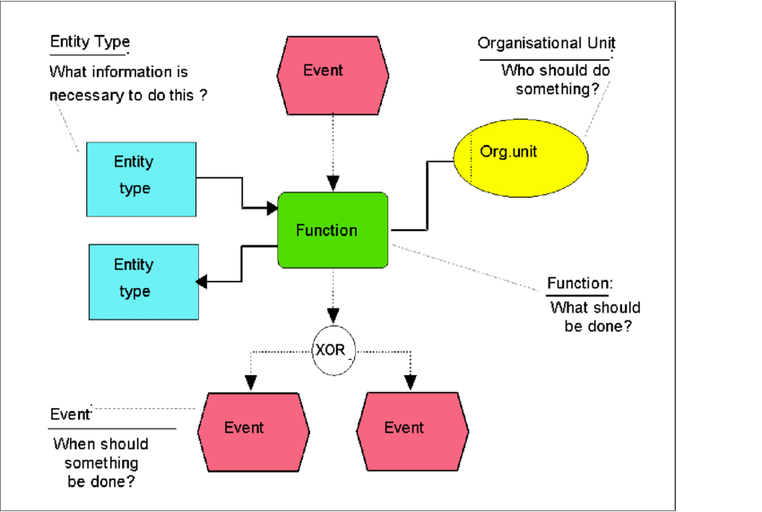
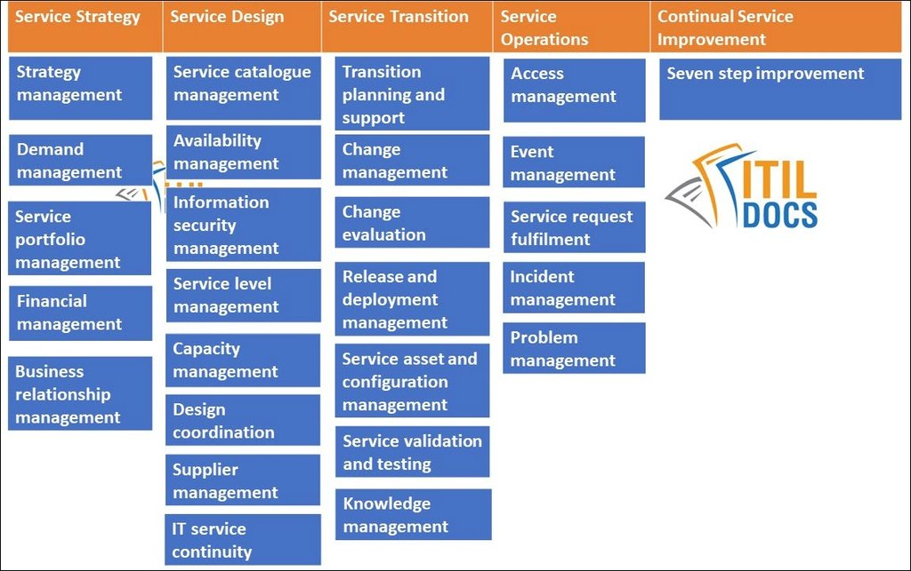

# Table of Contents

-   [What will you learn?](#org29d76e1)
-   [What's a process?](#orgd73bcf7)
-   [Process modeling](#orgfc10927)
    -   [Shared world view](#org826a1d9)
        -   [Situation](#org0ed0d66)
        -   [Complication & Question](#org28b64b3)
        -   [Answer](#org321bd78)
    -   [Process standardization](#org8c93143)
    -   [Process optimization](#org55cea87)
-   [EPCs](#orgdaca017)
    -   [What are "Event-driven Process Chains"?](#orgc6cb6c3)
    -   [EPC elements](#org9962809)
    -   [EPC rules](#org8a88e78)
-   [Practice](#org76cfeeb)
-   [References](#orgdedb264)

# What will you learn?

-   What is a process?
-   What is process modeling\*
-   Example: Event-controlled Process Chains (EPC)
-   Practice in the Signavio Process Editor

# What's a process?

-   What are the elements of any process?
-   What's special (if anything) about "business processes"?
-   What's special (if anything) about "IT processes"?<a id="fnr.1" class="footref" href="#fn.1">1</a>
-   Does data play any special role?

# Process modeling

The three-fold purpose of process modeling:

-   Shared world view (key)
-   Process standardization (means)
-   Process optimization (end)

## Shared world view

### Situation

### Complication & Question

**Example: hiring process.**

What does an IT person see and talk about?

What does an HR person see and talk about?

-   IT view

    *Image: computer parts - the IT world-view*
    
    
    
    *Image source: [EngWorkSheets.com 2020](#orgb99de7b)*

-   HR view

    *Image: HR and people operations - HR world-view*
    
    
    
    *Image source: [Sturgess, 2019](#orgda5a11a)*

### Answer

New problem: process model is not **standardized**.

*Image source: [CVO-Europe](#orgffe8693)*

## Process standardization

ARIS = Meta model for process modeling ("model of models")

*Image: Architecture of Information Systems (ARIS) [Software AG
2016](#orgf8d58a3)*

## Process optimization

/Image: Modified after Camunda

# EPCs

## What are "Event-driven Process Chains"?

> The event-driven Process Chain (EPC) is a flow chart for business
> process modeling introduced by [August-Wilhelm Scheer](https://en.wikipedia.org/wiki/August-Wilhelm_Scheer) in the early
> 1990s. It illustrates the business process workflows. It uses
> graphical symbols to show the control-flow structure of a business
> process as a chain of events and functions. ([Visual Paradigm, 2021](#org28aa572))

## EPC elements

*Image source: [Dechow et al, 2007](#org5f23c58)*

## EPC rules

Source: [Software AG](#orgf8d58a3)

# Practice

# References

 CVO-Europe (n.d.). Our Hiring Process [website]. [Online:
cvo-europe.com](https://www.cvo-europe.com/en/careers/our-hiring-process).

 Dechow et al (2007). Interactions between modern
information technology and management control [article]. [Online:
researchgate.net.](https://www.researchgate.net/publication/274260317_Interactions_between_modern_information_technology_and_management_control)

 EngWorkSheets (2020). Computer Parts ESL Vocabulary Matching
Exercise Worksheet For Kids - PDF Preview [website]. [Online:
engworksheets.com](https://www.engworksheets.com/vocabulary-pdf-preview/Computer-Parts/4/computer-parts-esl-vocabulary-matching-exercise-worksheet-for-kids.html).

 Maya G (Jun 29,2021). ITIL Processes [blog]. [Online:
itil-docs.com.](https://www.itil-docs.com/blogs/itil-concepts/itil-processes-functions)

 Software AG University Relations (2016). BPM with ARIS
[presentation]. [Online: ariscommunity.com.](http://cdn.ariscommunity.com/community2/documents/urelation/BPM-ARIS_Part2.pdf)

 Sturgess G (June 20, 2019). What's the Difference
between HR and People Operations? [website]. [Online:
talentalign.com.](https://www.talentalign.com/whats-the-difference-between-hr-and-people-operations/)

 Visual Paradigm (2021). What is Event-Driven
Process Chain (EPC)? [Website]. [Online: visual-paradigm.com](https://online.visual-paradigm.com/knowledge/business-design-tools/what-is-epc-diagram/#).

 Wikipedia (1 Oct 2021). ITIL [website]. [Online:
en.wikipedia.org](https://en.wikipedia.org/wiki/ITIL).

# Footnotes

<a id="fn.1" href="#fnr.1">1</a> Cp. ITIL library of IT processes, especially with regards
to IT services. More: [Wikipedia](#orgabcb550) (2021).

*Image source: ITIL docs, 2021*
