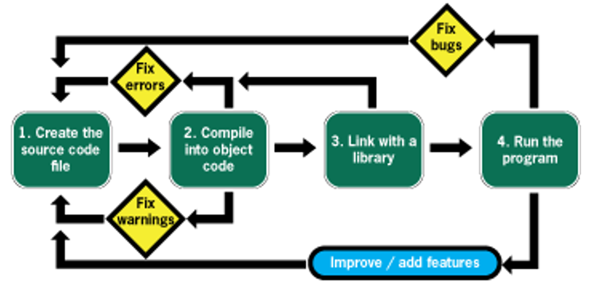

# Table of Contents

-   [What will you learn?](#org4aace17)
-   [What's a process?](#org2d80ae2)
-   [Process modeling](#orgb5db620)
    -   [Shared world view](#org9bab14d)
        -   [Situation](#org40f4135)
        -   [Complication & Question](#org916e1b5)
        -   [Answer](#orgb5a003a)
    -   [Process standardization](#org5a78d8f)
    -   [Process optimization](#org27ac4f9)
-   [EPCs](#orgf39cd34)
    -   [What are "Event-driven Process Chains"?](#org3552d61)
    -   [EPC elements](#orgf680c57)
        -   [Events and functions](#orgda05dfe)
        -   [Event and function rules](#orge98fc7a)
        -   [Flow](#orgd2fb879)
        -   [Operators and tokens](#org045c9e5)
        -   [Operator rules](#org209e755)
        -   [Process interfaces](#org9a13027)
        -   [Organizational units](#org6c8a3bc)
    -   [Extended Event-driven Process Chain (eEPC)](#org7af1e0a)
    -   [EPC rules summary](#org4b9c6b8)
-   [Practice - EPC Lab](#org3e8578b)
    -   [Signavio demo](#org969f575)
    -   [Find the mistakes](#org9836ead)
        -   [Problem](#orgaca552e)
        -   [Solution](#orgd6a674e)
    -   [Fill in a process model](#orgc8aee43)
        -   [Problem](#org4d0b987)
        -   [Solution](#org296ac08)
    -   [A puzzling question](#orgeafae47)
        -   [Problem](#orgfc15f1b)
        -   [Solution](#orge6f8cd8)
    -   [Model a whole process](#org47fadaa)
        -   [Problem](#orga62561c)
        -   [Solution](#org4a13b50)
    -   [Next: graded test (October 26)](#org46ab653)
-   [References](#org20a7bec)

# What will you learn?

-   What is a process?
-   What is process modeling\*
-   Example: Event-controlled Process Chains (EPC)
-   Practice in the Signavio Process Editor
    
    
    *Image: excerpt from the ["decision intelligence" mindmap](https://github.com/birkenkrahe/mod482/blob/main/9_modeling_epc/img/Decision%20%20Support.png)*

# What's a process?

-   What are the elements of any process?<a id="fnr.1" class="footref" href="#fn.1">1</a>
-   What's special (if anything) about "business processes"?<a id="fnr.2" class="footref" href="#fn.2">2</a>
-   What's special (if anything) about "IT processes"?<a id="fnr.3" class="footref" href="#fn.3">3</a>
-   Does data play any special role?

# Process modeling

The three-fold purpose of process modeling:

-   Shared world view (key)
-   Process standardization (means)
-   Process optimization (end)

## Shared world view

### Situation

### Complication & Question

**Example: hiring process.**

What does an IT person see and talk about?

What does an HR person see and talk about?

-   IT view

    *Image: computer parts - the IT world-view*
    
    
    
    *Image source: [EngWorkSheets.com 2020](#org48f92ea)*

-   HR view

    *Image: HR and people operations - HR world-view*
    
    
    
    *Image source: [Sturgess, 2019](#org717d5c5)*

### Answer

New problem: process model is not **standardized**.

*Image source: [CVO-Europe](#orgf64870e)*

## Process standardization

ARIS = Meta model for process modeling ("model of models")

*Image: Architecture of Information Systems (ARIS) [Software AG
2016](#org88529f8)*

## Process optimization

*Image: Own image, modified after Camunda, BPM governance cycle,
2019*

PDF: <https://github.com/birkenkrahe/mod482/blob/main/9_modeling/img/camunda.pdf>

# EPCs

## What are "Event-driven Process Chains"?

> The event-driven Process Chain (EPC) is a flow chart for business
> process modeling introduced by [August-Wilhelm Scheer](https://en.wikipedia.org/wiki/August-Wilhelm_Scheer) in the early
> 1990s. It illustrates the business process workflows. It uses
> graphical symbols to show the control-flow structure of a business
> process as a chain of events and functions. ([Visual Paradigm, 2021](#orgf88a194))

## EPC elements

*Image source: [Dechow et al, 2007](#org5effb85)*

### Events and functions

<table border="2" cellspacing="0" cellpadding="6" rules="groups" frame="hsides">

<colgroup>
<col  class="org-left" />

<col  class="org-left" />
</colgroup>
<tbody>
<tr>
<td class="org-left">Function</td>
<td class="org-left">Activities carried out by a person</td>
</tr>

<tr>
<td class="org-left">Event</td>
<td class="org-left">Status triggered by a function</td>
</tr>

<tr>
<td class="org-left">Control flow</td>
<td class="org-left">Sequence of activities</td>
</tr>
</tbody>
</table>

Image source: [Software AG](#org88529f8)

### Event and function rules

-   Every EPC starts and ends with an event
-   Events and functions alternate

### Flow

-   Flow represents the flow of time, and is itself represented by a
    solid arrow with a solid tip.
-   All process elements must be connected by flow (arrows)

-   Loops are allowed (but careful: maintain model readability)

### Operators and tokens

<table border="2" cellspacing="0" cellpadding="6" rules="groups" frame="hsides">

<colgroup>
<col  class="org-left" />

<col  class="org-left" />
</colgroup>
<thead>
<tr>
<th scope="col" class="org-left">Operator</th>
<th scope="col" class="org-left">Meaning</th>
</tr>
</thead>

<tbody>
<tr>
<td class="org-left">AND</td>
<td class="org-left">All following flows are executed</td>
</tr>

<tr>
<td class="org-left">OR</td>
<td class="org-left">One or several following flows are executed</td>
</tr>

<tr>
<td class="org-left">XOR (exclusive OR)</td>
<td class="org-left">Only one of the following flows is executed</td>
</tr>
</tbody>
</table>

### Operator rules

-   Must use operator (only) when flow splits or merges
-   Token rule: Splitting operator = joining operator
-   Only the AND operator can split the flow after an event

### Process interfaces

-   Process interfaces are used to link independent processes
-   Trigger following process or signal preceding process
-   Can only be at the start or at the end of a process diagram

### Organizational units

-   Organizational units are only connected to functions
-   They are RACI - Responsible, Accountable, Consulted and Informed
    
    

## Extended Event-driven Process Chain (eEPC)

eEPCs integrate the other views of the ARIS house:

-   Roles/organization
-   Products/services
-   Data input/output
    
    

## EPC rules summary

This is the complete lists of rules and recommendations. Despite
the apparent simplicity of this modeling language, it is incredibly
expressive - so much so that for example all of the 80,000 basic
transaction of an SAP Enterprise Resource Planning system are
modeled using EPCs.<a id="fnr.4" class="footref" href="#fn.4">4</a>

<table border="2" cellspacing="0" cellpadding="6" rules="groups" frame="hsides">

<colgroup>
<col  class="org-right" />

<col  class="org-left" />
</colgroup>
<thead>
<tr>
<th scope="col" class="org-right">&#xa0;</th>
<th scope="col" class="org-left">Rule</th>
</tr>
</thead>

<tbody>
<tr>
<td class="org-right">1</td>
<td class="org-left">Every EPC starts and ends with an event</td>
</tr>

<tr>
<td class="org-right">2</td>
<td class="org-left">Events and functions alternate</td>
</tr>

<tr>
<td class="org-right">3</td>
<td class="org-left">Must use operator (only) when flow splits or merges</td>
</tr>

<tr>
<td class="org-right">4</td>
<td class="org-left">Splitting operator = joining operator</td>
</tr>

<tr>
<td class="org-right">5</td>
<td class="org-left">Only the AND operator can split the flow after an event</td>
</tr>

<tr>
<td class="org-right">6</td>
<td class="org-left">Interfaces only before or after a process</td>
</tr>

<tr>
<td class="org-right">7</td>
<td class="org-left">Organizational units are only connected to functions</td>
</tr>

<tr>
<td class="org-right">8</td>
<td class="org-left">All process elements must be connected by flow</td>
</tr>

<tr>
<td class="org-right">9</td>
<td class="org-left">Loops are allowed as long as they're finite</td>
</tr>

<tr>
<td class="org-right">10</td>
<td class="org-left">Trivial events can be omitted</td>
</tr>
</tbody>
</table>

Here is a complete EPC "cheat sheet" (Source: Software AG)

# Practice - EPC Lab

Tip: [This platform allows you to play around in their online editor.](https://online.visual-paradigm.com/knowledge/business-design-tools/what-is-epc-diagram/#)

## Signavio demo

-   Fire up the [Signavio process editor](https://academic.signavio.com)
-   Let's draw some EPC diagrams
-   Create your models in your own folder

## Find the mistakes

### Problem

-   Find all mistakes in the EPC diagram!
-   Do not fix mistakes as you go along
-   There are 11 mistakes in total
    
    

### Solution

One could count the operator between Event 6 and 7 as a 12th
mistake - it's a double mistake: the operator shouldn't be here
and there ought to be a function instead.

## Fill in a process model

### Problem

The following process ("Invoice Check") has already been modeled
for you.

> "The invoice is checked by accounts payable when 1) the receipt
> for incoming goods, 2) the invoice, and 3) the sales order, have
> all been received. If the invoice is correct, it will be paid. If
> it is not correct, an inquiry process is triggered. The process is
> linked to four process interfaces: incoming -(1) incoming goods,
> (2) sales, and - outgoing - (3) payment, (4) inquiry."

1.  Draw the diagram in Signavio (in your folder)
2.  Read the process description carefully
3.  Name all elements including the operators
4.  Name and save your diagram
    
    

*The diagram contains rule violations. Why?*

### Solution

Things to consider:

-   Stick as close to the problem description as you can - don't
    make stuff up, change words or "improve" the process unless
    requested.
-   Don't change the standard size of process elements. If an event
    or a function don't seem to fit in the element, it is likely
    that you need to rethink your model (e.g. the activity may be
    too large and needs to be split up).
    
    

## A puzzling question

### Problem

<table border="2" cellspacing="0" cellpadding="6" rules="groups" frame="hsides">

<colgroup>
<col  class="org-left" />
</colgroup>
<tbody>
<tr>
<td class="org-left">Can all processes be modeled with languages like EPCs?</td>
</tr>
</tbody>
</table>

### Solution

Yes and no&#x2026;it depends on the ability to measure what's going
on. Process models - at least in the area of business and
technology - can only express things or actions that are
quantifiable.

## Model a whole process

### Problem

Consider the following process description<a id="fnr.5" class="footref" href="#fn.5">5</a>:

> "When programming in a compiled language (like C), you have to
> create a source code file using an editor. (This can be quite
> tricky if you use Emacs and haven't used it much before.) The
> compiler compiles the file and links it to a library. Finally you
> run the program.

-   Consider first what type of process this is
-   Model this process as an EPC in Signavio
-   Name the process "Compilation"
-   Save it in your personal folder
-   EPC models are usually drawn vertically

### Solution

This is a sample solution. Process modeling is not an exact
science, and there is always more than one answer.

-   Simple solution - happy path

    

-   Complete solution - extended EPC

## Next: graded test (October 26)

*Image: stats from classroom test 5 on October 19*

-   Process elements
-   Process modeling
-   Event-driven Process Chains
-   Multiple choice and open questions

# References

 CVO-Europe (n.d.). Our Hiring Process [website]. [Online:
cvo-europe.com](https://www.cvo-europe.com/en/careers/our-hiring-process).

 Dechow et al (2007). Interactions between modern
information technology and management control [article]. [Online:
researchgate.net.](https://www.researchgate.net/publication/274260317_Interactions_between_modern_information_technology_and_management_control)

 EngWorkSheets (2020). Computer Parts ESL Vocabulary Matching
Exercise Worksheet For Kids - PDF Preview [website]. [Online:
engworksheets.com](https://www.engworksheets.com/vocabulary-pdf-preview/Computer-Parts/4/computer-parts-esl-vocabulary-matching-exercise-worksheet-for-kids.html).

 Gookin D (2021). [Tiny C Projects. Manning](https://www.manning.com/books/tiny-c-projects).

 Maya G (Jun 29,2021). ITIL Processes [blog]. [Online:
itil-docs.com.](https://www.itil-docs.com/blogs/itil-concepts/itil-processes-functions)

 SAP (n.d.). What is ERP? [website]. [Online:
insights.sap.com.](https://insights.sap.com/what-is-erp/?sred=glo-products-whatiserp)

 Software AG University Relations (2016). BPM with ARIS
[presentation]. [Online: ariscommunity.com.](http://cdn.ariscommunity.com/community2/documents/urelation/BPM-ARIS_Part2.pdf)

 Sturgess G (June 20, 2019). What's the Difference
between HR and People Operations? [website]. [Online:
talentalign.com.](https://www.talentalign.com/whats-the-difference-between-hr-and-people-operations/)

 Visual Paradigm (2021). What is Event-Driven
Process Chain (EPC)? [Website]. [Online: visual-paradigm.com](https://online.visual-paradigm.com/knowledge/business-design-tools/what-is-epc-diagram/#).

 Wikipedia (1 Oct 2021). ITIL [website]. [Online:
en.wikipedia.org](https://en.wikipedia.org/wiki/ITIL).

# Footnotes

<a id="fn.1" href="#fnr.1">1</a> Different languages use different terms:(1)
\*Functions\*/tasks/actions/activities; (2) \*events\*/status/trigger; (3)
\*flow\*/path/sequence/connectors; (4) \*operators\*/gateways/decisions.

<a id="fn.2" href="#fnr.2">2</a> Business processes generate added value.

<a id="fn.3" href="#fnr.3">3</a> Cp. ITIL library of IT processes, especially with regards
to IT services. More: [Wikipedia](#orgaba1ddc) (2021).

*Image source: ITIL docs, 2021*

<a id="fn.4" href="#fnr.4">4</a> Any productive ERP system contains many more transactions than
that. In practice, these are often modeled as BPMN diagrams, or as ER
Diagrams, if customer-facing or database operations are being
modeled. For more about ERP systems, see this tutorial ([SAP](#org1b765d2)).

<a id="fn.5" href="#fnr.5">5</a> The idea for this problem came from a figure in a book I'm
reading, "Tiny C Projects" ([Gookin, 2021](#orgaa009da)):

