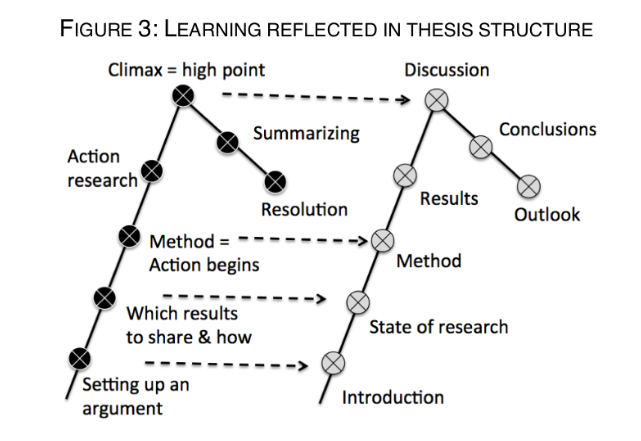

# Table of Contents

1.  [What is this?](#org7b6784d)
2.  [How do you report on and plan a research "method"?](#org410c950)
3.  [Who is your audience, and how should you address them?](#orgfa8d81e)
4.  [How can you find a topic for your scientific essay?](#org9a4778d)
    1.  [Using a chapter from THE MODEL THINKER](#org0d1046a)
    2.  [Research a topic based on a scientific article](#org9f1061c)
    3.  [Researching practical modeling methods](#org2f3b1db)
    4.  [An Introduction to Mathematical Modeling](#orgb5bde97)
5.  [How can you generate questions on something you've only just learnt?](#orgb9b8f94)
6.  [References](#orgdcf9a30)

# What is this?

This is a Frequently Asked Questions (FAQ) file for the special
seminar on "Data modeling" (CSC 482.02). For the FAQs across
courses, see the [org repo](https://github.com/birkenkrahe/org).

# How do you report on and plan a research "method"?

The focus of the second sprint review is "method", i.e. the "how" of
your research process. The main deliverable in this case is a
research report (a written essay) of moderate length (2,500-5000
words).

So what does "reporting on method" mean? Generally speaking it means
that you need to inform the audience what exactly you plan to do in
the course of your research, and convince them that you've chosen well.

Let's look at an example - a short conference paper that I wrote on
storytelling ([Birkenkrahe, 2014](https://github.com/birkenkrahe/mod482/blob/main/6_storytelling/IEEE-ICCI-CC-14-BIRKENKRAHE.final_copy.pdf)). The main achievement of this paper
is - you guessed it - a model, shown in the figure below.

The main purpose of the paper was to research my hypothesis that the
storytelling arc (e.g. in a traditional novel) can be mapped onto
the IMRaD structure for scientific papers.

My methods of investigation were:

1.  a short **literature review**. This review looked at publications
    that were also sitting "on the fence" between science and fiction
    writing. It was short because there wasn't very much. Most
    authors didn't think that writing in science and writing in
    fiction had much in common.
2.  data from a collection of **personal examples**, gathered in the
    course of a few years before this research. They included my own
    fiction writing and supervising students' writing (in a number of
    different settings).
3.  the outline of a **planned experiment** with students of a new
    course.

My methods therefore included checking work done by others (1),
analyzing my own experiences (2), and making a plan for testing my
model in a real setting (3).

Hopefully, this structural breakdown will help you think about your
modeling paper.

# Who is your audience, and how should you address them?

Your audience is a student like yourself - or rather, who you were
before you wrote the essay. You should strive to explain things
simply, using examples, but not shy away from math if
necessary. You should quantify, use or create graphical
illustrations when possible, instead of only write text.

I'm your customer (Scrum product owner), but I'm commissioning you
to write this essay for students. Don't try to write it for me,
though of course remain aware that I'll also be reading the essay,
especially with regard to formal criteria (spelling, references,
structure etc.) and with respect to your anchoring your topic in
current literature. This means that every essay must have a
literature review section, no matter how short.

# How can you find a topic for your scientific essay?

## Using a chapter from THE MODEL THINKER

Any of the chapters 5-29 would be a great choice for an
essay. We'll cover chapters 1-4 in class based on my
(rudimentary) lectures.

The chapters are suitable, because they mostly deliver only a
high level overview, coupled with a few examples. Details of
the examples are usually contained in the endnotes. None of the
chapters presume that you've read the entire book - you can
pretty much jump in anywhere you like (though, of course, the
more you've read the deeper your understanding).

When you pick a chapter, you could bring your own special
skills to it, and your own experience.

There's no problem if two or more students pick the same topic:
the chapters are very densely written and can easily be spread
out over several short essays. However, whoever has similar
topics needs to negotiate topic boundaries with me and with one
another.

Let's look at an example briefly. A student picked the chapter
17, "Markov Models". These are models that represent state
transitions, usually between equilibrium states (when, at least
for a while, nothing changes). Later in the chapter, you read
that Markov models were used to create Google's original PageRank
search algorithm. This is quite literally the corner stone of the
wealth of one of the most valuable companies on Earth today. The
description in the book is very dense- and worth researching in a
short essay. The research question of such an essay could be "How
were Markov models used to create Google's PageRank search
algorithm?" There is likely a myriad of articles dealing with
this issue already - you will have to check it out and chart your
own learning course.

Markov models are also highly relevant in cybersecurity and
network analysis ([Abraham and Nair, 2014](#orgceab56a)). If that's something
that interests you, this could be your example, or one of your
examples to illustrate the use of these models.

The more mathematical models, or those dealing with algorithms,
may be more suitable if you have a mathematical mind. If you're
interested in applications and business, focus on that. If you're
into programming and computing tech, go there. Some chapter are
philosophical and deal with difficult questions of ethics etc.

Whatever you pick, make sure that you don't start from a zero
baseline, i.e. assuming nothing. Use the fact that you are seniors
and show off what you already know - stats, algorithms, design,
whatever.

## Research a topic based on a scientific article

As promised, here are a few recent, not too difficult
articles. They're all from the Communications of the ACM, dealing
with different aspects of data modeling, about 10 pages
long<a id="fnr.1" class="footref" href="#fn.1">1</a>. These articles aren't hard to read or understand, but
they are overview articles without too much detail, written for
members of the ACM (computer scientists or engineers). They don't
contain too much theory, so this is something that you could
add. For an essay on any of these topics, you can use the article
as a central reference, but you should also research the topic
and find other sources, of course. If you follow the doi URL, you
get to a page of the ACM Digital Library, where you can often
find accompanying material like [these YouTube videos](https://youtube.com/playlist?list=PLn0nrSd4xjjbIHhktZoVlZuj2MbrBBC_f).

I have not studied some of these articles in detail, but if
needed, I'm happy to discuss them with you!  Here's to hoping
that you'll become the experts on your chosen topics! Order:
alphabetical.

Unlike the book chapters, only one person should pick one of the
articles for their essay - the topics are otherwise a little too
narrow.

(1) Dörner D (1990). **The logic of failure**. In:
Phil. Trans. R. Soc. London B 327:463-473. [Online: GDrive.](https://drive.google.com/file/d/1-QSk68lj6gkGZ9ofmZ-3CnURBFcX1yoG/view?usp=sharing)

> "Unlike other living creatures, humans can adapt to
> uncertainty. They can form hypotheses about situations marked by
> uncertainty and can anticipate their actions by planning. They
> can expect the unexpected and take precautions against it.  In
> numerous experiments, we have investigated the manner in which
> humans deal with these demands. In these experiments, we used
> computer simulated scenarios representing, for example, a small
> town, ecological or economic systems or political systems such as
> a Third World country. Within these computer-simulated scenarios,
> the subjects had to look for information, plan actions, form
> hypotheses, etc."

(2) Savage N (2021). **Getting Down to Basics**. In: Comm. of the ACM
64(6):12-14. <10.1145/3460734>. Online: [GDrive.](https://drive.google.com/file/d/1Et4Rapm-wZZdbT2-fQw5q16Eosl8pyD1/view?usp=sharing)

> "2020 ACM A.M. Turing Award recipients Alfred Aho and Jeffrey
> Ullman helped develop formal language theory, invented efficient
> algorithms to drive the tasks of a compiler, and put them all
> together in ‘The Dragon Book.’"

(3) Yener B (2017). **Cell-graphs: Image-Driven Modeling of
Structure-Function Relationship**. In: Comm. of the ACM
60(1):74-84. <10.1145/2960404>. Online: [GDrive.](https://drive.google.com/file/d/1-Fhl7hJJIAdE6mARRydvU0Q-5cdLw0yb/view?usp=sharing)

> "It is virtually impossible to accurately predict the final functional
> state of a healing wound. This illustrates a need to build models that
> represent the structural organization at the organ, tissue, cellular,
> and molecular levels. Furthermore, such models must capture
> relationships between these scales and relate them to the un- derlying
> functional state."

(4) Jensen K, Kristensen LM (2015). **Colored Petri nets: a graphical language for formal modeling and validation of
concurrent systems**. In: Comm. of the ACM
58(6):61-70. <10.1145/2663340>. Online: [GDrive](https://drive.google.com/file/d/1U2n9Vz4h9tyc8evPOW0H-mcSpORTkdEu/view?usp=sharing).

> "Colored Petri Nets, or CPNs, combine Petri nets with a programming
> language to obtain a scalable modeling language for concurrent
> systems. Petri nets provide the formal foundation for modeling
> concurrency and synchronization; a programming language provides the
> primitives for modeling data manipulation and creating compact and
> parameterizable models."

(5) Sakr S et al (2021). **The future is big graphs: a community view on graph processing systems**. In: Comm. of the ACM
64(9):62-71. <10.1145/3434642>. Online: [GDrive.](https://drive.google.com/file/d/1u4Df51u8jm2g-SAThG_siNdwcNScR5Je/view?usp=sharing)

> "Graphs are, by nature, ‘unifying abstractions’ that can leverage
> interconnectedness to represent, explore, predict, and explain
> real- and digital-world phenomena.  Although real users and
> consumers of graph instances and graph workloads understand these
> abstractions, future problems will require new abstractions and
> systems. What needs to happen in the next decade for big graph
> processing to continue to succeed?"

(6) Overton MA (2017). **The IDAR graph - An Improvement over UML**. In: Comm. of the ACM
60(7):40-45. <10.1145/3079970>. Online: [GDrive.](https://drive.google.com/file/d/1nCCHDl8gAYXwOIszKF8PrR87btAWtbM6/view?usp=sharing)

> "Unified Modeling Language (UML) is the de facto standard for
> representing object-oriented designs. It does a fine job of
> recording designs, but it has a severe problem: its diagrams
> don’t convey what humans need to know, making the diagrams
> difficult to understand. This is why most software developers use
> UML only when forced to."

(7) Ruotsalo T et al (2015). **Interactive intent modeling:
information discovery beyond search**. In: Comm. of the ACM
58(1):86-92. <10.1145/2656334>. Online: [GDrive.](https://drive.google.com/file/d/1AfawSwij3aswyso-NVG6XKm9fk20P73B/view?usp=sharing)

> "Combining intent modeling and visual user interfaces can help
> users discover novel information and dramatically improve their
> information-exploration performance.  Current-generation search
> engines serve billions of requests each day, returning responses
> to search queries in fractions of a second. They are great tools
> for checking facts and looking up information for which users can
> easily create queries (such as “Find the closest restaurants” or
> “Find reviews of a book”). What search engines are not good at is
> supporting complex information- exploration and discovery tasks
> that go beyond simple keyword queries."

(8) Bouguettaya A et al (2021). **An internet of things service roadmap**. In: Comm. of the ACM
64(9):86-95. <10.1145/3464960>. Online: [GDrive.](https://drive.google.com/file/d/1uutTnOXaiAy8om15J3p_z94eLXgKWNl0/view?usp=sharing)

> "The internet of things (IOT) is taking the world by storm,
> thanks to the proliferation of sensors and actuators embedded in
> everyday things, coupled with the wide availability of high-speed
> Internet50 and evolution of the 5th-generation (5G) networks.34
> IoT devices are increasingly supplying information about the
> physical environment (for example, infrastructure, assets, homes,
> and cars). The advent of IoT is enabling not only the connection
> and integration of devices that monitor physical world phenomena
> (for example, temperature, pollution, energy consumption, human
> activities, and movement), but also data-driven and AI-augmented
> intelligence. At all levels, synergies from advances in IoT, data
> analytics, and artificial intelligence (AI) are firmly recognized
> as strategic priorities for digital transformation."

(9) Winter S et al (2021). **Spatial concepts in the conversation with a computer**. In: Comm. of the ACM
64(7):82-88. <10.1145/3440752>. Online: [GDrive.](https://drive.google.com/file/d/1RufBPil8m1J0-AqItlVCkXqZTvrP_LXy/view?usp=sharing)

> "Human interactions with the physical environment are often
> mediated through information services, and sometimes depend on
> them. These human interactions with their environment relate to a
> range of scales,28 in the scenario here from the “west of the
> city” to the “back of the store,” or beyond the scenario to “the
> cat is under the sofa.” These interactions go far beyond
> references to places that are recorded in geographic
> gazetteers,37 both in scale (the place where the cat is) and
> conceptualization (the place that forms the west of the city29),
> or that fit to the classical coordinate-based repre- sentations
> of digital maps."

(10) Kienzle J et al (2020). **Toward model-driven sustainability
evaluation**. In: Comm. of the ACM
63(3):80-91. <10.1145/3371906>. Online: [GDrive.](https://drive.google.com/file/d/1Q_-Y0-mwS0aqd-fTUJBPMHLnqpFghT2Z/view?usp=sharing)

> "Sustainability—the capacity to endure—has emerged as a concern
> of central relevance for society.  However, the nature of
> sustainability is distinct from other concerns addressed by
> computing research, such as automation, self-adaptation, or
> intelligent systems. It demands the consideration of
> environmental resources, economic prosperity, individual well
> being, social welfare, and the evolvability of technical
> systems. Thus, it requires a focus not just on productivity,
> effectiveness, and efficiency, but also the consideration of
> longer- term, cumulative, and systemic effects of technology
> interventions, as well as lateral side effects not foreseen at
> the time of implementation. Furthermore, sustainability includes
> normative elements and encompasses multi-disciplinary aspects and
> potentially diverging views."

## Researching practical modeling methods

"Solving Messy Problems - A Guide to Problem-Structuring
Techniques", is a guide developed at Shell in 1998. It lists
twelve different, popular model-based techniques to tackle
complex problems. The descriptions are extremely short - this was
written for business practitioners by me and my team of strategic
planners when I worked at Shell. Your essay could cover one of
these, bring it into the present with examples and, possibly,
some theory.

Online: [GDrive.](https://drive.google.com/file/d/144NOnTyv913QeN3QDGyxIoKMeoTECqJN/view?usp=sharing)

## An Introduction to Mathematical Modeling

"Introduction to Mathematical Modeling" ([Bender, 2000](#org0880f56)) is a
classic first published in 1978. Written for engineering
students, it covers a lot of examples of modeling with
mathematical methods, especially probability theory and
calculus - suitable for a 1-year undergraduate course.

All of part I could easily become part of an essay. Here you must
be careful to not just repeat what Bender wrote, because he write
very well. To turn this into an original essay, you have to go
through the examples and make them your own for example by
solving the problems at the end of each chapter. If you can solve
(some of) them, you'll be on top of it. I might help with that
and you're like to find solutions online somewhere, too.

An example: chapter 5.2 covers "Monte Carlo Simulations", which
you may already have come across in mathematics. This is
especially for probabilistic models that cannot be analyzed
analytically (i.e. there is no formula<a id="fnr.2" class="footref" href="#fn.2">2</a>) but with high
statistics, you can also use the method to "prove" probability
problems.

For example, the following two lines of R code simulate drawing
one bead at random from a sample of five beads:

    ## define sample of beads - two red, three blue
    beads <- rep(c("red", "blue"), times = c(2,3))
    
    ## draw 1 bead from sample with replacement, repeat 10,000 times
    events <- replicate(10000, sample(beads,1))
    
    ## print relative probabilities of drawing blue vs red beads
    prop.table(table(events))

Here are the results:

    : events
    :   blue    red
    : 0.5936 0.4064

This is an analytically solvable problem, of course: as the
number of draws gets larger, the estimates get closer to
`3/5=0.6` and `2/5=0.4`.

Bender presents three different, interesting applications,
simulating a doctor's waiting room, settling of suspended
particles, and stream networks. They are worked through and
illustrated, but you should express them in your own language,
connect them with more current examples, and write some code of
the type shown above.

# How can you generate questions on something you've only just learnt?

This sounds as difficult as it is! I did not mean for it to sound
trivial, either. There are a few tricks though:

-   Begin with (technical) terms or concepts that you cannot define,
    and ask "what does this mean?"
-   Check out Internet sites like Quora, Stackoverflow, or Reddit
    for questions that others asked about the topic.
-   Post the topic to friends, colleagues or family and ask them
    what they'd like to know<a id="fnr.3" class="footref" href="#fn.3">3</a>.
-   Imagine having to explain the topic to a 5, a 10, a 15 and a
    20-year old person<a id="fnr.4" class="footref" href="#fn.4">4</a>.

# References

 Abraham S, Nair S (2014). Cyber Security Analytics: A
Stochastic Model for Security Quantification Using Absorbing Markov
Chains. In: J. of Communications 9(12):899-907. [Online: jocm.us.](http://www.jocm.us/uploadfile/2014/1231/20141231022619157.pdf)

 Bender EA (2000). An Introduction to Mathematical
Modeling. Reprint: Dover Books on Computer Science. Online:
[archive.org.](https://archive.org/details/introductiontoma00bend_0)

Birkenkrahe, M. (2014). Using Storytelling Methods To Improve
Emotion, Motivation and Attitude Of Students Writing Scientific
Papers And Theses. In: Proceedings of the 13th IEEE Int. Conf. on
Cognitive Informatics & Cognitive Computing, London, August
18-20, 2014.

 Hauser et al (2014). The mystery of language
evolution. In:
Front. Pschol. <https://doi.org/10.3389/fpsyg.2014.00401>

 WIRED (25 June 2018). Quantum Computing Expert
Explains One Concept in 5 Levels of Difficulty | WIRED
[Video]. [Online: youtube.com.](https://youtu.be/OWJCfOvochA)

# Footnotes

<a id="fn.1" href="#fnr.1">1</a> In the 1960s, fuelled by Chomsky's studies, it was believed that
there was a universal grammar of all languages. Figuring it out meant
that one could, for example, build an automatic translator
easily. This formalization of language has since turned out to be a
complete dead-end street. A few years ago, Chomsky and other prominent
linguists admitted that there were today, more than 50 years later,
still had no clue what language really is or where it came from
([Hauser et al, 2014](#orgfad9c24)).

<a id="fn.2" href="#fnr.2">2</a> This way of updating the code is not, of course, in the spirit
of version control. It would be better if every collaborator created a
branch of the file, updated it, and merged it with the original. In
this way, the software would take over highlighting of conflicts etc.x

<a id="fn.3" href="#fnr.3">3</a> Since everybody is an expert on something else, you'll be
surprised about the questions that you get. They can be quite
hard. Even a question like "how would this benefit me?" can be
enlightening because you may never have thought about it for that
person, who might be a cop, a plummer, an actor or a librarian.

<a id="fn.4" href="#fnr.4">4</a> This is a format that WIRED magazine developed, check out this
video ([WIRED, 2018](#orge852a50)). I once (as a 22-year-old) spent an entire 8-hour
train ride from Hamburg to Munich in Germany explaining particle
physics to an elderly lady. It really showed me what I did, and what I
did not know (yet).
