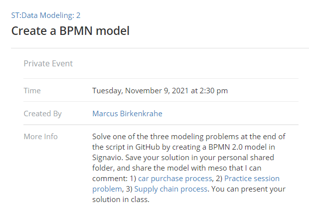
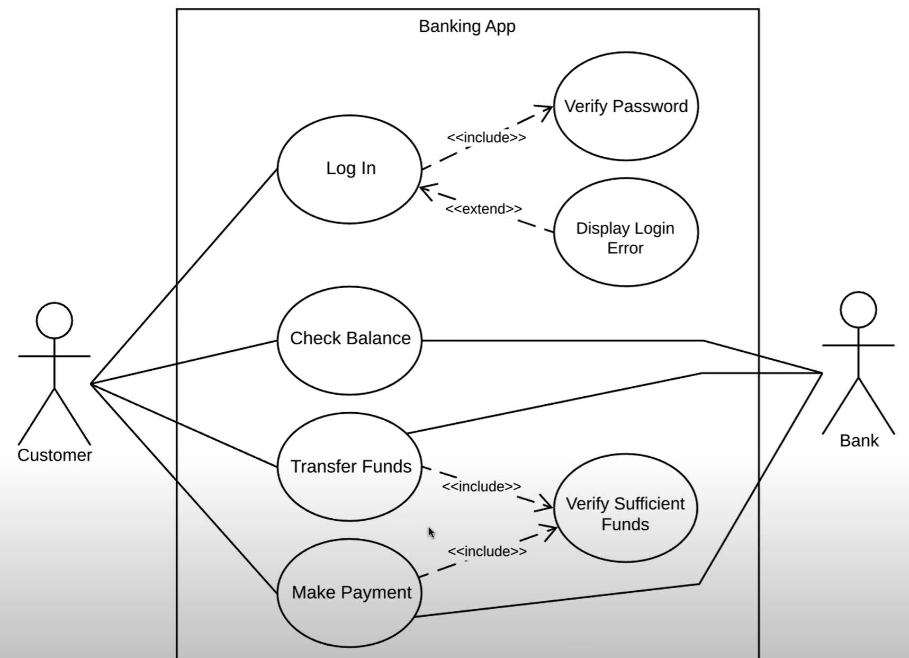
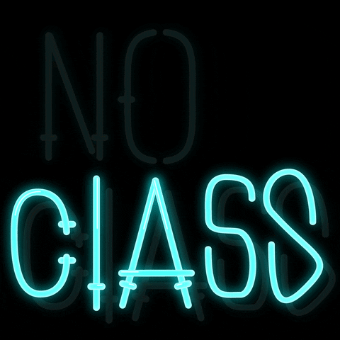
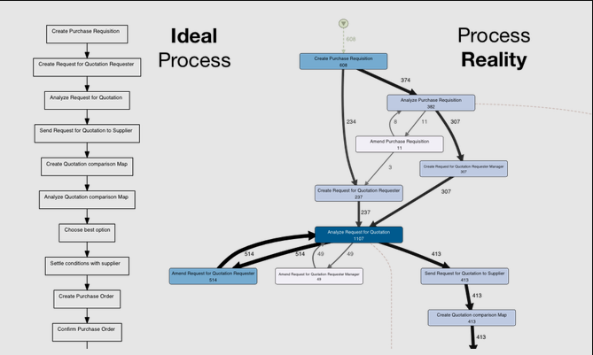

# Table of Contents

-   [Week 2 - August 24](#org197f78c)
-   [Week 2 - August 26](#org1122b32)
-   [Week 3 - August 31](#org9cb032a)
-   [Week 3 - September 2](#orgd3b0b30)
-   [Week 4 - September 9](#orgd8d19ab)
-   [Week 5 - September 16](#orgd917fa2)
-   [Week 6 - September 21](#org79933aa)
-   [Week 7 - September 28](#org1e23a8b)
-   [Week 9 - October 12](#org0f32b55)
-   [Week 9 - October 14](#org8a82bf3)
-   [Week 10 - October 19](#org7022777)
-   [Week 10 - October 21](#org949b046)
-   [Week 11 - October 26](#org3d0b14c)
-   [Week 11 - October 28](#orgb9f0c31)
-   [Week 12 - November 2](#orgac16ee3)
-   [Week 12 - November 4](#org6f5a83b)
-   [Week 13 - November 9](#org06e1d3d)
-   [Week 13 - November 11](#orgd1d8434)
-   [Week 14 - November 16](#org5795e69)
-   [Week 14 - November 18](#org9c5b230)
-   [Week 15 - November 23](#orga756af0)
-   [Week 16 - November 30/December 2](#org875fed7)
-   [References](#org216fc06)

# Week 2 - August 24

-   Housekeeping
-   "Many-model thinking"
-   Why Model? - "REDCAPE"
-   Next week: essay topics!

## Housekeeping

-   First weekly test ([Schoology](https://lyon.schoology.com/assignment/5227019586/assessment_questions))
-   Reading assignment (["The Model Thinker"](https://www.amazon.com/Model-Thinker-What-Need-Know/dp/B08WHN4M7S))
-   Delayed Schedule ([GitHub](https://github.com/birkenkrahe/mod482/blob/main/syllabus.md#schedule-and-session-content))
-   FAQ: ask questions! ([GitHub](https://github.com/birkenkrahe/mod482/blob/main/FAQ.md))
-   Term Diary ([GitHub](https://github.com/birkenkrahe/org/blob/master/diary.md#org3b0dc9e))
-   Questions?

# Week 2 - August 26

-   Housekeeping
-   Recap: complex systems
-   Next: "Many-model thinking"
-   Decision intelligence tools

## Housekeeping

-   Video recording ([Google meet](https://meet.google.com/ccb-ihqm-akb))
-   Essay ideas ([GitHub](https://github.com/birkenkrahe/mod482/blob/main/2_why_model/followup_08_24_2021.md#essay-ideas))
-   Questions?

## Recap

-   What do you remember?
-   "Strategic flexibility" ([GitHub](https://github.com/birkenkrahe/mod482/blob/main/2_why_model/followup_08_24_2021.md#the-logic-of-failure))

# Week 3 - August 31

-   [Test 2 is live - 10 questions](https://lyon.schoology.com/assignment/5257398641/assessment_questions)
-   [New project deadline: 9-Sep-2021](https://github.com/birkenkrahe/mod482/blob/main/syllabus.md#schedule-and-session-content)
-   Lecture: [Decision intelligence](https://github.com/birkenkrahe/mod482/tree/main/3_decision_intelligence)
-   Essay: topic identification how?
-   Lecture: [Agile project management](https://github.com/birkenkrahe/mod482/tree/main/4_agile_pm)
-   New [Scrum FAQs](https://github.com/birkenkrahe/org/blob/master/FAQ.md#orge594cc2)

# Week 3 - September 2

## Essay project

-   [Submit your essay topics by Sep-9](https://github.com/birkenkrahe/mod482/discussions/2)
-   Add [systematic literature review](https://github.com/birkenkrahe/org/blob/master/Systematic_Literature_Review_Example_Table.docx)!
-   Formal issue: (inline) referencing
-   [Wide choice of topics](https://github.com/birkenkrahe/mod482/blob/main/3_decision_intelligence/followup_08_31_2021.md)
-   [Example: Big Data Graph Databases](https://github.com/birkenkrahe/mod482/blob/main/3_decision_intelligence/followup_08_31_2021.md#research-a-topic-based-on-a-scientific-article)
-   How to read a scientific article?

## Agile management

-   Lecture: [Agile [project] management](https://github.com/birkenkrahe/mod482/tree/main/4_agile_pm)
-   Exercise: set up an agile project!
-   Come up with any research question
-   Tool: [Project Canvas](https://github.com/birkenkrahe/org/blob/master/ProjectCanvas.pdf)

## Next week

-   Bring research question ([project canvas](https://github.com/birkenkrahe/org/blob/master/ProjectCanvas.pdf))
-   Lecture: Why Model? (Page ch. 2)
-   REDCAPE model criteria (essay?)
-   Thursday: 1st sprint review ([FAQ](https://github.com/birkenkrahe/org/blob/master/FAQ.md#what-should-we-do-in-the-first-sprint))

# Week 4 - September 9

-   [Learning & Agile Methods](https://github.com/birkenkrahe/org/blob/master/diary.md) (diary)
-   [3P / efficiency vs resilience](https://github.com/birkenkrahe/mod482/blob/main/4_agile_pm/followup_09_07_2021.md) (followup)
-   [First sprint reviews](https://github.com/birkenkrahe/mod482/discussions/2)
-   Next: Why Model? (Read for Tue Sep 14)

## Sprint reviews

-   Everyone: present yr research question
-   Everyone else: prepare 1 question
-   Ask 2 of your questions
-   MB: critique questions

## Two examples

### Molly: [Grounded Theory analysis of creativity](https://psycnet.apa.org/record/2002-08436-005)

<table border="2" cellspacing="0" cellpadding="6" rules="groups" frame="hsides">

<colgroup>
<col  class="org-left" />

<col  class="org-left" />
</colgroup>
<thead>
<tr>
<th scope="col" class="org-left">PRO</th>
<th scope="col" class="org-left">CON</th>
</tr>
</thead>

<tbody>
<tr>
<td class="org-left">Important framework</td>
<td class="org-left">Difficult method</td>
</tr>

<tr>
<td class="org-left">Important issue</td>
<td class="org-left">Complex topic</td>
</tr>

<tr>
<td class="org-left">Lots of examples</td>
<td class="org-left">Lots of confusion</td>
</tr>

<tr>
<td class="org-left">Peer reviewed</td>
<td class="org-left">Date (2002)</td>
</tr>

<tr>
<td class="org-left">Lots of literature</td>
<td class="org-left">Not open source</td>
</tr>

<tr>
<td class="org-left">Focus on art making</td>
<td class="org-left">Small samples</td>
</tr>
</tbody>
</table>

### Owen: [The spread of misinformation](https://reader.elsevier.com/reader/sd/pii/S2590061720300569?token=CB8A5AB8B610593FD4CB342F3BD7658FFA2053C3D96188C2187DC62C4BECB08B47432F38EB25A429B94B7B391EB77DBE&originRegion=us-east-1&originCreation=20210909135607)

<table border="2" cellspacing="0" cellpadding="6" rules="groups" frame="hsides">

<colgroup>
<col  class="org-left" />

<col  class="org-left" />
</colgroup>
<thead>
<tr>
<th scope="col" class="org-left">PRO</th>
<th scope="col" class="org-left">CON</th>
</tr>
</thead>

<tbody>
<tr>
<td class="org-left">Recent &amp; relevant</td>
<td class="org-left">Divisive case</td>
</tr>

<tr>
<td class="org-left">Reputable publisher</td>
<td class="org-left">Conclusions weak</td>
</tr>

<tr>
<td class="org-left">Many models</td>
<td class="org-left">Many models</td>
</tr>

<tr>
<td class="org-left">Quantitative study</td>
<td class="org-left">Potential bias</td>
</tr>

<tr>
<td class="org-left">Literature review</td>
<td class="org-left">Many theories</td>
</tr>

<tr>
<td class="org-left">Linear regression</td>
<td class="org-left">Causal inference</td>
</tr>
</tbody>
</table>

### Suggestions

-   Molly: additional literature (e.g. [Koestler](https://www.brainpickings.org/2013/05/20/arthur-koestler-creativity-bisociation/))
-   Owen: test frameworks (e.g. [this article](https://theconversation.com/engineers-and-economists-prize-efficiency-but-nature-favors-resilience-lessons-from-texas-covid-19-and-the-737-max-152670))

# Week 5 - September 16

-   [Test 4: agility, bias, canvas](https://lyon.schoology.com/assignment/5314232116/assessment_questions)
-   [Fireside chat with Scott Page](#orgec3c80b) (2020)
-   The Model Thinker, chapter 2 "Why Model":
-   Models of systemic belonging ([lecture](https://github.com/birkenkrahe/mod482/tree/main/5_why_model))
-   System constellations ([Birkenkrahe, 2008](#org533f3ce))

# Week 6 - September 21

-   This week: **Storytelling** techniques:
-   Short midterm exam on Thu September 30!
-   Keep up with your essay research!
-   Homework 1: [Complete online lesson](https://h5p.org/node/800416)
-   Homework 2: [Post a story on your essay topic](https://github.com/birkenkrahe/mod482/discussions/3)
-   **Classes on Thu September 23 are cancelled**

# Week 7 - September 28

-   Homework 1: [Complete online lesson](https://h5p.org/node/800416) (Denning)
-   Homework 2: [Post a story on your essay topic](https://github.com/birkenkrahe/mod482/discussions/3)
-   Lecture & Lab: **[User Stories](https://github.com/birkenkrahe/mod482/tree/main/7_user_story)**
-   Next: midterm exam (**Thu Sept 30, 2.30pm**)
-   2nd sprint review (**Thu Oct 7**) ([FAQ](https://github.com/birkenkrahe/org/blob/master/FAQ.md))
-   Participation: protocols! ([Schedule](https://github.com/birkenkrahe/mod482/blob/main/schedule.md))
    
    *Figure: [Shah 2019](#org8ef1d29)*

# Week 9 - October 12

-   Last [2nd sprint reviews](https://github.com/birkenkrahe/mod482/tree/main/presentations/2nd_sprint_review)<a id="fnr.1" class="footref" href="#fn.1">1</a>:
    1.  Dane Roach/Nick Czerwinski
    2.  Molly Mellor
    3.  Dat O
    4.  <del>Fortunato Hernandez</del>
    5.  <del>Nick Norwood</del>
-   [Sprint review](https://github.com/birkenkrahe/org/blob/master/FAQ.md) critique
-   New diary/FAQ: [leaving Linux](https://github.com/birkenkrahe/org/blob/master/diary.md#org835fde8) :-(

# Week 9 - October 14

-   Minto Pyramid Principle ([lecture](https://github.com/birkenkrahe/mod482/tree/main/8_Minto_SCQA))
-   SCQA structuring method (with exercises)
-   By Tue Oct 18: [register in Signavio](https://academic.signavio.com/p/register?link=e0725e88b4b547928433bd3323962e7f) (see below) & create a
    sub-folder with your name in the folder `Lyon_DSC_482`
-   Next: [Event-controlled Process Chains(EPC)](https://en.wikipedia.org/wiki/Event-driven_process_chain)

# Week 10 - October 19

-   Recap: Minto Pyramid Principle ([test](https://lyon.schoology.com/assignment/5399738031) 15')
-   Process modeling (20')
-   Introduction to EPCs (30')
-   Signavio demo (10')
-   Challenge: online lesson ([BPM Basics](https://h5p.org/node/262310))

*Image: quiz stats*

# Week 10 - October 21

<table border="2" cellspacing="0" cellpadding="6" rules="groups" frame="hsides">

<colgroup>
<col  class="org-left" />

<col  class="org-left" />

<col  class="org-left" />
</colgroup>
<tbody>
<tr>
<td class="org-left">Recap</td>
<td class="org-left">Process, modeling, EPCs</td>
<td class="org-left">'15</td>
</tr>

<tr>
<td class="org-left">EPC practice</td>
<td class="org-left">Find the diagram mistakes</td>
<td class="org-left">'20</td>
</tr>

<tr>
<td class="org-left">&#xa0;</td>
<td class="org-left">Fill the model yourself</td>
<td class="org-left">'20</td>
</tr>

<tr>
<td class="org-left">&#xa0;</td>
<td class="org-left">Make your own model</td>
<td class="org-left">'20</td>
</tr>

<tr>
<td class="org-left">Challenge</td>
<td class="org-left">Online lesson: <a href="https://h5p.org/node/1138751">BPMN Primer</a></td>
<td class="org-left">&#xa0;</td>
</tr>

<tr>
<td class="org-left">Tue 26 Oct</td>
<td class="org-left">Graded test (process/modeling/EPC)</td>
<td class="org-left">'15</td>
</tr>
</tbody>
</table>

# Week 11 - October 26

<table border="2" cellspacing="0" cellpadding="6" rules="groups" frame="hsides">

<colgroup>
<col  class="org-left" />

<col  class="org-left" />

<col  class="org-left" />
</colgroup>
<tbody>
<tr>
<td class="org-left"><a href="https://lyon.schoology.com/assignment/5403938015">Graded test</a><a id="fnr.2" class="footref" href="#fn.2">2</a></td>
<td class="org-left">Process/modeling/EPCs</td>
<td class="org-left">30 min</td>
</tr>

<tr>
<td class="org-left"><a href="https://github.com/birkenkrahe/mod482/blob/main/9_modeling_epc/README.md#org3c728c3">EPC practice</a></td>
<td class="org-left">Correct a diagram</td>
<td class="org-left">15 min</td>
</tr>

<tr>
<td class="org-left">&#xa0;</td>
<td class="org-left">Share Signavio file</td>
<td class="org-left">&#xa0;</td>
</tr>

<tr>
<td class="org-left">&#xa0;</td>
<td class="org-left">Results discussion</td>
<td class="org-left">15 min</td>
</tr>

<tr>
<td class="org-left"><a href="https://youtu.be/BwkNceoybvA">Video tutorial</a></td>
<td class="org-left">Introduction to BPMN</td>
<td class="org-left">15 min</td>
</tr>

<tr>
<td class="org-left">&#xa0;</td>
<td class="org-left">Summary</td>
<td class="org-left">10 min</td>
</tr>
</tbody>
</table>

# Week 11 - October 28

<table border="2" cellspacing="0" cellpadding="6" rules="groups" frame="hsides">

<colgroup>
<col  class="org-left" />

<col  class="org-left" />

<col  class="org-left" />
</colgroup>
<thead>
<tr>
<th scope="col" class="org-left"><a href="https://youtu.be/BwkNceoybvA">Video tutorial</a></th>
<th scope="col" class="org-left">Introduction to BPMN</th>
<th scope="col" class="org-left">10 min</th>
</tr>

<tr>
<th scope="col" class="org-left"><a href="https://github.com/birkenkrahe/mod482/tree/main/10_bpmn">Lecture</a></th>
<th scope="col" class="org-left">BPMN basics and rules</th>
<th scope="col" class="org-left">15 min</th>
</tr>

<tr>
<th scope="col" class="org-left">BPMN practice</th>
<th scope="col" class="org-left">Diagram with errors</th>
<th scope="col" class="org-left">15 min</th>
</tr>
</thead>

<tbody>
<tr>
<td class="org-left"><a href="https://h5p.org/node/1138751">Homework</a></td>
<td class="org-left">Online lesson/video</td>
<td class="org-left">30 min</td>
</tr>

<tr>
<td class="org-left">&#xa0;</td>
<td class="org-left">Recreate diagram</td>
<td class="org-left">&#xa0;</td>
</tr>
</tbody>
</table>

# Week 12 - November 2

-   No meeting in class on this day - work on assignments.
-   Schoology assignment 1 - Rebuild BPMN diagram ([video](https://youtu.be/WtOzW8Ck5LY))
-   Schoology assignment 2 - Create a BPMN diagram ([lecture](https://github.com/birkenkrahe/mod482/tree/main/10_bpmn#build-your-first-own-bpmn-diagram))

# Week 12 - November 4

<table border="2" cellspacing="0" cellpadding="6" rules="groups" frame="hsides">

<colgroup>
<col  class="org-left" />

<col  class="org-left" />

<col  class="org-right" />
</colgroup>
<tbody>
<tr>
<td class="org-left">BPMN Test (online, graded)</td>
<td class="org-left">Symbols &amp; Syntax</td>
<td class="org-right">30</td>
</tr>

<tr>
<td class="org-left"><a href="https://youtu.be/l6-fCtOXin4">BPMN online lesson assignment</a></td>
<td class="org-left">Job application</td>
<td class="org-right">15</td>
</tr>

<tr>
<td class="org-left"><a href="https://github.com/birkenkrahe/mod482/tree/main/10_bpmn#practice-ii">BPMN Practice II</a></td>
<td class="org-left"><b>Model processes</b></td>
<td class="org-right">&#xa0;</td>
</tr>

<tr>
<td class="org-left">&#xa0;</td>
<td class="org-left">Workflow model</td>
<td class="org-right">15</td>
</tr>

<tr>
<td class="org-left">&#xa0;</td>
<td class="org-left">Convert EPK to BPMN</td>
<td class="org-right">15</td>
</tr>

<tr>
<td class="org-left">HOMEWORK</td>
<td class="org-left">Car purchasing</td>
<td class="org-right">15</td>
</tr>

<tr>
<td class="org-left">HOMEWORK</td>
<td class="org-left">Practice session</td>
<td class="org-right">30</td>
</tr>

<tr>
<td class="org-left">HOMEWORK</td>
<td class="org-left">Supply chain</td>
<td class="org-right">30</td>
</tr>
</tbody>
</table>

## [New `org` diary entry "Join me in spring 2022!"](https://github.com/birkenkrahe/org/blob/master/diary.md#join-me-in-spring-2022-nov-3)

# Week 13 - November 9

<table border="2" cellspacing="0" cellpadding="6" rules="groups" frame="hsides">

<colgroup>
<col  class="org-left" />

<col  class="org-left" />
</colgroup>
<tbody>
<tr>
<td class="org-left"><a href="https://github.com/birkenkrahe/mod482/tree/main/10_bpmn#orgeea3dbc">BPMN Homework</a></td>
<td class="org-left">Create a BPMN 2.0 model</td>
</tr>

<tr>
<td class="org-left"><a href="https://github.com/birkenkrahe/mod482/tree/main/11_uml">Lecture</a></td>
<td class="org-left">Unified Modeling Language (UML)</td>
</tr>

<tr>
<td class="org-left"><a href="https://github.com/birkenkrahe/mod482/tree/main/presentations/3rd_sprint_review">Homework</a></td>
<td class="org-left">3rd sprint review (presentation)</td>
</tr>

<tr>
<td class="org-left"><a href="https://github.com/birkenkrahe/mod482/tree/main/protocols">Protocol</a></td>
<td class="org-left">Dat O</td>
</tr>
</tbody>
</table>

## 3rd sprint review - results focus (Fri 12 Nov 1pm)

-   Create a presentation (PDF or PPT) that represents your progress
    (or lack thereof) using the usual sprint review questions.
-   Upload the presentation in the [`presentation/3rd_sprint_review`](https://github.com/birkenkrahe/mod482/tree/main/presentations/3rd_sprint_review)
    folder in GitHub no later than Friday, 12 November, 1 PM
-   Make sure that the presentation can be understood (use text)

# Week 13 - November 11

<table border="2" cellspacing="0" cellpadding="6" rules="groups" frame="hsides">

<colgroup>
<col  class="org-left" />

<col  class="org-left" />
</colgroup>
<tbody>
<tr>
<td class="org-left">Lecture</td>
<td class="org-left">UML Use Case Diagrams</td>
</tr>

<tr>
<td class="org-left">Practice</td>
<td class="org-left">Create use case diagrams</td>
</tr>

<tr>
<td class="org-left"><a href="https://github.com/birkenkrahe/mod482/tree/main/protocols">Protocol</a></td>
<td class="org-left">Molly Mellor</td>
</tr>
</tbody>
</table>

**SPRINT REVIEW DUE ON FRIDAY, NOVEMBER 12 @1PM**

# Week 14 - November 16

<table border="2" cellspacing="0" cellpadding="6" rules="groups" frame="hsides">

<colgroup>
<col  class="org-left" />

<col  class="org-left" />

<col  class="org-left" />
</colgroup>
<thead>
<tr>
<th scope="col" class="org-left"><a href="https://github.com/birkenkrahe/mod482/blob/main/schedule.md">Schedule</a></th>
<th scope="col" class="org-left">ERD postponed to Spring '22</th>
<th scope="col" class="org-left">&#xa0;</th>
</tr>

<tr>
<th scope="col" class="org-left">Cancellation</th>
<th scope="col" class="org-left">Week 29 Nov-Dec 3</th>
<th scope="col" class="org-left">&#xa0;</th>
</tr>

<tr>
<th scope="col" class="org-left">Essay</th>
<th scope="col" class="org-left"><b>Deadline Friday, Dec 3</b></th>
<th scope="col" class="org-left">&#xa0;</th>
</tr>
</thead>

<tbody>
<tr>
<td class="org-left">Lecture</td>
<td class="org-left">UML use case relationships</td>
<td class="org-left">15'</td>
</tr>

<tr>
<td class="org-left"><a href="https://youtu.be/zid-MVo7M-E">Video</a></td>
<td class="org-left">UML Use Case Diagram Tool</td>
<td class="org-left">15'</td>
</tr>

<tr>
<td class="org-left">Practice</td>
<td class="org-left">Create UML diagrams</td>
<td class="org-left">45'</td>
</tr>

<tr>
<td class="org-left"><a href="https://github.com/birkenkrahe/mod482/tree/main/protocols">Protocol</a></td>
<td class="org-left">Dane Roach</td>
<td class="org-left">&#xa0;</td>
</tr>
</tbody>
</table>

## Data science guest speaker, November 18, 11:45 Maxwell Room

From Dr. Wesley Beal (Lyon/English):

> I'm hosting a speaker for the HFP on Thursday, and if you or any of
> your students would be interested in his talk you're more than
> welcome to attend. Please consider spreading the word.
> 
> -   Michael Simeone, director of Data Science and Analytics at
>     Arizona State University, will deliver a talk entitled “Beyond
>     ‘Fake News’: A Study in How to Study Misinformation" on Thursday,
>     Nov 18 from 11:45-12:50. We will meet in the Maxfield Room, and
>     he will join us remotely; we're allowed to bring lunches
>     downstairs from the cafeteria. Dr. Simeone will discuss current,
>     data-driven research on misinformation. Dr. Simeone also co-hosts
>     a podcast, Misinfo Weekly. I asked him which episodes he would
>     recommend for students interested in getting a head start on his
>     talk, and here's what he suggested:
> -   S1E1 on Information literacy:  <https://play.acast.com/s/misinfo-weekly/episode-1>
> -   S1E8 on Instagram and "COVID parties": <https://play.acast.com/s/misinfo-weekly/covid-parties>
> -   S1E7 on the Wayfair furniture conspiracy: <https://play.acast.com/s/misinfo-weekly/the-wayfair-conspiracy-expensive-furniture-or-a-front-for-ch>
> 
> May or may not be the kind of content you're interested in, but I
> thought I'd at least offer!

# Week 14 - November 18

TEST REVIEW SESSION

-   Complete the already available tests in Schoology
-   Save and submit your attempt
-   Your results will help me create a fair final exam!

PREPARATION - WATCH VIDEOS

-   "[What is Robotic process automation?](https://youtu.be/aZDaNVh3l0k)" 7 min (IBM, 2021)
-   ["What is process mining?"](https://youtu.be/-u5y2dST7ng) 7 minutes (Sifters, 2017).

# Week 15 - November 23

<table border="2" cellspacing="0" cellpadding="6" rules="groups" frame="hsides">

<colgroup>
<col  class="org-left" />

<col  class="org-left" />
</colgroup>
<tbody>
<tr>
<td class="org-left">Evaluate the course, please!</td>
<td class="org-left">Online form</td>
</tr>

<tr>
<td class="org-left">UML test is live</td>
<td class="org-left"><a href="https://lyon.schoology.com/assignment/5459301289">Schoology</a></td>
</tr>

<tr>
<td class="org-left"><a href="https://github.com/birkenkrahe/mod482/tree/main/presentations/4th_sprint_review">Final essay instructions</a></td>
<td class="org-left">Schoology/Email/FAQ</td>
</tr>
</tbody>
</table>

<table border="2" cellspacing="0" cellpadding="6" rules="groups" frame="hsides">

<colgroup>
<col  class="org-left" />

<col  class="org-left" />

<col  class="org-left" />
</colgroup>
<tbody>
<tr>
<td class="org-left"><a href="https://github.com/birkenkrahe/mod482/tree/main/13_rpa">Lecture/Practice</a></td>
<td class="org-left">Robotic Process Automation (RPA)</td>
<td class="org-left">35'</td>
</tr>
</tbody>
</table>

 

<table border="2" cellspacing="0" cellpadding="6" rules="groups" frame="hsides">

<colgroup>
<col  class="org-left" />

<col  class="org-left" />

<col  class="org-left" />
</colgroup>
<tbody>
<tr>
<td class="org-left"><a href="https://github.com/birkenkrahe/mod482/tree/main/14_process_mining">Lecture/Practice</a></td>
<td class="org-left">Process Mining</td>
<td class="org-left">35'</td>
</tr>
</tbody>
</table>

# Week 16 - November 30/December 2

# References

 Birkenkrahe, M. (2008). System constellations as tool
supporting organisational learning and change processes. In:
International Journal of Learning and Change 3(3),
pp. 125-144. [Online: researchgate.net](https://www.researchgate.net/publication/228635553_System_constellations_as_tool_supporting_organisational_learning_and_change_processes). ([GDrive copy](https://drive.google.com/file/d/16VWX55tpbJptqZOWkrPZB5v1t_5TT5xD/view?usp=sharing))

Lucidchart (Apr 28, 2020). Business Process Model and Notation
(BPMN) 2.0 Tutorial [video]. [Online: youtube.com](https://youtu.be/BwkNceoybvA)

 Shah P (May 16, 2019). User Story Mapping | Product Backlog
Creation [Blog]. Online: [medium.com](https://priyank-it.medium.com/user-story-mapping-product-backlog-creation-7ea9a54f7f0e). ([GDrive copy](https://drive.google.com/file/d/1CzL42NgoIiMHyOgWpPZTJVkzKczpWeLC/view?usp=sharing))

 The Artists of Data Science with Harpreet Sahota (31 Aug
2020). The Many Models Mindset | Scott E. Page [Podcast]. Online:
[theartistsofdatascience.fireside.fm](https://theartistsofdatascience.fireside.fm/scott-e-page).

IBM Technology (Mar 19, 2021). What is RPA (Robotic Process
Automation)? [video] [URL: youtu.be/aZDaNVh3l0k](https://youtu.be/aZDaNVh3l0k)

Sifters Process Performance (Aug 21, 2017). What is Process
Mining? | Sifters [video]. [URL: youtu.be/-u5y2dST7ng](https://youtu.be/-u5y2dST7ng)

# Footnotes

<a id="fn.1" href="#fnr.1">1</a> Those who did not present in class need to upload their
presentations to get feedback.

<a id="fn.2" href="#fnr.2">2</a> Check your own performance and understanding using this
sheet. The questions may return for the final exam.
