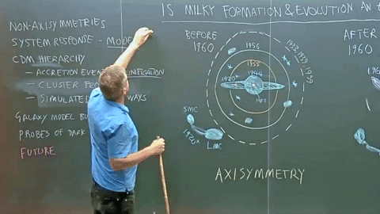

# Table of Contents

-   [Week 2 - August 24](#orge334f1b)
-   [Week 2 - August 26](#orge18da92)
-   [Week 3 - August 31](#org2bda438)
-   [Week 3 - September 2](#orgabc54d6)
-   [Week 4 - September 9](#org684d73f)
-   [Week 5 - September 16](#org04e0b98)
-   [References](#org85b4f7b)

# Week 2 - August 24

-   Housekeeping
-   "Many-model thinking"
-   Why Model? - "REDCAPE"
-   Next week: essay topics!

## Housekeeping

-   First weekly test ([Schoology](https://lyon.schoology.com/assignment/5227019586/assessment_questions))
-   Reading assignment (["The Model Thinker"](https://www.amazon.com/Model-Thinker-What-Need-Know/dp/B08WHN4M7S))
-   Delayed Schedule ([GitHub](https://github.com/birkenkrahe/mod482/blob/main/syllabus.md#schedule-and-session-content))
-   FAQ: ask questions! ([GitHub](https://github.com/birkenkrahe/mod482/blob/main/FAQ.md))
-   Term Diary ([GitHub](https://github.com/birkenkrahe/org/blob/master/diary.md#org3b0dc9e))
-   Questions?

# Week 2 - August 26

-   Housekeeping
-   Recap: complex systems
-   Next: "Many-model thinking"
-   Decision intelligence tools

## Housekeeping

-   Video recording ([Google meet](https://meet.google.com/ccb-ihqm-akb))
-   Essay ideas ([GitHub](https://github.com/birkenkrahe/mod482/blob/main/2_why_model/followup_08_24_2021.md#essay-ideas))
-   Questions?

## Recap

-   What do you remember?
-   "Strategic flexibility" ([GitHub](https://github.com/birkenkrahe/mod482/blob/main/2_why_model/followup_08_24_2021.md#the-logic-of-failure))

# Week 3 - August 31

-   [Test 2 is live - 10 questions](https://lyon.schoology.com/assignment/5257398641/assessment_questions)
-   [New project deadline: 9-Sep-2021](https://github.com/birkenkrahe/mod482/blob/main/syllabus.md#schedule-and-session-content)
-   Lecture: [Decision intelligence](https://github.com/birkenkrahe/mod482/tree/main/3_decision_intelligence)
-   Essay: topic identification how?
-   Lecture: [Agile project management](https://github.com/birkenkrahe/mod482/tree/main/4_agile_pm)
-   New [Scrum FAQs](https://github.com/birkenkrahe/org/blob/master/FAQ.md#orge594cc2)

# Week 3 - September 2

## Essay project

-   [Submit your essay topics by Sep-9](https://github.com/birkenkrahe/mod482/discussions/2)
-   Add [systematic literature review](https://github.com/birkenkrahe/org/blob/master/Systematic_Literature_Review_Example_Table.docx)!
-   Formal issue: (inline) referencing
-   [Wide choice of topics](https://github.com/birkenkrahe/mod482/blob/main/3_decision_intelligence/followup_08_31_2021.md)
-   [Example: Big Data Graph Databases](https://github.com/birkenkrahe/mod482/blob/main/3_decision_intelligence/followup_08_31_2021.md#research-a-topic-based-on-a-scientific-article)
-   How to read a scientific article?

## Agile management

-   Lecture: [Agile [project] management](https://github.com/birkenkrahe/mod482/tree/main/4_agile_pm)
-   Exercise: set up an agile project!
-   Come up with any research question
-   Tool: [Project Canvas](https://github.com/birkenkrahe/org/blob/master/ProjectCanvas.pdf)

## Next week

-   Bring research question ([project canvas](https://github.com/birkenkrahe/org/blob/master/ProjectCanvas.pdf))
-   Lecture: Why Model? (Page ch. 2)
-   REDCAPE model criteria (essay?)
-   Thursday: 1st sprint review ([FAQ](https://github.com/birkenkrahe/org/blob/master/FAQ.md#what-should-we-do-in-the-first-sprint))

# Week 4 - September 9

-   [Learning & Agile Methods](https://github.com/birkenkrahe/org/blob/master/diary.md) (diary)
-   [3P / efficiency vs resilience](https://github.com/birkenkrahe/mod482/blob/main/4_agile_pm/followup_09_07_2021.md) (followup)
-   [First sprint reviews](https://github.com/birkenkrahe/mod482/discussions/2)
-   Next: Why Model? (Read for Tue Sep 14)

## Sprint reviews

-   Everyone: present yr research question
-   Everyone else: prepare 1 question
-   Ask 2 of your questions
-   MB: critique questions

## Two examples

### Molly: [Grounded Theory analysis of creativity](https://psycnet.apa.org/record/2002-08436-005)

<table border="2" cellspacing="0" cellpadding="6" rules="groups" frame="hsides">

<colgroup>
<col  class="org-left" />

<col  class="org-left" />
</colgroup>
<thead>
<tr>
<th scope="col" class="org-left">PRO</th>
<th scope="col" class="org-left">CON</th>
</tr>
</thead>

<tbody>
<tr>
<td class="org-left">Important framework</td>
<td class="org-left">Difficult method</td>
</tr>

<tr>
<td class="org-left">Important issue</td>
<td class="org-left">Complex topic</td>
</tr>

<tr>
<td class="org-left">Lots of examples</td>
<td class="org-left">Lots of confusion</td>
</tr>

<tr>
<td class="org-left">Peer reviewed</td>
<td class="org-left">Date (2002)</td>
</tr>

<tr>
<td class="org-left">Lots of literature</td>
<td class="org-left">Not open source</td>
</tr>

<tr>
<td class="org-left">Focus on art making</td>
<td class="org-left">Small samples</td>
</tr>
</tbody>
</table>

### Owen: [The spread of misinformation](https://reader.elsevier.com/reader/sd/pii/S2590061720300569?token=CB8A5AB8B610593FD4CB342F3BD7658FFA2053C3D96188C2187DC62C4BECB08B47432F38EB25A429B94B7B391EB77DBE&originRegion=us-east-1&originCreation=20210909135607)

<table border="2" cellspacing="0" cellpadding="6" rules="groups" frame="hsides">

<colgroup>
<col  class="org-left" />

<col  class="org-left" />
</colgroup>
<thead>
<tr>
<th scope="col" class="org-left">PRO</th>
<th scope="col" class="org-left">CON</th>
</tr>
</thead>

<tbody>
<tr>
<td class="org-left">Recent & relevant</td>
<td class="org-left">Divisive case</td>
</tr>

<tr>
<td class="org-left">Reputable publisher</td>
<td class="org-left">Conclusions weak</td>
</tr>

<tr>
<td class="org-left">Many models</td>
<td class="org-left">Many models</td>
</tr>

<tr>
<td class="org-left">Quantitative study</td>
<td class="org-left">Potential bias</td>
</tr>

<tr>
<td class="org-left">Literature review</td>
<td class="org-left">Many theories</td>
</tr>

<tr>
<td class="org-left">Linear regression</td>
<td class="org-left">Causal inference</td>
</tr>
</tbody>
</table>

### Suggestions

-   Molly: additional literature (e.g. [Koestler](https://www.brainpickings.org/2013/05/20/arthur-koestler-creativity-bisociation/))
-   Owen: test frameworks (e.g. [this article](https://theconversation.com/engineers-and-economists-prize-efficiency-but-nature-favors-resilience-lessons-from-texas-covid-19-and-the-737-max-152670))

# Week 5 - September 16

-   [Test 4: agility, bias, canvas](https://lyon.schoology.com/assignment/5314232116/assessment_questions)
-   [Fireside chat with Scott Page](#org82dbe04) (2020)
-   The Model Thinker, chapter 2 "Why Model":
-   Models of systemic belonging ([lecture](https://github.com/birkenkrahe/mod482/tree/main/5_why_model))
-   System constellations ([Birkenkrahe, 2008](#org2eb1b71))

# References

 Birkenkrahe, M. (2008). System constellations as tool
supporting organisational learning and change processes. In:
International Journal of Learning and Change 3(3),
pp. 125-144. [Online: researchgate.net](https://www.researchgate.net/publication/228635553_System_constellations_as_tool_supporting_organisational_learning_and_change_processes). ([GDrive copy](https://drive.google.com/file/d/16VWX55tpbJptqZOWkrPZB5v1t_5TT5xD/view?usp=sharing))

 The Artists of Data Science with Harpreet Sahota (31 Aug
2020). The Many Models Mindset | Scott E. Page [Podcast]. Online:
[theartistsofdatascience.fireside.fm](https://theartistsofdatascience.fireside.fm/scott-e-page).

