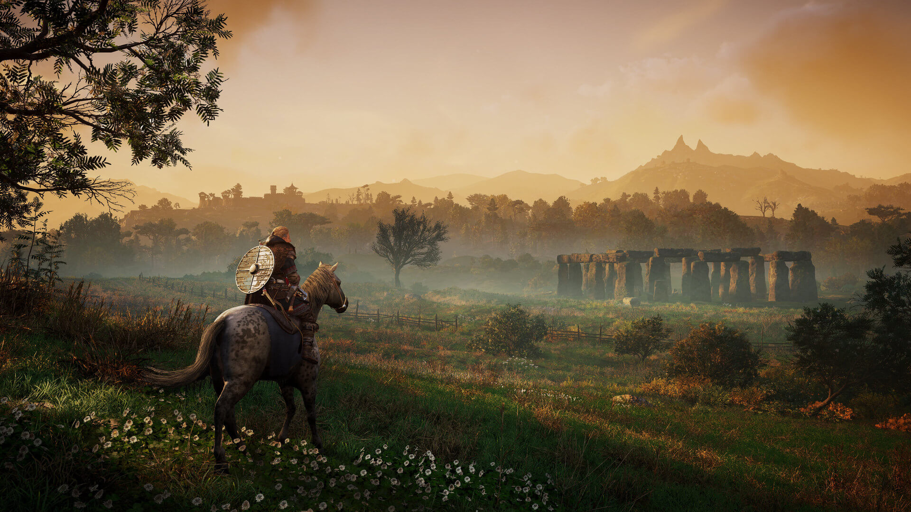

# Table of Contents

1.  [What is this?](#org73d5d17)
2.  [Getting started (for real) - September 7, 2021](#orgf379937)
3.  [When learning data science, trust your intuition - November 10, 2021](#orgc9ee58f)

# What is this?

A place for irregular articles of possible interest to students of
the DSC 482.02 "Data modeling" course, mostly to avoid lengthy
emails and to park content that I may want to develop later on time
permitting.

# Getting started (for real) - September 7, 2021

This is my first diary entry for the data modeling seminar
only. We're starting with week 4 of the course, and I feel refreshed
after Labor Day, which I used to not work at all<a id="fnr.1" class="footref" href="#fn.1">1</a>.

Frankly, this course has suffered from the fact that it feels
"sandwiched" between two other courses that commanded more of my
attention so far: the introductory data science course (DSC 101) is
kind of my flagship course - the first "proper" data science course
I ever developed and taught successfully at graduate level. The AI
seminar (482.01) was tricky, because I didn't know if I could do it
before I did it! This seminar, however, is packed with methods and
tools that I know like the back of my hand.

Knowing something as well as I know modeling meant that I had
difficulty meeting you, the students, at your level of understanding
and interest. I'm only slowly finding my groove here, and I'm sure
it's the same for you.

Also, the emphasis on academic writing (a final essay is one of the
main deliverables) means that the students have to be able to
express themselves. My feeling is that this is difficult and unusual
for them - even though they must've had some liberal arts classes -
I thought that these would be mostly about writing and arguing.

And then there's the need to grade and evaluate achievements. The
grading scheme for any of these courses is fragmented. For the
seminars, participation is graded (15%). So this week, I'm going to
challenge the students more on this front: we'll begin each class
with a 5 minute pair practice designed to foster (a) peer
discussion, (b) accurate expression, and (c) pithy presentations.

I'll get this started by bringing a question to class, but
ultimately I hope that the students will bring questions for
discussion. We'll see how it goes - fall is upon us, and life is
good!

*Image: Valhalla by Ubisoft. Stonehenge, Wiltshire, England (Source:
dsogaming.com)*

\*

# When learning data science, trust your intuition - November 10, 2021

> "If we want to solve a problem that we have never solved before, we
> must leave the door to the unknown afar." -Richard Feynman

Feynman's remark is relevant because learning a lot of new things is
a problem you may have never solved before. My advice mirrors
Feynman's: follow your instincts rather than clamp down on them and
follow a structure that someone else may have recommended because it
suits him or her. In new fields like data science, a particular
type of blog post is very popular: "10 ways to get started with data
science", or "The only way to become a good data scientist FAST", or
"5 books that any data scientist must have read", etc. Most of these
articles are worthless, but the meta message for you is: find your
own way through the maze, and rely on what you already
know. Otherwise you'll have very little chance to learn, retain and
use what you read, study and see. The deeper reason is that data
science, including modeling and everything we do, is quite
fragmented and still in flux - unlike e.g. mathematics, which is a
solid building. If you want to learn maths, the floor plan is well
known and well laid out. Not so in data science.

# Footnotes

<a id="fn.1" href="#fnr.1">1</a> Instead, I spent time outside (loving Batesville more and more -
why would anyone ever want to live elsewhere?), talked to a lot of
people, and christened my brand new PS5 video gaming console by
continuing Eivor's quest in "Valhalla", an Assassin's Creed
game. Crossed the 150 hour boundary on Sunday, assassinating my way
through 8th century England. The PS5 is a gamer's dream come
true. Details (except the price, ummmh) upon request in class!
