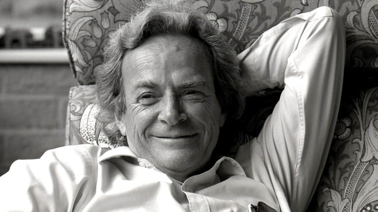

# Table of Contents

1.  [What is this?](#org054fd69)
2.  [Getting started (for real) - September 7, 2021](#org4a38bd2)
3.  [When learning data science, trust your intuition - November 10, 2021](#orgd790bf0)
4.  [Good-bye notes - December 16, 2021](#orgbd9c6d2)

# What is this?

A place for irregular articles of possible interest to students of
the DSC 482.02 "Data modeling" course, mostly to avoid lengthy
emails and to park content that I may want to develop later on time
permitting.

# Getting started (for real) - September 7, 2021

This is my first diary entry for the data modeling seminar
only. We're starting with week 4 of the course, and I feel refreshed
after Labor Day, which I used to not work at all<a id="fnr.1" class="footref" href="#fn.1">1</a>.

Frankly, this course has suffered from the fact that it feels
"sandwiched" between two other courses that commanded more of my
attention so far: the introductory data science course (DSC 101) is
kind of my flagship course - the first "proper" data science course
I ever developed and taught successfully at graduate level. The AI
seminar (482.01) was tricky, because I didn't know if I could do it
before I did it! This seminar, however, is packed with methods and
tools that I know like the back of my hand.

Knowing something as well as I know modeling meant that I had
difficulty meeting you, the students, at your level of understanding
and interest. I'm only slowly finding my groove here, and I'm sure
it's the same for you.

Also, the emphasis on academic writing (a final essay is one of the
main deliverables) means that the students have to be able to
express themselves. My feeling is that this is difficult and unusual
for them - even though they must've had some liberal arts classes -
I thought that these would be mostly about writing and arguing.

And then there's the need to grade and evaluate achievements. The
grading scheme for any of these courses is fragmented. For the
seminars, participation is graded (15%). So this week, I'm going to
challenge the students more on this front: we'll begin each class
with a 5 minute pair practice designed to foster (a) peer
discussion, (b) accurate expression, and (c) pithy presentations.

I'll get this started by bringing a question to class, but
ultimately I hope that the students will bring questions for
discussion. We'll see how it goes - fall is upon us, and life is
good!

*Image: Valhalla by Ubisoft. Stonehenge, Wiltshire, England (Source:
dsogaming.com)*

\*

# When learning data science, trust your intuition - November 10, 2021

> "If we want to solve a problem that we have never solved before, we
> must leave the door to the unknown afar." -Richard Feynman

Feynman's remark is relevant because learning a lot of new things is
a problem you may have never solved before. My advice mirrors
Feynman's: follow your instincts rather than clamp down on them and
follow a structure that someone else may have recommended because it
suits him or her. In new fields like data science, a particular
type of blog post is very popular: "10 ways to get started with data
science", or "The only way to become a good data scientist FAST", or
"5 books that any data scientist must have read", etc. Most of these
articles are worthless, but the meta message for you is: find your
own way through the maze, and rely on what you already
know. Otherwise you'll have very little chance to learn, retain and
use what you read, study and see. The deeper reason is that data
science, including modeling and everything we do, is quite
fragmented and still in flux - unlike e.g. mathematics, which is a
solid building. If you want to learn maths, the floor plan is well
known and well laid out. Not so in data science.

# Good-bye notes - December 16, 2021

I've just recorded a [short good-bye video](https://youtu.be/IxyqEW9-12s). Here are few parting
notes for this course.

## What does it all mean?

I don't know - isn't that why we model? Joking aside, there is some
truth to it. The main theme of the course was dealing with
complexity. Not just to solve problems, but sometimes also to just
understand things better, or to plan ahead, see the forest behind
the trees, and so on.

We've covered a lot of ground in this course, though not as much as
I had planned originally. I'm especially sad about spending too
little time on RPA and Process Mining. However, both of these are
relatively advanced techniques, developing rapidly, and perhaps
you're motivated to follow up on your own. Also, they may recur in
other courses as applications.

Though there were many methods, there was an overarching theme - it
was best explained in my short presentation on "decision
intelligence". Most models are concerned with data and processes -
these two are the core concepts to understand and describe:

1.  transactions (big data - lots of it, different, and fast)
2.  human behavior (non-obvious patterns)
3.  anomalies (things out of the ordinary)

Models are the thinking man's best friend when it comes to sorting
through facts and fakes. In this course, I've tried to take the
path of many models and many methods - you need it, because not all
models are good, true, or relevant.

Though model-building is much older than even modern science, it is
highly important even now, if not more important (because 1-3 are
growing rapidly). As a recent example, take the [Simulation science
initiative](https://simulation.science/). 

## What about the course?

This course grew out of several graduate course that I've taught
over the past few years. I was aware from the start that I was
asking a lot from you - and I am very happy to see that you were up
to the task.

Though there was much room for improvement, I was very impressed
with your ability to carry out research on mostly difficult,
worthwhile questions - without much previous practice or
experience.

Thank you especially for the rich evaluations - and a response rate
of 92% (I don't think I've ever encountered such a high response
rate)!

Your comments are very insightful and all to the point: yes, the
material was complex - not just the concepts but also the different
tools and the continuous topic switching - but you stayed the
course!

I'll learn to use the Schoology gradebook (unless Schoology
disappears, but then something else will follow)!

Someone didn't think an essay was appropriate as a final
assignment. I may have to rethink this. However, being able to
write a research paper is an important professional skill, and you
need(ed) to train it not just in liberal arts topics, but
especially in your very own technical discipline. As professors
like to say: "You'll thank me later!" (I hope).

There's something else. The more you study, the more you move away
from ignorance, the more you'll be in danger to lose touch with the
ground, and develop a dangerous intellectual arrogance. Failing
(without too much angst), falling down and getting up again, is a
good way of staying humble. At least that's what I've always
found. Of course, this is another (mental, highly biased) model!

This is why the most important part of your essay, and of anything
you'll ever write is the section on the "limitations" of your
research, your approach, your thinking or your solution.

There you have it, another lecture. I just can't let go!

## What next? Follow-up courses.

With so many topics, from storytelling over Scrum and Minto to
process mining&#x2026;I am reluctant to tell you to "read more", which
is what I will tell the participants of the other courses. But
modeling is too fragmented a field. So instead, what I'm
recommending is: use all, or any of the techniques we used in this
course in your future work - in my or (even better) in other
professors' classes:

-   replace (or expand) a bullet point list by a BPMN model
-   draw a use case diagram to illustrate a systemic point
-   check if what you wrote or presented has a "story"
-   check if your lists or chapters or slides have (Minto) logic
-   make your next project more agile and apply some Scrum rules
-   when coding, turn requirements into user stories
-   discover models in other people's writing or presentations
-   be aware of the bias implicit in all model building
-   learn more modeling languages

This list could go on, but I need to get back to preparing next
term's classes!

This particular course will probably not be repeated (except
perhaps when I do another special seminar), but the following
classes may be seen as expansions of this course's topics and
themes:

-   C/C++ (CSC 100): BPMN and UML diagrams before/during/after
    coding - Spring 2022
-   Databases (CSC 330): Entity Relationship Diagrams - Spring 2022
-   Operating systems (CSC 420): use of UML - Spring 2022
-   Introduction to data science (DSC 105): Use of BPMN - Fall 2022

## Final words

Again, thank you for welcoming me to Lyon by working with me during
this last term. I wish you a Merry Christmas, a restful break, and
I'm looking forward to seeing some of you again next term!

# Footnotes

<a id="fn.1" href="#fnr.1">1</a> Instead, I spent time outside (loving Batesville more and more -
why would anyone ever want to live elsewhere?), talked to a lot of
people, and christened my brand new PS5 video gaming console by
continuing Eivor's quest in "Valhalla", an Assassin's Creed
game. Crossed the 150 hour boundary on Sunday, assassinating my way
through 8th century England. The PS5 is a gamer's dream come
true. Details (except the price, ummmh) upon request in class!
